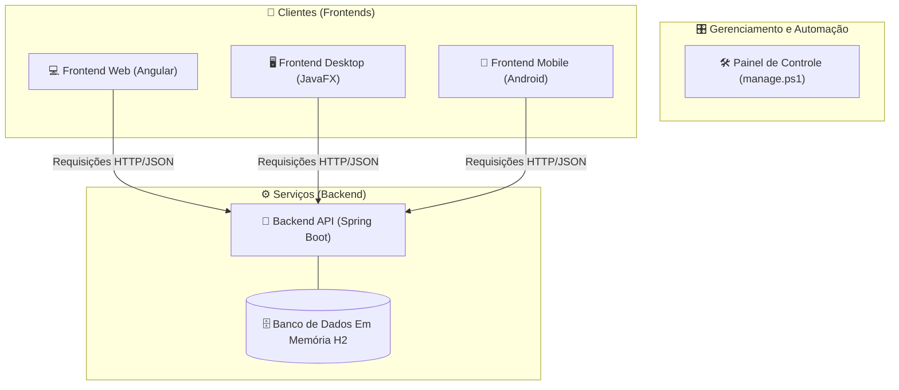

# 🏛️ Guia Arquitetural: Refatorando o Ecossistema Full Stack v3

## 🎯 Visão Geral e Objetivos da Refatoração
Este guia assume o papel de uma revisão de arquitetura e engenharia de software sobre o projeto "Lista de Tarefas". O objetivo não é apenas construir, mas refatorar e aprimorar a solução existente, aplicando princípios de **Clean Code**, **SOLID** e padrões de design modernos como **DTOs (Data Transfer Objects)** e **MVVM (Model-View-ViewModel)**.

Vamos transformar o código funcional em um código **profissional**, **escalável** e **fácil de manter**, melhorando a experiência do usuário em cada plataforma de acordo com as melhores práticas de mercado.

## 🗺️ Arquitetura Proposta
A arquitetura geral de serviços e clientes permanece, mas refinaremos as camadas internas de cada componente para aumentar o desacoplamento e a clareza.

### 🗂️ Estrutura de Módulos
Este guia está dividido nos seguintes módulos:

1.  **Backend (API) com Spring Boot:** Foco em robustez, desacoplamento e segurança.
2.  **Frontend (Web) com Angular:** Foco em componentização clara e experiência de usuário fluida.
3.  **Desktop com JavaFX:** Foco em interações nativas e performance.
4.  **Mobile com Android:** Foco em padrões de UI modernos e arquitetura MVVM.
5.  **Automação com PowerShell:** Centralização do gerenciamento do ambiente.
6.  **Análise Arquitetural e Conclusão:** Revisão das melhorias e sugestões para o futuro.

Continue para o próximo módulo para começar a refatoração do Backend.

---

### 🚀 [ricardotecpro.github.io](https://ricardotecpro.github.io/)

