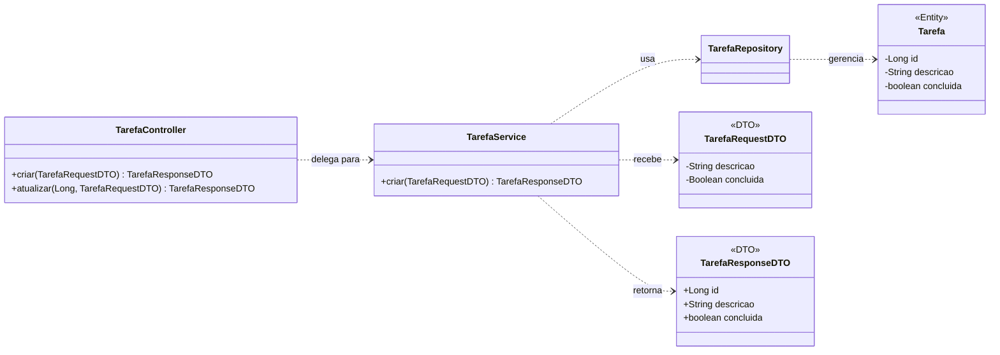

# ⚙️ Módulo 1: Backend (API) - Aderindo aos Princípios SOLID

**Objetivo:** Refatorar a API para ser mais robusta e desacoplada, utilizando DTOs, tratamento de exceções centralizado e validação de entrada.

### ### 📦 Passo 1: Introduzindo DTOs (Data Transfer Objects)

* **Problema:** A API expõe a entidade JPA (`Tarefa`) diretamente. Isso é uma má prática, pois acopla o contrato da sua API à estrutura do seu banco de dados.
* **Solução (Princípio da Responsabilidade Única - SOLID):** Criaremos DTOs, classes simples que representam os dados que entram e saem da API. Isso desacopla a camada da API da camada de persistência.

#### Diagrama de Classes com DTOs

1.  Dentro de `src/main/java/br/com/curso/listadetarefas/api`, crie um novo pacote `dto`.
2.  Dentro de `dto`, crie as classes `TarefaRequestDTO.java` e `TarefaResponseDTO.java`.

**`TarefaRequestDTO.java`**
```java
package br.com.curso.listadetarefas.api.dto;
import jakarta.validation.constraints.NotBlank;
import jakarta.validation.constraints.NotNull;
import jakarta.validation.constraints.Size;

public record TarefaRequestDTO(
    @NotBlank(message = "A descrição não pode ser vazia.")
    @Size(min = 3, message = "A descrição deve ter no mínimo 3 caracteres.")
    String descricao,
    
    @NotNull(message = "O campo 'concluida' é obrigatório.")
    Boolean concluida
) {}
```

**`TarefaResponseDTO.java`**
```java
package br.com.curso.listadetarefas.api.dto;

public record TarefaResponseDTO(
    Long id,
    String descricao,
    boolean concluida
) {}
```

#### Estrutura de Pastas com DTOs
```
listadetarefas-api/
└── src/main/java/br/com/curso/listadetarefas/api/
    ├── dto/
    │   ├── TarefaRequestDTO.java
    │   └── TarefaResponseDTO.java
    ├── tarefa/
    │   └── ... (classes existentes)
    └── ListadetarefasApiApplication.java
```

### ### 🔄 Passo 2: Refatorando as Camadas de Serviço e Controle

Agora, adaptamos o `Service` e o `Controller` para usar os novos DTOs.

**`TarefaService.java` (Refatorado)**
```java
package br.com.curso.listadetarefas.api.tarefa;
import br.com.curso.listadetarefas.api.dto.TarefaRequestDTO;
import br.com.curso.listadetarefas.api.dto.TarefaResponseDTO;
import org.springframework.beans.factory.annotation.Autowired;
import org.springframework.stereotype.Service;
import java.util.List;
import java.util.stream.Collectors;

@Service
public class TarefaService {
    @Autowired private TarefaRepository repository;

    public List<TarefaResponseDTO> listarTodas() {
        return repository.findAll().stream().map(this::toResponseDTO).collect(Collectors.toList());
    }
    public TarefaResponseDTO criar(TarefaRequestDTO requestDTO) {
        Tarefa tarefa = new Tarefa();
        tarefa.setDescricao(requestDTO.descricao());
        tarefa.setConcluida(requestDTO.concluida());
        return toResponseDTO(repository.save(tarefa));
    }
    // ... outros métodos (atualizar, deletar) devem ser adaptados da mesma forma ...

    private TarefaResponseDTO toResponseDTO(Tarefa tarefa) {
        return new TarefaResponseDTO(tarefa.getId(), tarefa.getDescricao(), tarefa.isConcluida());
    }
}
```

**`TarefaController.java` (Refatorado)**
```java
package br.com.curso.listadetarefas.api.tarefa;
import br.com.curso.listadetarefas.api.dto.TarefaRequestDTO;
import br.com.curso.listadetarefas.api.dto.TarefaResponseDTO;
import jakarta.validation.Valid;
import org.springframework.beans.factory.annotation.Autowired;
import org.springframework.http.ResponseEntity;
import org.springframework.web.bind.annotation.*;
import java.util.List;

@RestController
@RequestMapping("/api/tarefas")
@CrossOrigin(origins = "*")
public class TarefaController {
    @Autowired private TarefaService service;

    @GetMapping
    public List<TarefaResponseDTO> listarTarefas() { return service.listarTodas(); }

    @PostMapping
    public TarefaResponseDTO criarTarefa(@Valid @RequestBody TarefaRequestDTO tarefaDTO) {
        return service.criar(tarefaDTO);
    }
    // ... outros endpoints adaptados ...
}
```

### ### 🛡️ Passo 3: Centralizando Tratamento de Exceções

* **Solução (Princípio Don't Repeat Yourself - DRY):** Usamos um `@RestControllerAdvice` para capturar exceções globalmente, limpando o controlador.

1.  Crie o pacote `exception` e a classe `RestExceptionHandler.java`.

**`RestExceptionHandler.java`**
```java
package br.com.curso.listadetarefas.api.exception;
import org.springframework.http.HttpStatus;
import org.springframework.web.bind.annotation.ExceptionHandler;
import org.springframework.web.bind.annotation.ResponseStatus;
import org.springframework.web.bind.annotation.RestControllerAdvice;

@RestControllerAdvice
public class RestExceptionHandler {
    @ExceptionHandler(RuntimeException.class)
    @ResponseStatus(HttpStatus.NOT_FOUND)
    public String handleNotFound(RuntimeException ex) {
        return ex.getMessage();
    }
}
```
* Agora, os blocos `try-catch` podem ser removidos do `TarefaController`.