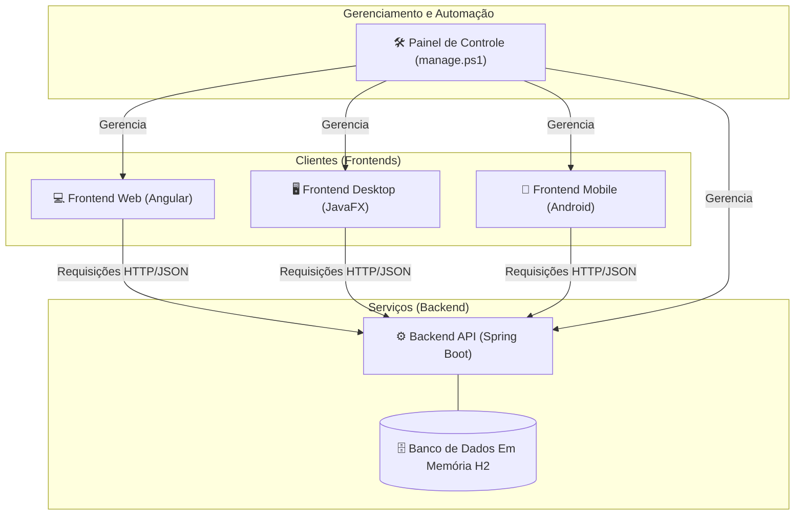

# **Guia de Aula: Construindo um Ecossistema Full Stack Completo**

## **Visão Geral da Arquitetura**

Neste projeto, construiremos um sistema completo de "Lista de Tarefas" (To-Do List), demonstrando como diferentes aplicações cliente podem consumir uma única fonte de dados central (API). A arquitetura final será:

  * **Um Backend (API REST):** O cérebro do sistema, desenvolvido em Java com Spring Boot.
  * **Três Clientes:**
    1.  Uma aplicação **Web** com Angular.
    2.  Uma aplicação **Desktop** nativa com JavaFX.
    3.  Uma aplicação **Mobile** nativa com Android e Jetpack Compose.
  * **Um Painel de Controle:** Um script PowerShell para automação e gerenciamento do ambiente.

### **Diagrama da Arquitetura**



-----

### **Módulo 1: A Fundação – Backend com Spring Boot (`listadetarefas-api`)**

**Objetivo:** Criar o serviço central que irá gerenciar os dados das tarefas, servindo como a única fonte de verdade para todos os clientes.

#### **Ferramentas Necessárias**

  * **Java Development Kit (JDK):** Versão 17 ou superior.
  * **Apache Maven:** Ferramenta de automação de build.
  * **IDE (Ambiente de Desenvolvimento):** IntelliJ IDEA ou Eclipse.
  * **Cliente REST:** Postman ou Insomnia (para testes).

#### **Passo 1: Criação e Configuração do Projeto**

1.  Acesse o **Spring Initializr** ([https://start.spring.io](https://start.spring.io)).
2.  Preencha os metadados do projeto:
      * **Project:** `Maven`
      * **Language:** `Java`
      * **Spring Boot:** Versão estável mais recente (ex: 3.x.x)
      * **Group:** `br.com.curso`
      * **Artifact:** `listadetarefas-api`
      * **Package name:** `br.com.curso.listadetarefas.api`
3.  Adicione as seguintes dependências (`Dependencies`):
      * `Spring Web`: Para criar aplicações web e APIs REST.
      * `Spring Data JPA`: Para persistência de dados em bancos SQL.
      * `H2 Database`: Um banco de dados em memória, ótimo para desenvolvimento.
      * `Lombok`: Para reduzir código repetitivo (getters, setters, etc.).
4.  Clique em **GENERATE** para baixar o projeto.
5.  Descompacte o arquivo e abra o projeto na sua IDE.
6.  Abra o arquivo `src/main/resources/application.properties` e adicione as seguintes linhas:
    ```properties
    # Permite que o servidor aceite conexões de qualquer endereço de rede da máquina.
    server.address=0.0.0.0

    # Habilita o console web do H2
    spring.h2.console.enabled=true
    # Define o caminho para acessar o console
    spring.h2.console.path=/h2-console

    # Configurações do Datasource para H2
    spring.datasource.url=jdbc:h2:mem:testdb
    spring.datasource.driverClassName=org.h2.Driver
    spring.datasource.username=sa
    spring.datasource.password=
    spring.jpa.database-platform=org.hibernate.dialect.H2Dialect
    ```

#### **Passo 2: Desenvolvimento do Código-Fonte**

Crie um novo pacote `tarefa` dentro de `br.com.curso.listadetarefas.api` para organizar as classes relacionadas.

**1. `Tarefa.java` (Entidade)**
Esta classe é o modelo dos nossos dados.

```java
package br.com.curso.listadetarefas.api.tarefa;

import jakarta.persistence.*;
import lombok.Data;

@Data // Anotação do Lombok que gera Getters, Setters, toString, etc.
@Entity // Marca esta classe como uma entidade JPA (será uma tabela no banco de dados).
@Table(name = "tb_tarefas") // Define o nome da tabela.
public class Tarefa {
    @Id // Marca o campo 'id' como a chave primária.
    @GeneratedValue(strategy = GenerationType.IDENTITY) // Configura o 'id' para ser autoincrementado.
    private Long id;
    private String descricao;
    private boolean concluida;
}
```

**2. `TarefaRepository.java` (Repositório)**
Esta interface é a camada de acesso aos dados. O Spring Data JPA implementará os métodos de CRUD automaticamente.

```java
package br.com.curso.listadetarefas.api.tarefa;

import org.springframework.data.jpa.repository.JpaRepository;

// Estendemos JpaRepository, informando a entidade (Tarefa) e o tipo da chave primária (Long).
public interface TarefaRepository extends JpaRepository<Tarefa, Long> {
}
```

**3. `TarefaService.java` (Serviço)**
Esta classe contém a lógica de negócio da aplicação.

```java
package br.com.curso.listadetarefas.api.tarefa;

import org.springframework.beans.factory.annotation.Autowired;
import org.springframework.stereotype.Service;
import java.util.List;

@Service // Marca a classe como um serviço gerenciado pelo Spring.
public class TarefaService {
    @Autowired // Injeção de dependência: O Spring fornecerá uma instância de TarefaRepository.
    private TarefaRepository tarefaRepository;

    public List<Tarefa> listarTodas() { return tarefaRepository.findAll(); }
    public Tarefa criar(Tarefa tarefa) { return tarefaRepository.save(tarefa); }
    public Tarefa atualizar(Long id, Tarefa tarefaAtualizada) {
        // Padrão funcional moderno: busca a tarefa, se encontrar (map), atualiza e salva.
        // Se não encontrar, lança uma exceção.
        return tarefaRepository.findById(id)
            .map(tarefaExistente -> {
                tarefaExistente.setDescricao(tarefaAtualizada.getDescricao());
                tarefaExistente.setConcluida(tarefaAtualizada.isConcluida());
                return tarefaRepository.save(tarefaExistente);
            }).orElseThrow(() -> new RuntimeException("Tarefa não encontrada com o id: " + id));
    }
    public void deletar(Long id) {
        if (!tarefaRepository.existsById(id)) {
            throw new RuntimeException("Tarefa não encontrada com o id: " + id);
        }
        tarefaRepository.deleteById(id);
    }
}
```

**4. `TarefaController.java` (Controlador REST)**
Esta classe expõe os endpoints HTTP que os clientes irão consumir.

```java
package br.com.curso.listadetarefas.api.tarefa;

import org.springframework.beans.factory.annotation.Autowired;
import org.springframework.http.ResponseEntity;
import org.springframework.web.bind.annotation.*;
import java.util.List;

@RestController // Especialização de @Controller para criar APIs RESTful.
@RequestMapping("/api/tarefas") // Mapeia todas as requisições para este Controller para o caminho /api/tarefas.
@CrossOrigin(origins = "*") // Permite que requisições de qualquer origem acessem esta API.
public class TarefaController {
    @Autowired
    private TarefaService tarefaService;

    @GetMapping
    public List<Tarefa> listarTarefas() { return tarefaService.listarTodas(); }

    @PostMapping
    public Tarefa criarTarefa(@RequestBody Tarefa tarefa) { return tarefaService.criar(tarefa); }

    @PutMapping("/{id}")
    public ResponseEntity<Tarefa> atualizarTarefa(@PathVariable Long id, @RequestBody Tarefa tarefa) {
        try {
            Tarefa atualizada = tarefaService.atualizar(id, tarefa);
            return ResponseEntity.ok(atualizada); // Retorna HTTP 200 OK.
        } catch (RuntimeException e) {
            return ResponseEntity.notFound().build(); // Retorna HTTP 404 Not Found.
        }
    }

    @DeleteMapping("/{id}")
    public ResponseEntity<Void> deletarTarefa(@PathVariable Long id) {
        try {
            tarefaService.deletar(id);
            return ResponseEntity.noContent().build(); // Retorna HTTP 204 No Content.
        } catch (RuntimeException e) {
            return ResponseEntity.notFound().build(); // Retorna HTTP 404 Not Found.
        }
    }
}
```

#### **Passo 3: Execução e Teste da API**

1.  **Executar a Aplicação:**

      * Na sua IDE, encontre a classe `ListadetarefasApiApplication.java` e execute o método `main`.
      * Alternativamente, abra um terminal na raiz do projeto e execute: `./mvnw spring-boot:run`
      * Você verá no console que o servidor Tomcat iniciou na porta `8080`.

2.  **Testar com um Cliente REST (Postman/Insomnia):**

      * **Boas Práticas:** Testar a API de forma isolada é fundamental. Isso garante que a lógica do backend está correta antes de construir qualquer interface, facilitando a depuração.
      * **Procedimento de Teste (Ciclo CRUD):**
        1.  **Criar Tarefa (POST):**
              * **Método:** `POST`
              * **URL:** `http://localhost:8080/api/tarefas`
              * **Body (JSON):** `{ "descricao": "Testar a API", "concluida": false }`
              * **Verificação:** A resposta deve ser `200 OK` e o corpo deve conter a tarefa criada com um `id`.
        2.  **Listar Tarefas (GET):**
              * **Método:** `GET`
              * **URL:** `http://localhost:8080/api/tarefas`
              * **Verificação:** A resposta deve ser `200 OK` e o corpo deve ser um array JSON contendo a tarefa criada no passo anterior.
        3.  **Atualizar Tarefa (PUT):**
              * **Método:** `PUT`
              * **URL:** `http://localhost:8080/api/tarefas/1` (use o `id` da tarefa criada)
              * **Body (JSON):** `{ "descricao": "Testar a API com sucesso!", "concluida": true }`
              * **Verificação:** A resposta deve ser `200 OK` e o corpo deve mostrar os dados atualizados.
        4.  **Deletar Tarefa (DELETE):**
              * **Método:** `DELETE`
              * **URL:** `http://localhost:8080/api/tarefas/1`
              * **Verificação:** A resposta deve ser `204 No Content` (sucesso, sem corpo de resposta).
        5.  **Verificação Final (GET):**
              * **Método:** `GET`
              * **URL:** `http://localhost:8080/api/tarefas`
              * **Verificação:** A resposta deve ser `200 OK` e o corpo deve ser um array JSON vazio `[]`.

#### **Passo 4: Acessando e Testando com o Console H2**

Com o console H2 habilitado, podemos inspecionar o estado do banco de dados em memória diretamente pelo navegador, o que é uma ferramenta de depuração poderosa.

1.  **Crie algumas tarefas:** Use o cliente REST (Postman/Insomnia) para criar 2 ou 3 tarefas, como no passo anterior. Não as delete ainda.

2.  **Acesse o Console H2:**

      * Com a sua aplicação Spring Boot ainda em execução, abra seu navegador e acesse a URL: `http://localhost:8080/h2-console`

3.  **Configure a Conexão:**

      * Você verá uma tela de login do H2. Preencha os campos exatamente como configurado no `application.properties`.
      * **Driver Class:** `org.h2.Driver`
      * **JDBC URL:** `jdbc:h2:mem:testdb`
      * **User Name:** `sa`
      * **Password:** (deixe em branco)

4.  **Conecte e Explore:**

      * Clique em **Connect**.
      * Você verá uma interface web onde pode interagir com o banco de dados.
      * No painel esquerdo, você verá a tabela `TB_TAREFAS` que foi criada pela anotação `@Entity`.
      * No campo de texto principal, você pode executar queries SQL. Para ver os dados que você inseriu via API, execute:
        ```sql
        SELECT * FROM TB_TAREFAS;
        ```
      * Clique em **Run**. O resultado mostrará uma tabela com as tarefas que você criou.

5.  **Boas Práticas e Utilidade:**

      * **Verificação de Estado:** O console H2 é perfeito para verificar se suas operações de `save`, `update` e `delete` estão funcionando como esperado, diretamente no banco.
      * **Depuração de Queries Complexas:** Se você estivesse usando queries customizadas (com `@Query` no repositório), poderia testar o SQL diretamente aqui.
      * **Entendimento do Schema:** Ajuda a visualizar como o JPA traduziu suas entidades Java em tabelas e colunas SQL.

-----

### **Módulo 2: Cliente Web com Angular (`listadetarefas-web`)**

**Objetivo:** Criar uma interface web moderna e reativa (Single-Page Application) para interagir com a API.

#### **Ferramentas Necessárias**

  * **Node.js e npm:** Ambiente de execução e gerenciador de pacotes para JavaScript.
  * **Angular CLI:** Interface de linha de comando para projetos Angular. (`npm install -g @angular/cli`)
  * **Editor de Código:** Visual Studio Code (recomendado).

#### **Passo 1: Criação e Configuração do Projeto**

1.  Abra um terminal e execute o comando para criar um novo projeto Angular.
    ```bash
    # Cria um projeto usando componentes standalone (moderno) e CSS puro.
    ng new listadetarefas-web --standalone --style=css
    ```
2.  Navegue para a pasta do projeto.
    ```bash
    cd listadetarefas-web
    ```
3.  Gere os artefatos necessários (modelo, serviço e componente).
    ```bash
    ng generate interface models/tarefa
    ng generate service services/tarefa
    ng generate component components/task-list
    ```
4.  Configure o projeto para permitir requisições HTTP. Abra `src/app/app.config.ts` e adicione `provideHttpClient`.
    ```typescript
    // src/app/app.config.ts
    import { ApplicationConfig } from '@angular/core';
    import { provideRouter } from '@angular/router';
    import { routes } from './app.routes';
    import { provideHttpClient, withFetch } from '@angular/common/http'; // Importe

    export const appConfig: ApplicationConfig = {
      providers: [
        provideRouter(routes),
        provideHttpClient(withFetch()) // Adicione o provider
      ]
    };
    ```

#### **Passo 2: Desenvolvimento do Código-Fonte**

**1. `src/app/models/tarefa.ts` (Interface)**
Define a estrutura de dados da tarefa no frontend.

```typescript
export interface Tarefa {
  id?: number; // Opcional ao criar, presente ao receber da API.
  descricao: string;
  concluida: boolean;
  editando?: boolean; // Propriedade de controle de UI, não existe no backend.
}
```

**2. `src/app/services/tarefa.service.ts` (Serviço)**
Responsável por toda a comunicação com a API backend.

```typescript
// src/app/services/tarefa.service.ts
import { Injectable } from '@angular/core';
import { HttpClient } from '@angular/common/http';
import { Observable } from 'rxjs';
import { Tarefa } from '../models/tarefa';

@Injectable({ providedIn: 'root' })
export class TarefaService {
  private apiUrl = 'http://localhost:8080/api/tarefas';

  constructor(private http: HttpClient) { }

  getTarefas(): Observable<Tarefa[]> { return this.http.get<Tarefa[]>(this.apiUrl); }
  addTarefa(tarefa: Tarefa): Observable<Tarefa> { return this.http.post<Tarefa>(this.apiUrl, tarefa); }
  updateTarefa(tarefa: Tarefa): Observable<Tarefa> { return this.http.put<Tarefa>(`${this.apiUrl}/${tarefa.id}`, tarefa); }
  deleteTarefa(id: number): Observable<void> { return this.http.delete<void>(`${this.apiUrl}/${id}`); }
}
```

**3. `src/app/components/task-list/task-list.component.ts` (Lógica do Componente)**

```typescript
// src/app/components/task-list/task-list.component.ts
import { Component, OnInit } from '@angular/core';
import { TarefaService } from '../../services/tarefa.service';
import { Tarefa } from '../../models/tarefa';
import { CommonModule } from '@angular/common';
import { FormsModule } from '@angular/forms';

@Component({
  selector: 'app-task-list',
  standalone: true,
  imports: [ CommonModule, FormsModule ], // Módulos para diretivas (*ngFor) e formulários (ngModel).
  templateUrl: './task-list.component.html',
  styleUrl: './task-list.component.css'
})
export class TaskListComponent implements OnInit {
  tarefas: Tarefa[] = [];
  novaTarefa: Tarefa = { descricao: '', concluida: false };
  private descricaoOriginal: string = '';

  constructor(private tarefaService: TarefaService) { }

  ngOnInit(): void { this.carregarTarefas(); }

  carregarTarefas(): void {
    this.tarefaService.getTarefas().subscribe(data => { this.tarefas = data; });
  }

  adicionarTarefa(): void {
    if (this.novaTarefa.descricao.trim() === '') return;
    this.tarefaService.addTarefa(this.novaTarefa).subscribe(data => {
      this.tarefas.push(data);
      this.novaTarefa = { descricao: '', concluida: false }; // Limpa o campo.
    });
  }

  atualizarTarefa(tarefa: Tarefa): void {
    this.tarefaService.updateTarefa(tarefa).subscribe();
  }

  deletarTarefa(id: number | undefined): void {
    if (id === undefined) return;
    this.tarefaService.deleteTarefa(id).subscribe(() => {
      this.tarefas = this.tarefas.filter(t => t.id !== id);
    });
  }

  // Métodos para controle da UI de edição
  iniciarEdicao(tarefa: Tarefa): void {
    this.descricaoOriginal = tarefa.descricao;
    tarefa.editando = true;
  }

  salvarEdicao(tarefa: Tarefa): void {
    tarefa.editando = false;
    if (tarefa.descricao.trim() === '') {
      tarefa.descricao = this.descricaoOriginal; // Restaura se o campo ficar vazio.
    } else {
      this.atualizarTarefa(tarefa);
    }
  }

  cancelarEdicao(tarefa: Tarefa): void {
    tarefa.descricao = this.descricaoOriginal;
    tarefa.editando = false;
  }
}
```

**4. `src/app/components/task-list/task-list.component.html` (Template)**

```html
<div class="container">
  <h1>Minha Lista de Tarefas (Web)</h1>

  <form class="form-add" (ngSubmit)="adicionarTarefa()">
    <input type="text" placeholder="O que precisa ser feito?" [(ngModel)]="novaTarefa.descricao" name="descricao" required>
    <button type="submit">Adicionar</button>
  </form>

  <ul class="task-list">
    <li *ngFor="let tarefa of tarefas">
      <input type="checkbox" [(ngModel)]="tarefa.concluida" (change)="atualizarTarefa(tarefa)">

      <span *ngIf="!tarefa.editando" (dblclick)="iniciarEdicao(tarefa)" [ngClass]="{'completed': tarefa.concluida}">
        {{ tarefa.descricao }}
      </span>

      <input *ngIf="tarefa.editando" type="text" [(ngModel)]="tarefa.descricao"
             (blur)="salvarEdicao(tarefa)"
             (keyup.enter)="salvarEdicao(tarefa)"
             (keyup.escape)="cancelarEdicao(tarefa)"
             class="edit-input" autofocus>

      <button class="delete-btn" (click)="deletarTarefa(tarefa.id)">×</button>
    </li>
  </ul>
</div>
```

**5. `src/app/components/task-list/task-list.component.css` (Estilos)**

```css
/* ========================================
  Váriaveis de Cores para fácil customização
  ========================================
*/
:host {
  --cor-primaria: #007bff;
  --cor-sucesso: #28a745;
  --cor-perigo: #dc3545;
  --cor-fundo: #f4f7f6;
  --cor-container: #ffffff;
  --cor-texto: #333;
  --cor-texto-claro: #888;
  --cor-borda: #dee2e6;
  --sombra-caixa: 0 4px 12px rgba(0, 0, 0, 0.08);
}

/* ========================================
  Estilo do Container Principal
  ========================================
*/
.container {
  max-width: 650px;
  margin: 3rem auto;
  padding: 2rem;
  background-color: var(--cor-container);
  border-radius: 12px;
  box-shadow: var(--sombra-caixa);
  font-family: -apple-system, BlinkMacSystemFont, "Segoe UI", Roboto, "Helvetica Neue", Arial, sans-serif;
}

h1 {
  text-align: center;
  color: var(--cor-texto);
  margin-bottom: 2rem;
  font-weight: 600;
}

/* ========================================
  Formulário para Adicionar Tarefas
  ========================================
*/
.form-add {
  display: flex;
  margin-bottom: 2rem;
}

.form-add input[type="text"] {
  flex-grow: 1;
  padding: 0.8rem 1rem;
  font-size: 1rem;
  border: 1px solid var(--cor-borda);
  border-radius: 8px 0 0 8px;
  transition: border-color 0.2s ease, box-shadow 0.2s ease;
  outline: none;
}

.form-add input[type="text"]:focus {
  border-color: var(--cor-primaria);
  box-shadow: 0 0 0 3px rgba(0, 123, 255, 0.2);
}

.form-add button {
  padding: 0.8rem 1.5rem;
  font-size: 1rem;
  font-weight: 500;
  border: none;
  background-color: var(--cor-primaria);
  color: white;
  cursor: pointer;
  border-radius: 0 8px 8px 0;
  transition: background-color 0.2s ease;
}

.form-add button:hover {
  background-color: #0056b3;
}

/* ========================================
  Lista de Tarefas
  ========================================
*/
.task-list {
  list-style: none;
  padding: 0;
}

.task-list li {
  display: flex;
  align-items: center;
  padding: 1rem 0.5rem;
  border-bottom: 1px solid #f0f0f0;
  transition: background-color 0.2s ease;
}

.task-list li:last-child {
  border-bottom: none;
}

.task-list li:hover {
  background-color: #fafafa;
}

/* Checkbox */
.task-list input[type="checkbox"] {
  margin-right: 1rem;
  cursor: pointer;
  width: 20px;
  height: 20px;
}

/* Span com o texto da tarefa e campo de edição */
.task-list li span,
.task-list li .edit-input {
  flex-grow: 1;
  color: var(--cor-texto);
  transition: color 0.3s ease;
}

.task-list li span {
  cursor: pointer;
}

/* Estilo para tarefas concluídas */
.task-list li span.completed {
  text-decoration: line-through;
  color: var(--cor-texto-claro);
}

/* Campo de input para edição */
.edit-input {
  padding: 0.4rem;
  font-size: 1rem;
  border: 1px solid var(--cor-primaria);
  border-radius: 4px;
  outline: none;
}


/* Botão de Deletar */
.delete-btn {
  border: none;
  background: transparent;
  color: #ccc;
  cursor: pointer;
  font-size: 1.5rem;
  font-weight: bold;
  padding: 0 0.5rem;
  margin-left: 1rem;
  opacity: 0.5;
  transition: color 0.2s ease, opacity 0.2s ease;
}

.task-list li:hover .delete-btn {
  opacity: 1;
}

.delete-btn:hover {
  color: var(--cor-perigo);
}
```

#### **Passo 3: Integração do Componente Principal**

1.  Importe e declare o `TaskListComponent` no componente raiz `AppComponent`. **Esta etapa corrige o erro `'app-task-list' is not a known element'`.**
    ```typescript
    // src/app/app.component.ts
    import { Component } from '@angular/core';
    import { RouterOutlet } from '@angular/router';
    // 1. IMPORTE o seu componente aqui
    import { TaskListComponent } from './components/task-list/task-list.component';

    @Component({
      selector: 'app-root',
      standalone: true,
      imports: [
        RouterOutlet,
        TaskListComponent // 2. ADICIONE o componente ao array de imports
      ],
      templateUrl: './app.component.html',
      styleUrl: './app.component.css'
    })
    export class AppComponent {
      title = 'listadetarefas-web';
    }
    ```
2.  Substitua o conteúdo de `src/app/app.component.html` para usar seu novo componente.
    ```html
    <app-task-list></app-task-list>
    ```

#### **Passo 4: Execução e Teste da Aplicação Web**

1.  **Pré-requisito:** A API backend (`listadetarefas-api`) deve estar em execução.
2.  **Executar a Aplicação:**
      * No terminal, na raiz do projeto `listadetarefas-web`, execute:
        ```bash
        ng serve --open
        ```
      * O navegador abrirá automaticamente em `http://localhost:4200`.
3.  **Teste Manual e Depuração:**
      * **Boas Práticas:** Use as ferramentas de desenvolvedor do navegador (F12) para depurar. A aba **Network** mostra todas as requisições HTTP feitas para a API, permitindo verificar se os dados estão sendo enviados e recebidos corretamente. A aba **Console** exibe erros de JavaScript.
      * **Procedimento de Teste:**
        1.  A página carregou e a lista está vazia?
        2.  Digite uma nova tarefa no campo de texto e clique em "Adicionar". A tarefa apareceu na lista?
        3.  Marque o checkbox da tarefa. O texto foi riscado?
        4.  Clique duas vezes no texto da tarefa. O campo de edição apareceu? Altere o texto e pressione Enter. A alteração foi salva?
        5.  Clique no "X" para deletar a tarefa. Ela sumiu da lista?
        6.  Recarregue a página (F5). As tarefas que não foram deletadas continuam lá? (Isso testa se os dados estão vindo da API no carregamento inicial).

-----

### **Módulo 3: Cliente Desktop com JavaFX (`listadetarefas-desktop`)**

*Neste módulo, o foco será na lógica de serviço, que é a parte mais crítica da integração.*

#### **Ferramentas Necessárias**

  * **Java Development Kit (JDK):** Versão 17 ou superior, com JavaFX SDK.
  * **Apache Maven**
  * **IDE:** IntelliJ IDEA ou Eclipse com suporte a JavaFX.

#### **Passo 1: Criação e Configuração do Projeto**

1.  Crie um **projeto Maven** na sua IDE.
      * `GroupId`: `br.com.curso`
      * `ArtifactId`: `listadetarefas-desktop`
2.  Configure o `pom.xml` para incluir as dependências do **JavaFX** e do **Jackson Databind** (para manipulação de JSON).
3.  Crie o arquivo `module-info.java` em `src/main/java` para declarar as dependências do sistema de módulos do Java, como `requires javafx.controls;` e `opens br.com.curso.listadetarefas.desktop to javafx.fxml;`.

#### **Passo 2: Desenvolvimento do Serviço de API**

**`TarefaApiService.java`**
Esta classe encapsula toda a comunicação com a API backend usando o cliente HTTP moderno do Java.

```java
package br.com.curso.listadetarefas.desktop;

import com.fasterxml.jackson.core.type.TypeReference;
import com.fasterxml.jackson.databind.ObjectMapper;
import java.io.IOException;
import java.net.URI;
import java.net.http.HttpClient;
import java.net.http.HttpRequest;
import java.net.http.HttpResponse;
import java.util.Collections;
import java.util.List;

public class TarefaApiService {
    private final HttpClient client = HttpClient.newHttpClient();
    private final ObjectMapper objectMapper = new ObjectMapper();
    private final String API_URL = "http://localhost:8080/api/tarefas";

    public List<Tarefa> listarTarefas() {
        HttpRequest request = HttpRequest.newBuilder().uri(URI.create(API_URL)).GET().build();
        try {
            HttpResponse<String> response = client.send(request, HttpResponse.BodyHandlers.ofString());
            if (response.statusCode() == 200) {
                return objectMapper.readValue(response.body(), new TypeReference<>() {});
            }
        } catch (IOException | InterruptedException e) {
            e.printStackTrace();
        }
        return Collections.emptyList();
    }

    public void deletarTarefa(Long id) {
        try {
            HttpRequest request = HttpRequest.newBuilder()
                    .uri(URI.create(API_URL + "/" + id))
                    .DELETE()
                    .build();
            client.send(request, HttpResponse.BodyHandlers.ofString());
        } catch (IOException | InterruptedException e) {
            e.printStackTrace();
        }
    }
    // ... incluir os outros métodos (adicionarTarefa, atualizarTarefa)
}
```

  * **Boas Práticas:** Em uma aplicação JavaFX, as chamadas para os métodos desta classe devem ser feitas em uma thread separada para não congelar a interface do usuário (UI). Utilize a classe `javafx.concurrent.Task` para executar operações de rede em segundo plano e atualizar a UI na thread principal quando os dados chegarem.

#### **Passo 3: Execução e Teste**

1.  **Pré-requisito:** A API backend (`listadetarefas-api`) deve estar em execução.
2.  **Construir o Projeto:**
      * No terminal, na raiz do projeto `listadetarefas-desktop`, execute:
        ```bash
        mvn clean package
        ```
      * Isso gerará um arquivo `.jar` executável na pasta `target`.
3.  **Executar a Aplicação:**
    ```bash
    java -jar target/listadetarefas-desktop-1.0-SNAPSHOT.jar
    ```
4.  **Teste Manual:**
      * Realize o mesmo roteiro de testes do cliente web: adicione, edite, marque como concluída e delete tarefas.
      * **Depuração:** Fique de olho no console onde você executou o comando `java -jar`. Erros de conexão ou de processamento de dados (stack traces) aparecerão lá, ajudando a diagnosticar problemas.

-----

### **Módulo 4: Cliente Mobile com Android (`listadetarefas-android`)**

#### **Ferramentas Necessárias**

  * **Android Studio:** A IDE oficial para desenvolvimento Android.
  * **Android SDK:** Instalado via Android Studio.
  * **Emulador Android (AVD)** ou um dispositivo físico.

#### **Passo 1: Criação e Configuração do Projeto**

1.  No **Android Studio**, crie um novo projeto com o template **Empty Activity (Compose)**.
2.  Configure o projeto:
      * `Name`: `listadetarefas-android`
      * `Package name`: `br.com.curso.listadetarefas.android`
3.  Adicione as dependências de `Retrofit`, `Gson`, `ViewModel`, `Coroutines` e `Compose` ao arquivo `build.gradle.kts (Module :app)`.
4.  No arquivo `AndroidManifest.xml`, adicione as permissões de rede.
    ```xml
    <uses-permission android:name="android.permission.INTERNET" />
    <application
        ...
        android:usesCleartextTraffic="true"> ...
    </application>
    ```

#### **Passo 2: Configuração do Ambiente de Rede**

  * **Boas Práticas:** O emulador Android roda em sua própria máquina virtual com um endereço de rede separado. `localhost` ou `127.0.0.1` dentro do emulador refere-se ao próprio emulador, não à sua máquina. Para conectar à API que está rodando no seu computador, você precisa criar um túnel reverso.

<!-- end list -->

1.  **Pré-requisito:** A API backend (`listadetarefas-api`) deve estar em execução com `server.address=0.0.0.0`.
2.  Execute o seguinte comando no terminal (com o emulador já rodando):
    ```bash
    adb reverse tcp:8080 tcp:8080
    ```
    Isso redireciona o tráfego da porta 8080 do emulador para a porta 8080 da sua máquina.

#### **Passo 3: Desenvolvimento do Código-Fonte**

*O código para `Tarefa.kt`, `TarefaApiService.kt`, `RetrofitClient.kt`, `TarefaViewModel.kt` e `MainActivity.kt` é o mesmo da versão anterior. As boas práticas (ViewModel, StateFlow, Coroutines, etc.) já estão aplicadas.*

#### **Passo 4: Execução e Teste**

1.  **Executar a Aplicação:**
      * No Android Studio, selecione o emulador desejado e clique no botão "Run 'app'" (ícone de play).
2.  **Teste Manual e Depuração:**
      * **Ferramenta Principal:** **Logcat**. A janela do Logcat no Android Studio é sua melhor amiga. Ela exibe todos os logs do sistema e do seu aplicativo (`Log.e`, `Log.d`, etc.), incluindo exceções e erros de rede. Use filtros para ver apenas os logs da sua aplicação.
      * **Procedimento de Teste:**
        1.  O aplicativo abriu? A lista está vazia com a mensagem "Nenhuma tarefa encontrada"?
        2.  Adicione uma nova tarefa. Ela apareceu na lista?
        3.  Toque no checkbox. A tarefa foi marcada/desmarcada?
        4.  Toque no texto da tarefa. A caixa de diálogo para edição abriu? Edite e salve.
        5.  Toque no ícone da lixeira. A tarefa foi removida?
        6.  Arraste a lista para baixo (pull-to-refresh). A lista é atualizada a partir da API?

-----

### **Módulo 5: Automação com PowerShell (`manage.ps1`)**

#### **Ferramentas Necessárias**

  * **Windows Terminal** ou **PowerShell**.

#### **Passo 1: Preparação**

1.  Crie um arquivo chamado **`manage.ps1`** na **pasta raiz** que contém todos os seus projetos (ex: `C:\Projetos\ToDoList\`).
2.  Habilite a execução de scripts no seu sistema. Abra o PowerShell como **Administrador** e execute uma única vez:
    ```powershell
    Set-ExecutionPolicy -ExecutionPolicy RemoteSigned -Scope CurrentUser
    ```

#### **Passo 2: Código do Script de Automação**

*Cole o código PowerShell corrigido e melhorado da versão anterior do guia. Ele usa `$PSScriptRoot` para ser portátil e os nomes corretos dos projetos.*

#### **Passo 3: Execução e Teste do Painel**

1.  Abra o terminal na pasta raiz onde o script `manage.ps1` foi salvo.
2.  Execute o script:
    ```powershell
    .\manage.ps1
    ```
3.  **Teste do Script:**
      * O objetivo aqui é testar se o próprio painel de controle funciona.
      * **Procedimento de Teste:**
        1.  Use a opção **1** para iniciar a API. Verifique no Gerenciador de Tarefas se um processo `java.exe` iniciou. Verifique o status no painel.
        2.  Use a opção **2** para parar a API. O processo `java.exe` foi encerrado?
        3.  Use a opção **A** para iniciar o emulador.
        4.  Use a opção **G** para criar o túnel adb.
        5.  Use a opção **9** para iniciar todos os serviços. Verifique se a API, o servidor web do Angular e a aplicação desktop iniciaram corretamente.
        6.  Use a opção **10** para parar tudo e verifique se todos os processos foram encerrados.

-----

### **Módulo 6: Conclusão e Próximos Passos**

**Parabéns\!** Ao final deste guia, você terá construído e testado um ecossistema de software completo e funcional, aplicando conceitos de:

  * **Arquitetura de API-First:** Projetando um backend robusto que serve múltiplos clientes.
  * **Desenvolvimento Full-Stack:** Conectando um backend Java a um frontend web moderno.
  * **Desenvolvimento Multiplataforma:** Reutilizando a mesma API para aplicações Web, Desktop e Mobile.
  * **Automação e DevOps Básico:** Simplificando o gerenciamento do ambiente de desenvolvimento com scripts.

**Desafios Futuros (Próximos Passos):**

  * **Segurança:** Implemente autenticação na API com `Spring Security` e `JWT`.
  * **Comunicação em Tempo Real:** Use `WebSockets` para sincronização automática entre os clientes.
  * **Testes Automatizados:** Escreva testes unitários e de integração para a API (`JUnit`/`Mockito`) e testes de UI para os frontends (`Jasmine`/`Karma`/`Espresso`).
  * **Deployment:** Empacote suas aplicações com **Docker** e faça o deploy em um provedor de nuvem.