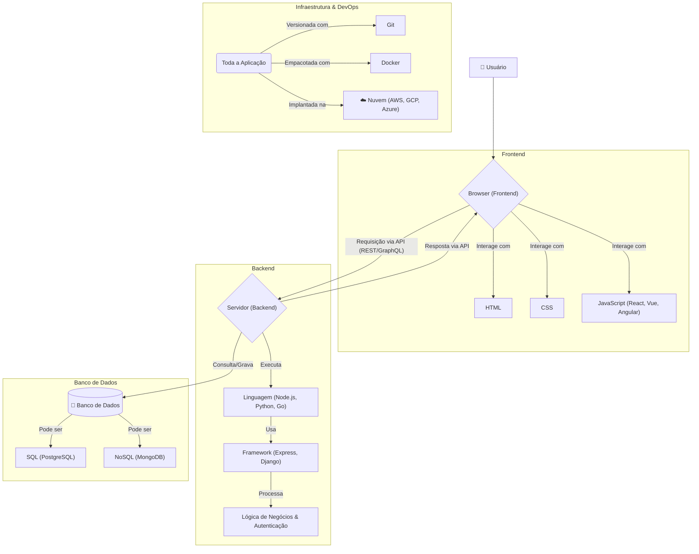

# 🥞 Projetos Full Stack: Navegando por Todas as Camadas

O termo **Full Stack** se refere a um perfil de desenvolvedor de software que possui conhecimento e habilidade para trabalhar em todas as camadas (*stack*) de uma aplicação, desde o **frontend (client-side)** até o **backend (server-side)**, incluindo o banco de dados e, cada vez mais, noções de infraestrutura e DevOps.

Em uma analogia com um restaurante, o desenvolvedor Full Stack seria o chef de cozinha que não apenas sabe preparar o prato principal na cozinha (backend), mas também entende como ele deve ser apresentado visualmente no prato e como a sala de jantar deve funcionar para servir o cliente (frontend).

É crucial entender que ser "Full Stack" **não significa ser um especialista em tudo**. Significa ter uma visão holística do sistema, ser capaz de construir e manter uma aplicação de ponta a ponta e contribuir de forma significativa em qualquer parte do processo. Muitos desenvolvedores Full Stack se encaixam no perfil **"T-shaped"**: possuem um conhecimento amplo em várias áreas, mas uma especialização profunda em uma ou duas delas.

-----

# ⚒️ Projetos

* **[Projetos](./projetos/)**: Projetos: Estudo de Casos

---

## 🔗 Tópicos

* **[Tópicos](/topicos.md)**: Trilhas de Aprendizagem.

---

## 📚 As Camadas do Conhecimento Full Stack

Um desenvolvedor Full Stack navega confortavelmente por estas quatro camadas principais:

### 1\. Frontend (A Camada de Apresentação)

É a parte da aplicação com a qual o usuário interage diretamente. As competências essenciais são:

  - **Fundamentos**: Domínio de **HTML** (estrutura), **CSS** (estilo) e **JavaScript** (comportamento).
  - **Frameworks Modernos**: Conhecimento em pelo menos um grande framework/biblioteca de JavaScript, como **React**, **Angular** ou **Vue.js**, para construir interfaces de usuário complexas e reativas.
  - **Ferramentas**: Familiaridade com gerenciadores de pacotes (npm, yarn) e ferramentas de build (Vite, Webpack).

### 2\. Backend (A Camada de Lógica)

É o cérebro da aplicação, onde a lógica de negócios, as regras e o processamento de dados acontecem.

  - **Linguagem e Framework**: Proficiência em uma linguagem de programação de servidor e seu principal framework (ex: **Node.js** com Express.js, **Python** com Django/Flask, **PHP** com Laravel, **Go**, **Rust**, **Java** com Spring).
  - **Design de APIs**: Habilidade para projetar, construir e documentar APIs, geralmente usando padrões como **REST** ou **GraphQL**, para que o frontend possa se comunicar com o backend.
  - **Autenticação e Segurança**: Implementar sistemas de login, gerenciar permissões de usuário e proteger a aplicação contra vulnerabilidades comuns.

### 3\. Banco de Dados (A Camada de Persistência)

É onde os dados da aplicação são armazenados de forma permanente.

  - **Bancos de Dados Relacionais (SQL)**: Entender como modelar dados em tabelas e escrever consultas SQL. Conhecimento em sistemas como **PostgreSQL** ou **MySQL** é fundamental.
  - **Bancos de Dados Não-Relacionais (NoSQL)**: Familiaridade com diferentes modelos de dados (documento, chave-valor, etc.) e sistemas como **MongoDB** ou **Redis**.
  - **ORMs (Object-Relational Mapping)**: Conhecimento de ferramentas como Prisma, TypeORM (no mundo JS) ou SQLAlchemy (Python) que facilitam a interação entre o código da aplicação e o banco de dados.

### 4\. DevOps e Infraestrutura (A Camada de Operações)

É o conhecimento de como implantar, monitorar e manter a aplicação em funcionamento.

  - **Controle de Versão**: Domínio absoluto de **Git** e plataformas como **GitHub** ou **GitLab**.
  - **Linha de Comando**: Conforto em usar o terminal para gerenciar servidores e processos.
  - **Contêineres**: Noções básicas de **Docker** para empacotar a aplicação e suas dependências, garantindo consistência entre os ambientes.
  - **Nuvem (Cloud)**: Familiaridade com os serviços básicos de um provedor de nuvem como **AWS**, **Google Cloud** ou **Azure** para implantar a aplicação.

-----

## 🗺️ O Mapa do Território Full Stack

Este diagrama ilustra como as diferentes camadas se conectam em uma aplicação web moderna.

-----

## ⚖️ Vantagens e Desafios da Carreira

### Vantagens

  - **Visão Holística**: Um desenvolvedor Full Stack entende o fluxo de dados de ponta a ponta, o que o ajuda a tomar melhores decisões arquiteturais e a identificar a causa raiz de um problema mais rapidamente.
  - **Versatilidade e Flexibilidade**: É um profissional valioso, especialmente em startups e equipes pequenas, pois pode transitar entre diferentes tarefas e suprir lacunas onde for necessário.
  - **Prototipagem Rápida**: Tem a capacidade de pegar uma ideia e construir um produto mínimo viável (MVP) do zero, de forma autônoma.
  - **Melhor Comunicação**: Consegue dialogar de forma eficaz tanto com desenvolvedores frontend quanto backend, pois entende os desafios e as linguagens de ambos os mundos.

### Desafios

  - **O Risco do "Pato"**: O ditado diz que o pato nada, anda e voa, mas não faz nenhum dos três com perfeição. O desafio é evitar se tornar um "generalista superficial", conhecendo um pouco de tudo, mas sem profundidade em nada.
  - **Manter-se Atualizado**: A tecnologia evolui em uma velocidade vertiginosa. Acompanhar as novidades, tendências e melhores práticas do frontend, backend, bancos de dados e DevOps simultaneamente é uma tarefa hercúlea.
  - **Carga Cognitiva Elevada**: A troca constante de contexto entre diferentes linguagens, paradigmas e ferramentas pode ser mentalmente desgastante.

-----

## 🚀 Como se Tornar um Desenvolvedor Full Stack?

Não há um caminho único, mas uma trilha comum e eficaz é:

1.  **Domine os Fundamentos da Web**: Comece com a base do frontend: HTML, CSS e, principalmente, JavaScript. Esta é a base de quase tudo.
2.  **Aprofunde-se no Frontend**: Aprenda um framework JavaScript moderno (React é uma escolha popular) para entender como construir UIs complexas.
3.  **Escolha uma Trilha para o Backend**: Selecione uma linguagem de backend (Node.js é uma transição natural do JavaScript) e aprenda seu principal framework para construir uma API REST.
4.  **Aprenda a Persistir Dados**: Estude os fundamentos de bancos de dados relacionais (SQL) e pratique com PostgreSQL ou MySQL.
5.  **Conecte as Pontas**: Construa projetos completos onde seu frontend consome a API que você mesmo construiu e que interage com um banco de dados que você modelou.
6.  **Explore o Básico de DevOps**: Aprenda Git profundamente. Em seguida, aprenda o básico de Docker para empacotar seu projeto. Finalmente, faça o deploy de uma aplicação para um serviço de nuvem (como Vercel, Heroku ou AWS).
7.  **Nunca Pare de Aprender**: A jornada é contínua.

---

## ✉️ Contatos

* **[Contatos](https://ricardotecpro.github.io/contatos.html)**: Contatos / Contacts

---

### 📌 [ricardotecpro.github.io](https://ricardotecpro.github.io/)
