# Full Stack

## ** Construindo o Ecossistema To-Do List**

**Visão Geral da Arquitetura:**
Este guia aborda a construção de um sistema completo, composto por:

  * **Um Backend (API REST):** O cérebro do sistema, desenvolvido em Java com Spring Boot.
  * **Três Clientes:**
    1.  Uma aplicação **Web** com Angular.
    2.  Uma aplicação **Desktop** nativa com JavaFX.
    3.  Uma aplicação **Mobile** nativa com Android e Jetpack Compose.
  * **Um Painel de Controle:** Um script PowerShell para automação e gerenciamento do ambiente.

**Diagrama da Arquitetura Final:**

```mermaid

graph TD
    subgraph "Gerenciamento e Automação"
        Script["🛠 Painel de Controle\n(manage.ps1)"]
    end

    subgraph "Clientes (Frontends)"
        Web["💻 Frontend Web\n(Angular)"]
        Desktop["🖥 Frontend Desktop\n(JavaFX)"]
        Mobile["📱 Frontend Mobile\n(Android)"]
    end

    subgraph "Serviços (Backend)"
        API["⚙️ Backend API\n(Spring Boot)"]
        DB[("🗄 Banco de Dados\nH2")]
    end

    %% Conexões de Dados
    Web -->|HTTP/JSON| API
    Desktop -->|HTTP/JSON| API
    Mobile -->|HTTP/JSON| API
    API --- DB

    %% Conexões de Gerenciamento
    Script -- Gerencia --> API
    Script -- Gerencia --> Web
    Script -- Gerencia --> Desktop
    Script -- Gerencia --> Mobile


```



-----

### **Módulo 1: A Fundação – Backend com Spring Boot (`todolist-api`)**

**Objetivo:** Criar o serviço central que servirá como a única fonte de dados para todos os clientes.

#### **Passo 1: Criação e Configuração do Projeto**

1.  Use o **Spring Initializr** ([https://start.spring.io](https://start.spring.io)) com as seguintes configurações:
      * **Project:** Maven
      * **Language:** Java
      * **Group:** `br.com.curso`
      * **Artifact:** `todolist-api`
      * **Package name:** `br.com.curso.todolist.api`
      * **Dependencies:** `Spring Web`, `Spring Data JPA`, `H2 Database`, `Lombok`.
2.  No arquivo `src/main/resources/application.properties`, adicione a linha abaixo para que a API aceite conexões de rede de diferentes origens, o que é crucial para o cliente Android.
    ```properties
    server.address=0.0.0.0
    ```

#### **Passo 2: Código-Fonte Completo**

Crie o pacote `tarefa` dentro de `br.com.curso.todolist.api`.

**1. `Tarefa.java` (Entidade)**

```java
package br.com.curso.todolist.api.tarefa;

import jakarta.persistence.*;
import lombok.Data;

@Data
@Entity
@Table(name = "tb_tarefas")
public class Tarefa {
    @Id
    @GeneratedValue(strategy = GenerationType.IDENTITY)
    private Long id;
    private String descricao;
    private boolean concluida;
}
```

**2. `TarefaRepository.java` (Repositório)**

```java
package br.com.curso.todolist.api.tarefa;

import org.springframework.data.jpa.repository.JpaRepository;

public interface TarefaRepository extends JpaRepository<Tarefa, Long> {
}
```

**3. `TarefaService.java` (Serviço)**

```java
package br.com.curso.todolist.api.tarefa;

import org.springframework.beans.factory.annotation.Autowired;
import org.springframework.stereotype.Service;
import java.util.List;

@Service
public class TarefaService {
    @Autowired
    private TarefaRepository tarefaRepository;

    public List<Tarefa> listarTodas() { return tarefaRepository.findAll(); }
    public Tarefa criar(Tarefa tarefa) { return tarefaRepository.save(tarefa); }
    public Tarefa atualizar(Long id, Tarefa tarefaAtualizada) {
        return tarefaRepository.findById(id)
            .map(tarefaExistente -> {
                tarefaExistente.setDescricao(tarefaAtualizada.getDescricao());
                tarefaExistente.setConcluida(tarefaAtualizada.isConcluida());
                return tarefaRepository.save(tarefaExistente);
            }).orElseThrow(() -> new RuntimeException("Tarefa não encontrada com o id: " + id));
    }
    public void deletar(Long id) {
        if (!tarefaRepository.existsById(id)) {
            throw new RuntimeException("Tarefa não encontrada com o id: " + id);
        }
        tarefaRepository.deleteById(id);
    }
}
```

**4. `TarefaController.java` (Controlador)**

```java
package br.com.curso.todolist.api.tarefa;

import org.springframework.beans.factory.annotation.Autowired;
import org.springframework.http.ResponseEntity;
import org.springframework.web.bind.annotation.*;
import java.util.List;

@RestController
@RequestMapping("/api/tarefas")
@CrossOrigin(origins = "*")
public class TarefaController {
    @Autowired
    private TarefaService tarefaService;

    @GetMapping
    public List<Tarefa> listarTarefas() { return tarefaService.listarTodas(); }

    @PostMapping
    public Tarefa criarTarefa(@RequestBody Tarefa tarefa) { return tarefaService.criar(tarefa); }

    @PutMapping("/{id}")
    public ResponseEntity<Tarefa> atualizarTarefa(@PathVariable Long id, @RequestBody Tarefa tarefa) {
        try {
            Tarefa atualizada = tarefaService.atualizar(id, tarefa);
            return ResponseEntity.ok(atualizada);
        } catch (RuntimeException e) {
            return ResponseEntity.notFound().build();
        }
    }

    @DeleteMapping("/{id}")
    public ResponseEntity<Void> deletarTarefa(@PathVariable Long id) {
        try {
            tarefaService.deletar(id);
            return ResponseEntity.noContent().build();
        } catch (RuntimeException e) {
            return ResponseEntity.notFound().build();
        }
    }
}
```

-----

### **Módulo 2: Cliente Web com Angular (`todolist-web`)**

**Objetivo:** Criar uma interface web com todas as funcionalidades de CRUD, incluindo a edição de texto.

#### **Passo 1: Criação e Configuração do Projeto**

1.  **Crie o projeto:** `ng new todolist-web --standalone --style=css`
2.  **Gere os arquivos:**
    ```bash
    ng generate interface models/tarefa
    ng generate service services/tarefa
    ng generate component components/task-list
    ```
3.  **Configure o `app.config.ts`** para permitir requisições HTTP, utilizando `withFetch()` para melhor performance.
    ```typescript
    import { ApplicationConfig } from '@angular/core';
    import { provideRouter } from '@angular/router';
    import { routes } from './app.routes';
    import { provideHttpClient, withFetch } from '@angular/common/http';

    export const appConfig: ApplicationConfig = {
      providers: [
        provideRouter(routes),
        provideHttpClient(withFetch())
      ]
    };
    ```

#### **Passo 2: Código-Fonte Completo**

**1. `src/app/models/tarefa.ts`**

```typescript
export interface Tarefa {
  id?: number;
  descricao: string;
  concluida: boolean;
  editando?: boolean;
}
```

**2. `src/app/services/tarefa.service.ts`**

```typescript
import { Injectable } from '@angular/core';
import { HttpClient } from '@angular/common/http';
import { Observable } from 'rxjs';
import { Tarefa } from '../models/tarefa';

@Injectable({ providedIn: 'root' })
export class TarefaService {
  private apiUrl = 'http://localhost:8080/api/tarefas';

  constructor(private http: HttpClient) { }

  getTarefas(): Observable<Tarefa[]> { return this.http.get<Tarefa[]>(this.apiUrl); }
  addTarefa(tarefa: Tarefa): Observable<Tarefa> { return this.http.post<Tarefa>(this.apiUrl, tarefa); }
  updateTarefa(tarefa: Tarefa): Observable<Tarefa> { return this.http.put<Tarefa>(`${this.apiUrl}/${tarefa.id}`, tarefa); }
  deleteTarefa(id: number): Observable<void> { return this.http.delete<void>(`${this.apiUrl}/${id}`); }
}
```

**3. `src/app/components/task-list/task-list.component.ts`**

```typescript
import { Component, OnInit } from '@angular/core';
import { TarefaService } from '../../services/tarefa.service';
import { Tarefa } from '../../models/tarefa';
import { CommonModule } from '@angular/common';
import { FormsModule } from '@angular/forms';

@Component({
  selector: 'app-task-list',
  standalone: true,
  imports: [ CommonModule, FormsModule ],
  templateUrl: './task-list.component.html',
  styleUrl: './task-list.component.css'
})
export class TaskListComponent implements OnInit {
  tarefas: Tarefa[] = [];
  novaTarefa: Tarefa = { descricao: '', concluida: false };
  private descricaoOriginal: string = '';

  constructor(private tarefaService: TarefaService) { }

  ngOnInit(): void { this.carregarTarefas(); }

  carregarTarefas(): void {
    this.tarefaService.getTarefas().subscribe(data => { this.tarefas = data; });
  }

  adicionarTarefa(): void {
    if (this.novaTarefa.descricao.trim() === '') return;
    this.tarefaService.addTarefa(this.novaTarefa).subscribe(data => {
      this.tarefas.push(data);
      this.novaTarefa = { descricao: '', concluida: false };
    });
  }

  atualizarTarefa(tarefa: Tarefa): void {
    this.tarefaService.updateTarefa(tarefa).subscribe();
  }

  deletarTarefa(id: number | undefined): void {
    if (id === undefined) return;
    this.tarefaService.deleteTarefa(id).subscribe(() => {
      this.tarefas = this.tarefas.filter(t => t.id !== id);
    });
  }

  iniciarEdicao(tarefa: Tarefa): void {
    this.descricaoOriginal = tarefa.descricao;
    tarefa.editando = true;
  }

  salvarEdicao(tarefa: Tarefa): void {
    if (tarefa.descricao.trim() === '') {
      tarefa.descricao = this.descricaoOriginal;
    }
    tarefa.editando = false;
    this.atualizarTarefa(tarefa);
  }

  cancelarEdicao(tarefa: Tarefa): void {
    tarefa.descricao = this.descricaoOriginal;
    tarefa.editando = false;
  }
}
```

**4. `src/app/components/task-list/task-list.component.html`**

```html
<div class="container">
  <h1>Minha Lista de Tarefas (Web)</h1>
  <form class="form-add" (ngSubmit)="adicionarTarefa()">
    <input type="text" placeholder="O que precisa ser feito?" [(ngModel)]="novaTarefa.descricao" name="descricao" required>
    <button type="submit">Adicionar</button>
  </form>
  <ul class="task-list">
    <li *ngFor="let tarefa of tarefas">
      <input type="checkbox" [(ngModel)]="tarefa.concluida" (change)="atualizarTarefa(tarefa)">
      <span *ngIf="!tarefa.editando" (dblclick)="iniciarEdicao(tarefa)" [ngClass]="{'completed': tarefa.concluida}">
        {{ tarefa.descricao }}
      </span>
      <input *ngIf="tarefa.editando" type="text" [(ngModel)]="tarefa.descricao" (blur)="salvarEdicao(tarefa)" (keyup.enter)="salvarEdicao(tarefa)" (keyup.escape)="cancelarEdicao(tarefa)" class="edit-input">
      <button class="delete-btn" (click)="deletarTarefa(tarefa.id)">×</button>
    </li>
  </ul>
</div>
```

**5. Integração Final**

  * **`src/app/components/task-list/task-list.component.css`**: Adicione o CSS para estilização.


Por fim, adicione um pouco de CSS em `src/app/components/task-list/task-list.component.css` para deixar a aplicação mais agradável.

```css
.container {
  max-width: 600px;
  margin: 2rem auto;
  font-family: sans-serif;
  padding: 1rem;
}

.form-add {
  display: flex;
  margin-bottom: 1.5rem;
}

.form-add input {
  flex-grow: 1;
  padding: 0.8rem;
  border: 1px solid #ccc;
  border-radius: 4px 0 0 4px;
}

.form-add button {
  padding: 0.8rem 1.2rem;
  border: none;
  background-color: #007bff;
  color: white;
  cursor: pointer;
  border-radius: 0 4px 4px 0;
}

.task-list {
  list-style: none;
  padding: 0;
}

.task-list li {
  display: flex;
  align-items: center;
  padding: 0.8rem;
  border-bottom: 1px solid #eee;
}

.task-list li:last-child {
  border-bottom: none;
}

.task-list li span {
  flex-grow: 1;
  margin-left: 1rem;
}

.task-list li span.completed {
  text-decoration: line-through;
  color: #888;
}

.delete-btn {
  border: none;
  background: transparent;
  color: #ff4d4d;
  cursor: pointer;
  font-size: 1.2rem;
  font-weight: bold;
}

```

  * **`src/app/app.component.ts`**: Importe o `TaskListComponent` e adicione-o ao array `imports`.
   
   

#### 2\. Integre o Componente Filho

Em uma aplicação standalone, o `AppComponent` precisa importar explicitamente os componentes que utiliza. Abra `src/app/app.component.ts`:

```typescript
// src/app/app.component.ts
import { Component } from '@angular/core';
import { RouterOutlet } from '@angular/router';
import { TaskListComponent } from './components/task-list/task-list.component'; // 1. IMPORTE

@Component({
  selector: 'app-root',
  standalone: true,
  imports: [
    RouterOutlet,
    TaskListComponent // 2. ADICIONE AOS IMPORTS
  ],
  templateUrl: './app.component.html',
  styleUrl: './app.component.css'
})
export class AppComponent {
  title = 'todolist-web';
}
```
   

### 3\. A Aparência do Componente (`task-list.component.html`)

Abra `src/app/components/task-list/task-list.component.html` e substitua seu conteúdo pelo HTML que irá renderizar nosso formulário e a lista de tarefas.

```html
<div class="container">
  <h1>Minha Lista de Tarefas</h1>

  <form class="form-add" (ngSubmit)="adicionarTarefa()">
    <input
      type="text"
      placeholder="O que precisa ser feito?"
      [(ngModel)]="novaTarefa.descricao"
      name="descricao"
      required
    >
    <button type="submit">Adicionar</button>
  </form>

  <ul class="task-list">
    <li *ngFor="let tarefa of tarefas">
      <input
        type="checkbox"
        [(ngModel)]="tarefa.concluida"
        (change)="atualizarStatus(tarefa)"
      >
      <span [ngClass]="{'completed': tarefa.concluida}">
        {{ tarefa.descricao }}
      </span>
      <button class="delete-btn" (click)="deletarTarefa(tarefa.id)">×</button>
    </li>
  </ul>
</div>
```

   
  * **`src/app/app.component.html`**: Apague o conteúdo padrão e adicione apenas `<app-task-list></app-task-list>`.


## Etapa 4: Rodando a Aplicação Completa\!

Chegou a hora de ver tudo funcionando junto.

1.  **Garanta que sua API Spring Boot esteja rodando.**
2.  Abra um terminal na pasta do projeto Angular (`todolist-web`) e execute:

<!-- end list -->

```bash
ng serve --open
```

Seu navegador abrirá em `http://localhost:4200` e você poderá interagir com sua aplicação de lista de tarefas\!

-----


-----

### **Módulo 3: Cliente Desktop com JavaFX (`todolist-desktop`)**

**Objetivo:** Criar uma aplicação desktop nativa que consome a mesma API.

#### **Passo 1: Criação e Configuração do Projeto**

1.  Crie um **projeto Maven** na sua IDE com `GroupId: br.com.curso` e `ArtifactId: todolist-desktop`.
2.  Configure o **`pom.xml`** com as dependências do JavaFX, Jackson, e o `maven-shade-plugin` para criar um JAR executável.
3.  Crie o arquivo **`module-info.java`** em `src/main/java` com todos os `requires`, `exports` e `opens` necessários.

#### **Passo 2: Código-Fonte e Interface Completa**

Crie o pacote `br.com.curso.todolist.desktop`.

**1. `Launcher.java`**: Crie esta classe para servir como ponto de entrada para o JAR, chamando `MainApp.main(args)`.
**2. `MainApp.java`**: A classe principal que estende `Application` e carrega o `MainView.fxml`.
**3. `Tarefa.java`**: Um POJO (Plain Old Java Object) para representar a tarefa.
**4. `MainView.fxml`**: Em `src/main/resources/...`, crie a interface com `TableView`, `TableColumn`, `TextField` e botões para "Adicionar" e "Atualizar".

**5. `TarefaApiService.java`**

```java
package br.com.curso.todolist.desktop;

import com.fasterxml.jackson.core.type.TypeReference;
import com.fasterxml.jackson.databind.ObjectMapper;
import java.io.IOException;
import java.net.URI;
import java.net.http.HttpClient;
import java.net.http.HttpRequest;
import java.net.http.HttpResponse;
import java.util.Collections;
import java.util.List;

public class TarefaApiService {
    private final HttpClient client = HttpClient.newHttpClient();
    private final ObjectMapper objectMapper = new ObjectMapper();
    private final String API_URL = "http://localhost:8080/api/tarefas";

    public List<Tarefa> listarTarefas() {
        HttpRequest request = HttpRequest.newBuilder().uri(URI.create(API_URL)).GET().build();
        try {
            HttpResponse<String> response = client.send(request, HttpResponse.BodyHandlers.ofString());
            if (response.statusCode() == 200) {
                return objectMapper.readValue(response.body(), new TypeReference<>() {});
            }
        } catch (IOException | InterruptedException e) {
            e.printStackTrace();
        }
        return Collections.emptyList();
    }

    public Tarefa adicionarTarefa(Tarefa novaTarefa) {
        try {
            String jsonBody = objectMapper.writeValueAsString(novaTarefa);
            HttpRequest request = HttpRequest.newBuilder()
                    .uri(URI.create(API_URL))
                    .header("Content-Type", "application/json")
                    .POST(HttpRequest.BodyPublishers.ofString(jsonBody))
                    .build();
            HttpResponse<String> response = client.send(request, HttpResponse.BodyHandlers.ofString());
            if (response.statusCode() == 200 || response.statusCode() == 201) {
                return objectMapper.readValue(response.body(), Tarefa.class);
            }
        } catch (IOException | InterruptedException e) {
            e.printStackTrace();
        }
        return null;
    }

    public void atualizarTarefa(Tarefa tarefa) {
        try {
            String jsonBody = objectMapper.writeValueAsString(tarefa);
            HttpRequest request = HttpRequest.newBuilder()
                    .uri(URI.create(API_URL + "/" + tarefa.getId()))
                    .header("Content-Type", "application/json")
                    .PUT(HttpRequest.BodyPublishers.ofString(jsonBody))
                    .build();
            client.send(request, HttpResponse.BodyHandlers.ofString());
        } catch (IOException | InterruptedException e) {
            e.printStackTrace();
        }
    }

    public void deletarTarefa(Long id) {
        try {
            HttpRequest request = HttpRequest.newBuilder()
                    .uri(URI.create(API_URL + "/" + id))
                    .DELETE()
                    .build();
            client.send(request, HttpResponse.BodyHandlers.ofString());
        } catch (IOException | InterruptedException e) {
            e.printStackTrace();
        }
    }
}
```

**6. `MainViewController.java`**: O controlador FXML completo, que implementa `Initializable` e contém a lógica para configurar as colunas da tabela (incluindo `cellFactory` para checkboxes e edição), chamar o `TarefaApiService` em threads de fundo usando `javafx.concurrent.Task`, e implementar as ações dos botões.

-----

### **Módulo 4: Cliente Mobile com Android (`TodoListAndroid`)**

**Objetivo:** Completar o ecossistema com um cliente Android nativo e moderno.

#### **Passo 1: Criação e Configuração do Projeto**

1.  Crie um projeto no **Android Studio** usando o template "Empty Activity (Compose)".
2.  Configure os arquivos **`build.gradle.kts (Module :app)`** e **`gradle/libs.versions.toml`** com as dependências finais, incluindo Retrofit, ViewModel, Coroutines e o plugin do Compose.
3.  No **`AndroidManifest.xml`**, adicione as permissões de `INTERNET` e `usesCleartextTraffic="true"`.

#### **Passo 2: Ambiente de Conexão**

1.  **API:** Verifique se a API está rodando com `server.address=0.0.0.0`.
2.  **Emulador:** Inicie-o usando "Cold Boot Now" para um estado de rede limpo.
3.  **Túnel de Rede:** Execute o comando `adb reverse tcp:8080 tcp:8080`.

#### **Passo 3: Código-Fonte Completo**

Crie o pacote `br.com.curso.todolist.android`.

**1. `Tarefa.kt`**

```kotlin
package br.com.curso.todolist.android
data class Tarefa(
    val id: Long?,
    var descricao: String?,
    var concluida: Boolean
)
```

**2. `TarefaApiService.kt`**

```kotlin
package br.com.curso.todolist.android
import retrofit2.Response
import retrofit2.http.*

interface TarefaApiService {
    @GET("tarefas")
    suspend fun getTarefas(): List<Tarefa>
    @POST("tarefas")
    suspend fun addTarefa(@Body tarefa: Tarefa): Tarefa
    @PUT("tarefas/{id}")
    suspend fun updateTarefa(@Path("id") id: Long, @Body tarefa: Tarefa): Tarefa
    @DELETE("tarefas/{id}")
    suspend fun deleteTarefa(@Path("id") id: Long): Response<Void>
}
```

**3. `RetrofitClient.kt`**

```kotlin
package br.com.curso.todolist.android

import okhttp3.OkHttpClient
import okhttp3.logging.HttpLoggingInterceptor
import retrofit2.Retrofit
import retrofit2.converter.gson.GsonConverterFactory

object RetrofitClient {
    private const val BASE_URL = "http://127.0.0.1:8080/api/"

    val instance: TarefaApiService by lazy {
        val logging = HttpLoggingInterceptor().apply { level = HttpLoggingInterceptor.Level.BODY }
        val httpClient = OkHttpClient.Builder().addInterceptor(logging).build()
        val retrofit = Retrofit.Builder()
            .baseUrl(BASE_URL)
            .addConverterFactory(GsonConverterFactory.create())
            .client(httpClient)
            .build()
        retrofit.create(TarefaApiService::class.java)
    }
}
```

**4. `TarefaViewModel.kt`**

```kotlin
package br.com.curso.todolist.android

import android.util.Log
import androidx.lifecycle.ViewModel
import androidx.lifecycle.viewModelScope
import kotlinx.coroutines.Dispatchers
import kotlinx.coroutines.flow.MutableStateFlow
import kotlinx.coroutines.flow.StateFlow
import kotlinx.coroutines.flow.asStateFlow
import kotlinx.coroutines.flow.update
import kotlinx.coroutines.launch
import kotlinx.coroutines.withContext

data class TarefaUiState(
    val tarefas: List<Tarefa> = emptyList(),
    val isLoading: Boolean = false,
    val error: String? = null
)

class TarefaViewModel : ViewModel() {
    private val _uiState = MutableStateFlow(TarefaUiState())
    val uiState: StateFlow<TarefaUiState> = _uiState.asStateFlow()
    private val TAG = "TarefaViewModel"

    init { carregarTarefas() }

    fun carregarTarefas() {
        _uiState.update { it.copy(isLoading = true) }
        viewModelScope.launch {
            try {
                val tarefasDaApi = withContext(Dispatchers.IO) { RetrofitClient.instance.getTarefas() }
                withContext(Dispatchers.Main) { _uiState.update { it.copy(isLoading = false, tarefas = tarefasDaApi, error = null) } }
            } catch (e: Exception) {
                withContext(Dispatchers.Main) {
                    Log.e(TAG, "Falha ao carregar tarefas", e)
                    _uiState.update { it.copy(isLoading = false, error = "Falha ao carregar tarefas") }
                }
            }
        }
    }

    fun adicionarTarefa(descricao: String) {
        viewModelScope.launch {
            try {
                val tarefaAdicionada = withContext(Dispatchers.IO) {
                    RetrofitClient.instance.addTarefa(Tarefa(id = null, descricao = descricao, concluida = false))
                }
                withContext(Dispatchers.Main) { _uiState.update { it.copy(tarefas = it.tarefas + tarefaAdicionada) } }
            } catch (e: Exception) { Log.e(TAG, "Falha ao adicionar tarefa", e) }
        }
    }

    fun updateTarefa(tarefa: Tarefa) {
        viewModelScope.launch {
            try {
                tarefa.id?.let {
                    val tarefaAtualizada = withContext(Dispatchers.IO) { RetrofitClient.instance.updateTarefa(it, tarefa) }
                    withContext(Dispatchers.Main) {
                        _uiState.update { currentState ->
                            currentState.copy(tarefas = currentState.tarefas.map { t -> if (t.id == tarefaAtualizada.id) tarefaAtualizada else t })
                        }
                    }
                }
            } catch (e: Exception) { Log.e(TAG, "Falha ao atualizar tarefa", e) }
        }
    }

    fun deleteTarefa(id: Long?) {
        viewModelScope.launch {
            try {
                id?.let {
                    withContext(Dispatchers.IO) { RetrofitClient.instance.deleteTarefa(it) }
                    withContext(Dispatchers.Main) { _uiState.update { currentState -> currentState.copy(tarefas = currentState.tarefas.filter { t -> t.id != id }) } }
                }
            } catch (e: Exception) { Log.e(TAG, "Falha ao deletar tarefa", e) }
        }
    }
}
```

**5. `MainActivity.kt`**

```kotlin
@file:OptIn(ExperimentalMaterial3Api::class)

package br.com.curso.todolist.android

import android.os.Bundle
import androidx.activity.ComponentActivity
import androidx.activity.compose.setContent
import androidx.compose.foundation.clickable
import androidx.compose.foundation.layout.*
import androidx.compose.foundation.lazy.LazyColumn
import androidx.compose.foundation.lazy.items
import androidx.compose.material.icons.Icons
import androidx.compose.material.icons.filled.Delete
import androidx.compose.material.pullrefresh.PullRefreshIndicator
import androidx.compose.material.pullrefresh.pullRefresh
import androidx.compose.material.pullrefresh.rememberPullRefreshState
import androidx.compose.material3.*
import androidx.compose.runtime.*
import androidx.compose.ui.Alignment
import androidx.compose.ui.Modifier
import androidx.compose.ui.text.style.TextAlign
import androidx.compose.ui.text.style.TextDecoration
import androidx.compose.ui.unit.dp
import androidx.lifecycle.viewmodel.compose.viewModel
import br.com.curso.todolist.android.ui.theme.TodoListAndroidTheme

class MainActivity : ComponentActivity() {
    override fun onCreate(savedInstanceState: Bundle?) {
        super.onCreate(savedInstanceState)
        setContent {
            TodoListAndroidTheme {
                Surface(modifier = Modifier.fillMaxSize(), color = MaterialTheme.colorScheme.background) {
                    TarefaApp()
                }
            }
        }
    }
}

@Composable
fun TarefaApp(tarefaViewModel: TarefaViewModel = viewModel()) {
    val uiState by tarefaViewModel.uiState.collectAsState()
    var tarefaParaEditar by remember { mutableStateOf<Tarefa?>(null) }
    
    val pullRefreshState = rememberPullRefreshState(
        refreshing = uiState.isLoading,
        onRefresh = { tarefaViewModel.carregarTarefas() }
    )

    Scaffold(
        topBar = { TopAppBar(title = { Text("To-Do List Android") }) }
    ) { paddingValues ->
        Box(
            modifier = Modifier
                .fillMaxSize()
                .padding(paddingValues)
                .pullRefresh(pullRefreshState)
        ) {
            if (uiState.error != null) {
                Text(text = "Erro: ${uiState.error}", modifier = Modifier.align(Alignment.Center), textAlign = TextAlign.Center)
            } else {
                TarefaScreen(
                    tarefas = uiState.tarefas,
                    isLoading = uiState.isLoading,
                    onAddTask = tarefaViewModel::adicionarTarefa,
                    onUpdateTask = tarefaViewModel::updateTarefa,
                    onDeleteTask = tarefaViewModel::deleteTarefa,
                    onTaskClick = { tarefa -> tarefaParaEditar = tarefa }
                )
            }
            
            PullRefreshIndicator(
                refreshing = uiState.isLoading,
                state = pullRefreshState,
                modifier = Modifier.align(Alignment.TopCenter)
            )

            tarefaParaEditar?.let { tarefa ->
                EditTaskDialog(
                    tarefa = tarefa,
                    onDismiss = { tarefaParaEditar = null },
                    onSave = { novaDescricao ->
                        val tarefaAtualizada = tarefa.copy(descricao = novaDescricao)
                        tarefaViewModel.updateTarefa(tarefaAtualizada)
                        tarefaParaEditar = null
                    }
                )
            }
        }
    }
}

@Composable
fun TarefaScreen(
    tarefas: List<Tarefa>,
    isLoading: Boolean,
    onAddTask: (String) -> Unit,
    onUpdateTask: (Tarefa) -> Unit,
    onDeleteTask: (Long?) -> Unit,
    onTaskClick: (Tarefa) -> Unit
) {
    var textoNovaTarefa by remember { mutableStateOf("") }
    Column(modifier = Modifier.fillMaxSize().padding(16.dp)) {
        Row(modifier = Modifier.fillMaxWidth(), verticalAlignment = Alignment.CenterVertically) {
            OutlinedTextField(value = textoNovaTarefa, onValueChange = { textoNovaTarefa = it }, label = { Text("Nova tarefa") }, modifier = Modifier.weight(1f))
            Spacer(modifier = Modifier.width(8.dp))
            Button(onClick = {
                if (textoNovaTarefa.isNotBlank()) {
                    onAddTask(textoNovaTarefa)
                    textoNovaTarefa = ""
                }
            }) { Text("Add") }
        }
        Spacer(modifier = Modifier.height(16.dp))

        if (isLoading && tarefas.isEmpty()) {
            Box(modifier = Modifier.fillMaxSize(), contentAlignment = Alignment.Center) {
                CircularProgressIndicator()
            }
        } else if (tarefas.isEmpty()) {
            Text(text = "Nenhuma tarefa encontrada.\nPuxe para atualizar ou adicione uma nova!", modifier = Modifier.fillMaxWidth().padding(top = 32.dp), textAlign = TextAlign.Center)
        } else {
            LazyColumn(modifier = Modifier.fillMaxSize()) {
                items(tarefas, key = { it.id!! }) { tarefa ->
                    TarefaItem(
                        tarefa = tarefa,
                        onCheckedChange = { isChecked -> onUpdateTask(tarefa.copy(concluida = isChecked)) },
                        onDeleteClick = { onDeleteTask(tarefa.id) },
                        onTaskClick = { onTaskClick(tarefa) }
                    )
                    Divider()
                }
            }
        }
    }
}

@Composable
fun TarefaItem(
    tarefa: Tarefa,
    onCheckedChange: (Boolean) -> Unit,
    onDeleteClick: () -> Unit,
    onTaskClick: () -> Unit
) {
    Row(
        modifier = Modifier.fillMaxWidth().clickable { onTaskClick() }.padding(vertical = 8.dp),
        verticalAlignment = Alignment.CenterVertically
    ) {
        Checkbox(checked = tarefa.concluida, onCheckedChange = onCheckedChange)
        Text(
            text = tarefa.descricao ?: "",
            modifier = Modifier.weight(1f).padding(horizontal = 8.dp),
            style = if (tarefa.concluida) LocalTextStyle.current.copy(textDecoration = TextDecoration.LineThrough) else LocalTextStyle.current
        )
        IconButton(onClick = onDeleteClick) {
            Icon(Icons.Filled.Delete, contentDescription = "Deletar Tarefa")
        }
    }
}

@Composable
fun EditTaskDialog(
    tarefa: Tarefa,
    onDismiss: () -> Unit,
    onSave: (String) -> Unit
) {
    var textoEditado by remember { mutableStateOf(tarefa.descricao ?: "") }
    AlertDialog(
        onDismissRequest = onDismiss,
        title = { Text("Editar Tarefa") },
        text = { OutlinedTextField(value = textoEditado, onValueChange = { textoEditado = it }, label = { Text("Descrição") }, modifier = Modifier.fillMaxWidth()) },
        confirmButton = { Button(onClick = { if (textoEditado.isNotBlank()) { onSave(textoEditado) } }) { Text("Salvar") } },
        dismissButton = { TextButton(onClick = onDismiss) { Text("Cancelar") } }
    )
}
```

-----

### **Módulo 5: Automação com PowerShell (`manage.ps1`)**

**Objetivo:** Criar um painel de controle para gerenciar todo o ecossistema.

1.  Crie o arquivo **`manage.ps1`** na pasta raiz que contém todos os projetos.
2.  Habilite a execução de scripts (uma vez, como Administrador): `Set-ExecutionPolicy -ExecutionPolicy RemoteSigned -Scope CurrentUser`.

**3. `manage.ps1` (Código Completo)**

```powershell
# manage.ps1 (Versão Final - Painel de Controle Completo)
# Script com menu interativo para construir, iniciar, parar e gerenciar o ecossistema To-Do List.

# --- CONFIGURAÇÕES GLOBAIS ---
# AJUSTE O $basePath PARA A PASTA RAIZ ONDE ESTÃO SEUS PROJETOS
$basePath = "C:\Caminho\Para\Seus\Projetos"
$apiPath = "$basePath\todolist-api"
$webPath = "$basePath\todolist-web"
$desktopPath = "$basePath\todolist-desktop"
$androidPath = "$basePath\todolist-android"

# AJUSTE O $sdkPath E O $emulatorName COM AS SUAS INFORMAÇÕES
$sdkPath = "C:\Users\$env:UserName\AppData\Local\Android\Sdk"
$emulatorPath = "$sdkPath\emulator"
$platformToolsPath = "$sdkPath\platform-tools"
$emulatorName = "Medium_Phone" # Nome do seu emulador (verifique com 'emulator -list-avds')

$apiJar = "$apiPath\target\todolist-api-1.0-SNAPSHOT.jar"
$desktopJar = "$desktopPath\target\todolist-desktop-1.0-SNAPSHOT.jar"
$androidPackage = "br.com.curso.todolist.android"
$desktopWindowTitle = "Minha Lista de Tarefas (Desktop)"

# --- FUNÇÕES AUXILIARES ---

function Get-ServiceStatus($serviceName) {
    switch ($serviceName) {
        'api'     { if (Get-NetTCPConnection -LocalPort 8080 -State Listen -ErrorAction SilentlyContinue) { return "RUNNING" } else { return "STOPPED" } }
        'web'     { if (Get-NetTCPConnection -LocalPort 4200 -State Listen -ErrorAction SilentlyContinue) { return "RUNNING" } else { return "STOPPED" } }
        'desktop' { if (Get-Process -Name "java", "javaw" -ErrorAction SilentlyContinue | Where-Object { $_.MainWindowTitle -eq $desktopWindowTitle }) { return "RUNNING" } else { return "STOPPED" } }
        'android' { if ((& "$platformToolsPath\adb.exe" shell ps) -match $androidPackage) { return "RUNNING" } else { return "STOPPED" } }
        'emulator'{ if ((& "$platformToolsPath\adb.exe" devices) -like "*device*") { return "RUNNING" } else { return "STOPPED" } }
    }
}

function Start-Service($serviceName) {
    Write-Host "`nTentando iniciar serviço: $serviceName..." -ForegroundColor Yellow
    switch ($serviceName) {
        'api' {
            if (!(Test-Path $apiJar)) {
                $choice = Read-Host "Arquivo '$apiJar' não encontrado. Deseja executar '.\mvnw.cmd clean package' agora? (s/n)"
                if ($choice -eq 's') {
                    Push-Location $apiPath; Write-Host "Construindo API..."; & ".\mvnw.cmd" clean package; Pop-Location
                } else { Write-Host "Início cancelado." -ForegroundColor Red; Start-Sleep 2; return }
            }
            Push-Location $apiPath; Start-Process java -ArgumentList "-jar", $apiJar; Pop-Location
        }
        'web' {
            if (!(Test-Path "$webPath\dist")) {
                $choice = Read-Host "Pasta 'dist' não encontrada. Deseja executar 'ng build' agora? (s/n)"
                if ($choice -eq 's') {
                    Push-Location $webPath; Write-Host "Construindo App Web..."; & ng build; Pop-Location
                } else { Write-Host "Início cancelado." -ForegroundColor Red; Start-Sleep 2; return }
            }
            Push-Location $webPath; Start-Process powershell -ArgumentList "-Command", "ng serve --open"; Pop-Location
        }
        'desktop' {
            if (!(Test-Path $desktopJar)) {
                $choice = Read-Host "Arquivo '$desktopJar' não encontrado. Deseja executar '.\mvnw.cmd clean package' agora? (s/n)"
                if ($choice -eq 's') {
                    Push-Location $desktopPath; Write-Host "Construindo App Desktop..."; & ".\mvnw.cmd" clean package; Pop-Location
                } else { Write-Host "Início cancelado." -ForegroundColor Red; Start-Sleep 2; return }
            }
            Push-Location $desktopPath; Start-Process java -ArgumentList "-jar", $desktopJar; Pop-Location
        }
        'android' {
            & "$platformToolsPath\adb.exe" shell am start -n "$androidPackage/$androidPackage.MainActivity"
        }
        'emulator' {
            Push-Location $emulatorPath; Start-Process ".\emulator.exe" -ArgumentList "-avd", $emulatorName; Pop-Location
        }
    }
    Write-Host "Comando de início enviado para '$serviceName'." -ForegroundColor Green
    Start-Sleep -Seconds 3
}

function Stop-Service($serviceName) {
    Write-Host "`nParando serviço: $serviceName..." -ForegroundColor Yellow
    switch ($serviceName) {
        'api'     { $p = Get-NetTCPConnection -LocalPort 8080 -State Listen -EA 0; if ($p) { Stop-Process -Id $p.OwningProcess -Force } }
        'web'     { $p = Get-NetTCPConnection -LocalPort 4200 -State Listen -EA 0; if ($p) { Stop-Process -Id $p.OwningProcess -Force } }
        'desktop' { Get-Process -Name "java", "javaw" -EA 0 | Where-Object { $_.MainWindowTitle -eq $desktopWindowTitle } | Stop-Process -Force }
        'android' { & "$platformToolsPath\adb.exe" shell am force-stop $androidPackage }
        'emulator'{ & "$platformToolsPath\adb.exe" emu kill }
    }
}

# --- LÓGICA PRINCIPAL (LOOP DO MENU) ---

while ($true) {
    Clear-Host
    Write-Host "=================================================" -ForegroundColor Cyan
    Write-Host "     PAINEL DE CONTROLE - PROJETO TO-DO LIST     " -ForegroundColor Cyan
    Write-Host "================================================="
    Write-Host ""
    
    $statusApi = Get-ServiceStatus 'api'
    $statusWeb = Get-ServiceStatus 'web'
    $statusDesktop = Get-ServiceStatus 'desktop'
    $statusEmulator = Get-ServiceStatus 'emulator'
    $statusAndroid = if ($statusEmulator -eq 'RUNNING') { Get-ServiceStatus 'android' } else { "OFFLINE" }

    Write-Host "STATUS ATUAL:"
    Write-Host "  Emulador Android:" -NoNewline; Write-Host " `t`t$statusEmulator" -ForegroundColor $(if ($statusEmulator -eq 'RUNNING') { 'Green' } else { 'Red' })
    Write-Host "  API Backend (Porta 8080):" -NoNewline; Write-Host " `t$statusApi" -ForegroundColor $(if ($statusApi -eq 'RUNNING') { 'Green' } else { 'Red' })
    Write-Host "  Servidor Web (Porta 4200):" -NoNewline; Write-Host "`t$statusWeb" -ForegroundColor $(if ($statusWeb -eq 'RUNNING') { 'Green' } else { 'Red' })
    Write-Host "  App Desktop:" -NoNewline; Write-Host " `t`t`t$statusDesktop" -ForegroundColor $(if ($statusDesktop -eq 'RUNNING') { 'Green' } else { 'Red' })
    Write-Host "  App Android (no emulador):" -NoNewline; Write-Host "`t$statusAndroid" -ForegroundColor $(if ($statusAndroid -eq 'RUNNING') { 'Green' } else { 'Red' })
    
    Write-Host ""
    Write-Host "--- OPÇÕES ---" -ForegroundColor Yellow
    Write-Host " AMBIENTE ANDROID `t`t GERAL"
    Write-Host "  A. Iniciar Emulador `t 9. Iniciar TUDO (exceto emulador)"
    Write-Host "  B. Parar Emulador `t`t 10. Parar TUDO (exceto emulador)"
    Write-Host "  G. Criar Túnel (adb reverse)`t Q. Sair"
    Write-Host "---------------- `t----------------"
    Write-Host " API Backend: `t`t App Web:"
    Write-Host "  1. Iniciar API `t 3. Iniciar Web"
    Write-Host "  2. Parar API `t`t 4. Parar Web"
    Write-Host "---------------- `t----------------"
    Write-Host " App Desktop: `t`t App Android:"
    Write-Host "  5. Iniciar Desktop `t 7. Iniciar App"
    Write-Host "  6. Parar Desktop `t`t 8. Parar App"
    Write-Host ""

    $choice = Read-Host "Digite sua opção e pressione Enter"

    switch ($choice) {
        'a' { Start-Service 'emulator' }
        'b' { Stop-Service 'emulator' }
        'g' { & "$platformToolsPath\adb.exe" reverse tcp:8080 tcp:8080; Write-Host "Túnel adb reverse tcp:8080 tcp:8080 criado." -ForegroundColor Green; Start-Sleep 2 }
        '1' { Start-Service 'api' }
        '2' { Stop-Service 'api' }
        '3' { Start-Service 'web' }
        '4' { Stop-Service 'web' }
        '5' { Start-Service 'desktop' }
        '6' { Stop-Service 'desktop' }
        '7' { Start-Service 'android' }
        '8' { Stop-Service 'android' }
        '9' { Start-Service 'api'; Start-Service 'web'; Start-Service 'desktop'; Start-Service 'android' }
        '10'{ Stop-Service 'api'; Stop-Service 'web'; Stop-Service 'desktop'; Stop-Service 'android' }
        'q' { Write-Host "Saindo..."; break }
        default { Write-Host "Opção inválida!" -ForegroundColor Red; Start-Sleep -Seconds 2 }
    }
}
```

-----

### **Módulo 6: Conclusão e Próximos Passos**

**Parabéns\!** Você construiu um ecossistema de software completo, demonstrando habilidades em:

  * **Arquitetura de Software:** Projetou sistemas desacoplados que se comunicam via API.
  * **Desenvolvimento Full-Stack:** Conectou um backend Java a um frontend web.
  * **Desenvolvimento Multiplataforma:** Provou que a mesma API pode servir a Web, Desktop e Mobile.
  * **Automação e DevOps:** Criou um painel de controle para gerenciar o ambiente de desenvolvimento.

**Desafios Futuros:**

  * **Segurança:** Implemente autenticação com `Spring Security` e `JWT`.
  * **Comunicação em Tempo Real:** Use `WebSockets` para sincronização automática entre os clientes.
  * **Testes Automatizados:** Escreva testes unitários com `JUnit`, `Mockito` e `Jasmine`.
  * **Deployment:** Coloque sua aplicação na nuvem usando **Docker** e serviços como Heroku ou AWS.
---

### [ricardotecpro.github.io](https://ricardotecpro.github.io/)
