# 🚀 Guia de Aula: Construindo um Ecossistema Full Stack Completo

## 🗺️ Visão Geral da Arquitetura

Neste projeto, construiremos um sistema completo de "Lista de Tarefas" (To-Do List), demonstrando como diferentes aplicações cliente podem consumir uma única fonte de dados central (API). A arquitetura final será:

  * **Um Backend (API REST):** O cérebro do sistema, desenvolvido em Java com Spring Boot.
  * **Três Clientes:**
    1.  Uma aplicação **Web** com Angular.
    2.  Uma aplicação **Desktop** nativa com JavaFX.
    3.  Uma aplicação **Mobile** nativa com Android e Jetpack Compose.
  * **Um Painel de Controle:** Um script PowerShell para automação e gerenciamento do ambiente.

### Diagrama da Arquitetura

```mermaid
graph TD
    subgraph "🎛️ Gerenciamento e Automação"
        Script["🛠️ Painel de Controle (manage.ps1)"]
    end

    subgraph "📱 Clientes (Frontends)"
        Web["💻 Frontend Web (Angular)"]
        Desktop["🖥️ Frontend Desktop (JavaFX)"]
        Mobile["📱 Frontend Mobile (Android)"]
    end

    subgraph "⚙️ Serviços (Backend)"
        API["🔌 Backend API (Spring Boot)"]
        DB[("🗄️ Banco de Dados Em Memória H2")]
    end

    %% Conexões de Dados
    Web -->|Requisições HTTP/JSON| API
    Desktop -->|Requisições HTTP/JSON| API
    Mobile -->|Requisições HTTP/JSON| API
    API --- DB

    %% Conexões de Gerenciamento
    Script -- Gerencia --> API
    Script -- Gerencia --> Web
    Script -- Gerencia --> Desktop
    Script -- Gerencia --> Mobile

```



-----

## ⚙️ Módulo 1: A Fundação – Backend com Spring Boot (`listadetarefas-api`)

**Objetivo:** Criar o serviço central que irá gerenciar os dados das tarefas, servindo como a única fonte de verdade para todos os clientes.

### 🛠️ Ferramentas Necessárias

  * **Java Development Kit (JDK):** Versão 17 ou superior.
  * **Apache Maven:** Ferramenta de automação de build.
  * **IDE (Ambiente de Desenvolvimento):** IntelliJ IDEA ou Eclipse.
  * **Cliente REST:** Postman ou Insomnia (para testes).

### \#\#\# 📂 Passo 1: Criação do Projeto

1.  Acesse o **Spring Initializr** ([https://start.spring.io](https://start.spring.io)).
2.  Preencha os metadados do projeto:
      * **Project:** `Maven`
      * **Language:** `Java`
      * **Spring Boot:** Versão estável mais recente (ex: 3.x.x)
      * **Group:** `br.com.curso`
      * **Artifact:** `listadetarefas-api`
      * **Package name:** `br.com.curso.listadetarefas.api`
3.  Adicione as seguintes dependências (`Dependencies`):
      * `Spring Web`, `Spring Data JPA`, `H2 Database`, `Lombok`.
4.  Clique em **GENERATE**, baixe o projeto, descompacte-o e abra na sua IDE.

#### Estrutura Inicial de Pastas

Após criar o projeto, sua estrutura de pastas principal será:

```
listadetarefas-api/
├── src/
│   └── main/
│       ├── java/
│       │   └── br/com/curso/listadetarefas/api/
│       │       └── ListadetarefasApiApplication.java
│       └── resources/
│           └── application.properties
└── pom.xml
```

### \#\#\# ⚙️ Passo 2: Configuração do Projeto

Abra o arquivo `src/main/resources/application.properties` e substitua seu conteúdo por este:

```properties
# Permite que o servidor aceite conexões de qualquer endereço de rede da máquina.
server.address=0.0.0.0

# Habilita o console web do H2
spring.h2.console.enabled=true
# Define o caminho para acessar o console
spring.h2.console.path=/h2-console

# Configurações do Datasource para H2
spring.datasource.url=jdbc:h2:mem:testdb
spring.datasource.driverClassName=org.h2.Driver
spring.datasource.username=sa
spring.datasource.password=
spring.jpa.database-platform=org.hibernate.dialect.H2Dialect
```

### \#\#\# 📝 Passo 3: Modelagem dos Dados

Vamos definir a estrutura da nossa tabela de tarefas.

#### Diagrama Entidade-Relacionamento (ER)


1.  Dentro de `src/main/java/br/com/curso/listadetarefas/api`, crie um novo pacote chamado `tarefa`.
2.  Dentro do pacote `tarefa`, crie a classe `Tarefa.java`.

<!-- end list -->

```java
// src/main/java/br/com/curso/listadetarefas/api/tarefa/Tarefa.java
package br.com.curso.listadetarefas.api.tarefa;

import jakarta.persistence.*;
import lombok.Data;

@Data
@Entity
@Table(name = "tb_tarefas")
public class Tarefa {
    @Id
    @GeneratedValue(strategy = GenerationType.IDENTITY)
    private Long id;
    private String descricao;
    private boolean concluida;
}
```

#### Estrutura de Pastas Após a Criação do Modelo

```
api/
└── src/main/java/br/com/curso/listadetarefas/api/
    ├── tarefa/
    │   └── Tarefa.java  # <- Arquivo criado
    └── ListadetarefasApiApplication.java
```

### \#\#\# 🏗️ Passo 4: Construção das Camadas de Serviço

Agora, criaremos as classes que formam a arquitetura da nossa API: `Repository` (acesso a dados), `Service` (regras de negócio) e `Controller` (endpoints HTTP).

#### Diagrama de Classes


1.  Dentro do pacote `tarefa`, crie as seguintes classes e interfaces:

**`TarefaRepository.java`**

```java
package br.com.curso.listadetarefas.api.tarefa;
import org.springframework.data.jpa.repository.JpaRepository;
public interface TarefaRepository extends JpaRepository<Tarefa, Long> {
}
```

**`TarefaService.java`**

```java
package br.com.curso.listadetarefas.api.tarefa;
import org.springframework.beans.factory.annotation.Autowired;
import org.springframework.stereotype.Service;
import java.util.List;

@Service
public class TarefaService {
    @Autowired
    private TarefaRepository tarefaRepository;

    public List<Tarefa> listarTodas() { return tarefaRepository.findAll(); }
    public Tarefa criar(Tarefa tarefa) { return tarefaRepository.save(tarefa); }
    public Tarefa atualizar(Long id, Tarefa tarefaAtualizada) {
        return tarefaRepository.findById(id)
            .map(tarefaExistente -> {
                tarefaExistente.setDescricao(tarefaAtualizada.getDescricao());
                tarefaExistente.setConcluida(tarefaAtualizada.isConcluida());
                return tarefaRepository.save(tarefaExistente);
            }).orElseThrow(() -> new RuntimeException("Tarefa não encontrada com o id: " + id));
    }
    public void deletar(Long id) {
        if (!tarefaRepository.existsById(id)) {
            throw new RuntimeException("Tarefa não encontrada com o id: " + id);
        }
        tarefaRepository.deleteById(id);
    }
}
```

**`TarefaController.java`**

```java
package br.com.curso.listadetarefas.api.tarefa;
import org.springframework.beans.factory.annotation.Autowired;
import org.springframework.http.ResponseEntity;
import org.springframework.web.bind.annotation.*;
import java.util.List;

@RestController
@RequestMapping("/api/tarefas")
@CrossOrigin(origins = "*")
public class TarefaController {
    @Autowired
    private TarefaService tarefaService;

    @GetMapping
    public List<Tarefa> listarTarefas() { return tarefaService.listarTodas(); }
    @PostMapping
    public Tarefa criarTarefa(@RequestBody Tarefa tarefa) { return tarefaService.criar(tarefa); }
    @PutMapping("/{id}")
    public ResponseEntity<Tarefa> atualizarTarefa(@PathVariable Long id, @RequestBody Tarefa tarefa) {
        try {
            Tarefa atualizada = tarefaService.atualizar(id, tarefa);
            return ResponseEntity.ok(atualizada);
        } catch (RuntimeException e) {
            return ResponseEntity.notFound().build();
        }
    }
    @DeleteMapping("/{id}")
    public ResponseEntity<Void> deletarTarefa(@PathVariable Long id) {
        try {
            tarefaService.deletar(id);
            return ResponseEntity.noContent().build();
        } catch (RuntimeException e) {
            return ResponseEntity.notFound().build();
        }
    }
}
```

#### Estrutura de Pastas Final do Backend

```
api/
└── src/main/java/br/com/curso/listadetarefas/api/
    ├── tarefa/
    │   ├── Tarefa.java
    │   ├── TarefaController.java
    │   ├── TarefaRepository.java
    │   └── TarefaService.java
    └── ListadetarefasApiApplication.java
```

### \#\#\# ✅ Passo 5: Execução e Teste da API

#### Diagrama de Casos de Uso da API

```mermaid
usecaseDiagram
    Usuário as "Usuário (via Cliente)"
    package "Sistema de Tarefas" {
        usecase "Listar todas as tarefas" as UC1
        usecase "Adicionar nova tarefa" as UC2
        usecase "Atualizar uma tarefa" as UC3
        usecase "Deletar uma tarefa" as UC4
    }
    Usuário --> UC1
    Usuário --> UC2
    Usuário --> UC3
    Usuário --> UC4
```

1.  **Execute a Aplicação:**

      * Na sua IDE, execute a classe `ListadetarefasApiApplication.java`.
      * Ou, via terminal na raiz do projeto: `./mvnw spring-boot:run`

2.  **Teste com Cliente REST (ex: Postman):**

      * Use um cliente REST para fazer requisições para `http://localhost:8080/api/tarefas` e verifique todas as operações de CRUD (GET, POST, PUT, DELETE) como detalhado no guia anterior.

3.  **Teste com o Console H2:**

      * Com a API rodando, acesse `http://localhost:8080/h2-console` no navegador.
      * Use as seguintes credenciais para logar:
          * **JDBC URL:** `jdbc:h2:mem:testdb`
          * **User Name:** `sa`
          * **Password:** (em branco)
      * Após criar tarefas via API, execute o comando SQL `SELECT * FROM TB_TAREFAS;` para ver os dados diretamente no banco.

-----

## 💻 Módulo 2: Cliente Web com Angular (`listadetarefas-web`)

**Objetivo:** Criar uma interface web moderna e reativa para interagir com a API.

### 🛠️ Ferramentas Necessárias

  * **Node.js e npm:** Ambiente de execução e gerenciador de pacotes.
  * **Angular CLI:** (`npm install -g @angular/cli`)
  * **Editor de Código:** Visual Studio Code.

### \#\#\# 📂 Passo 1: Criação do Projeto

1.  No terminal, crie o projeto:
    ```bash
    ng new listadetarefas-web --standalone --style=css
    ```
2.  Navegue até a pasta `cd listadetarefas-web`.
3.  Gere os arquivos necessários:
    ```bash
    ng generate interface models/tarefa
    ng generate service services/tarefa
    ng generate component components/task-list
    ```

#### Estrutura de Pastas Após Geração

```
listadetarefas-web/
└── src/
    └── app/
        ├── components/
        │   └── task-list/
        │       ├── task-list.component.css
        │       ├── task-list.component.html
        │       └── task-list.component.ts
        ├── models/
        │   └── tarefa.ts
        └── services/
            └── tarefa.service.ts
```

### \#\#\# ✍️ Passo 2: Codificação do Cliente Web

Siga os passos e use os códigos fornecidos no guia anterior para os seguintes arquivos:

  * `src/app/models/tarefa.ts`
  * `src/app/services/tarefa.service.ts`
  * `src/app/components/task-list/task-list.component.ts`
  * `src/app/components/task-list/task-list.component.html`
  * `src/app/components/task-list/task-list.component.css` (use a versão melhorada e com variáveis).

### \#\#\# 🔗 Passo 3: Integração Final

Para corrigir o erro `'app-task-list' is not a known element'`, integre o componente principal:

1.  **Configure o HttpClient:** Verifique se `provideHttpClient(withFetch())` está em `src/app/app.config.ts`.
2.  **Importe o Componente:** Altere o `src/app/app.component.ts` para importar e usar o `TaskListComponent`:

<!-- end list -->

```typescript
// src/app/app.component.ts
import { Component } from '@angular/core';
import { RouterOutlet } from '@angular/router';
import { TaskListComponent } from './components/task-list/task-list.component';

@Component({
  selector: 'app-root',
  standalone: true,
  imports: [ RouterOutlet, TaskListComponent ], // Importado aqui
  templateUrl: './app.component.html',
  styleUrl: './app.component.css'
})
export class AppComponent { }
```

3.  **Atualize o Template Principal:** Limpe o `src/app/app.component.html` e adicione apenas:

<!-- end list -->

```html
<app-task-list></app-task-list>
```

### \#\#\# ✅ Passo 4: Execução e Teste

1.  **Pré-requisito:** A API backend deve estar rodando.
2.  **Execute:** No terminal (na pasta `listadetarefas-web`), rode `ng serve --open`.
3.  **Teste:** Abra as ferramentas de desenvolvedor do navegador (F12) e teste todas as funcionalidades: adicionar, editar com duplo clique, marcar como concluída e deletar.

-----

## 🖥️ Módulo 3: Cliente Desktop com JavaFX (`listadetarefas-desktop`)

**Objetivo:** Criar uma aplicação desktop nativa e funcional que consome a API backend.

### 🛠️ Ferramentas Necessárias

  * **Java Development Kit (JDK):** Versão 17 ou superior.
  * **IDE:** IntelliJ IDEA ou VS Code com o "Extension Pack for Java".

### \#\#\# 📂 Passo 1: Criação e Configuração do Projeto

1.  **Crie um projeto Maven** na sua IDE para `listadetarefas-desktop` (siga as instruções detalhadas do guia anterior para IntelliJ ou VS Code).
2.  **Substitua o `pom.xml`** pelo código completo fornecido no guia anterior, que inclui JavaFX, Jackson e o `maven-shade-plugin`.
3.  **Crie o arquivo `module-info.java`** em `src/main/java` com a versão final e corrigida, contendo todos os `requires`, `opens` e `exports` necessários.

### \#\#\# 🏗️ Passo 2: Estrutura de Código e UI

Siga os passos e use os códigos completos e detalhados do guia anterior para criar a estrutura final.

#### Diagrama de Classes do Cliente Desktop


#### Estrutura de Pastas e Arquivos Final do Desktop

```
listadetarefas-desktop/
├── src/
│   └── main/
│       ├── java/
│       │   ├── br/com/curso/listadetarefas/desktop/
│       │   │   ├── Launcher.java
│       │   │   ├── MainApp.java
│       │   │   ├── MainViewController.java
│       │   │   ├── Tarefa.java
│       │   │   └── TarefaApiService.java
│       │   └── module-info.java
│       └── resources/
│           └── br/com/curso/listadetarefas/desktop/
│               └── MainView.fxml
└── pom.xml
```

### \#\#\# ✅ Passo 3: Construção e Teste

1.  **Pré-requisito:** A API backend deve estar rodando.
2.  **Construa:** No terminal, na raiz do projeto, rode `mvn clean package`.
3.  **Execute:** Rode o JAR gerado: `java -jar target/listadetarefas-desktop-1.0-SNAPSHOT.jar`.
4.  **Teste:** Verifique todas as funcionalidades: adicionar, deletar, atualizar a lista, e editar a descrição com duplo clique.

-----

## 📱 Módulo 4: Cliente Mobile com Android (`listadetarefas-android`)

**Objetivo:** Completar o ecossistema com um cliente Android nativo e moderno, utilizando as melhores práticas recomendadas pelo Google, como Jetpack Compose e ViewModel.

### 🛠️ Ferramentas Necessárias

  * **Android Studio:** A IDE oficial para desenvolvimento Android (versão "Hedgehog" ou mais recente).
  * **Android SDK:** Instalado via Android Studio.
  * **Emulador Android (AVD)** ou um dispositivo físico.

### \#\#\# 📂 Passo 1: Criação do Projeto

1.  No **Android Studio**, vá em **File \> New \> New Project...**.
2.  Selecione o template **Empty Activity** (com o logo do Compose).
3.  Configure o projeto:
      * **Name:** `listadetarefas-android`
      * **Package name:** `br.com.curso.listadetarefas.android`
      * **Minimum SDK:** API 24 ou superior.
4.  Clique em **Finish**.

#### Estrutura Inicial de Pastas

O Android Studio gerará uma estrutura complexa. Focaremos na pasta principal do nosso código:

```
listadetarefas-android/
└── app/
    └── src/
        └── main/
            ├── java/
            │   └── br/com/curso/listadetarefas/android/
            │       └── MainActivity.kt
            └── AndroidManifest.xml
```

### \#\#\# ⚙️ Passo 2: Configuração do Projeto

1.  **Adicionar Dependências:** Abra o arquivo `app/build.gradle.kts` e adicione as dependências para Retrofit (cliente HTTP) e Gson (conversor JSON) na seção `dependencies { ... }`.
2.  **Adicionar Permissões de Rede:** Abra o arquivo `app/src/main/AndroidManifest.xml` e adicione a permissão de internet e a permissão para tráfego de texto limpo (necessário para `localhost` em desenvolvimento).

<!-- end list -->

```xml
<?xml version="1.0" encoding="utf-8"?>
<manifest ...>
    <uses-permission android:name="android.permission.INTERNET" />
    <application
        ...
        android:usesCleartextTraffic="true"> ...
    </application>
</manifest>
```

### \#\#\# 🔗 Passo 3: Configuração da Rede para o Emulador

1.  **Pré-requisito:** A API backend deve estar rodando com `server.address=0.0.0.0`.
2.  **Crie o Túnel Reverso:** Com o emulador Android em execução, abra um terminal e execute o comando:
    ```bash
    adb reverse tcp:8080 tcp:8080
    ```
      * **Explicação:** Este comando redireciona as requisições feitas para a porta `8080` do emulador para a porta `8080` da sua máquina (onde a API está rodando).

### \#\#\# ✍️ Passo 4: Codificação da Camada de Dados e Rede

1.  Dentro do pacote `br.com.curso.listadetarefas.android`, crie os seguintes arquivos Kotlin:

**`Tarefa.kt` (Modelo de Dados)**

```kotlin
package br.com.curso.listadetarefas.android
// data class gera automaticamente getters, setters, equals, etc.
data class Tarefa(
    val id: Long?,
    var descricao: String?,
    var concluida: Boolean
)
```

**`TarefaApiService.kt` (Interface da API)**

```kotlin
package br.com.curso.listadetarefas.android
import retrofit2.Response
import retrofit2.http.*

interface TarefaApiService {
    @GET("tarefas")
    suspend fun getTarefas(): List<Tarefa>
    @POST("tarefas")
    suspend fun addTarefa(@Body tarefa: Tarefa): Tarefa
    @PUT("tarefas/{id}")
    suspend fun updateTarefa(@Path("id") id: Long, @Body tarefa: Tarefa): Tarefa
    @DELETE("tarefas/{id}")
    suspend fun deleteTarefa(@Path("id") id: Long): Response<Void>
}
```

**`RetrofitClient.kt` (Cliente HTTP)**

```kotlin
package br.com.curso.listadetarefas.android
import okhttp3.OkHttpClient
import okhttp3.logging.HttpLoggingInterceptor
import retrofit2.Retrofit
import retrofit2.converter.gson.GsonConverterFactory

object RetrofitClient {
    // 127.0.0.1 é o endereço de localhost para o emulador Android (após o adb reverse).
    private const val BASE_URL = "http://127.0.0.1:8080/api/"
    val instance: TarefaApiService by lazy {
        val logging = HttpLoggingInterceptor().apply { level = HttpLoggingInterceptor.Level.BODY }
        val httpClient = OkHttpClient.Builder().addInterceptor(logging).build()
        val retrofit = Retrofit.Builder()
            .baseUrl(BASE_URL)
            .addConverterFactory(GsonConverterFactory.create())
            .client(httpClient)
            .build()
        retrofit.create(TarefaApiService::class.java)
    }
}
```

#### Estrutura de Pastas Após a Criação da Rede

```
android/
└── app/src/main/java/br/com/curso/listadetarefas/android/
    ├── MainActivity.kt
    ├── RetrofitClient.kt     # <- Arquivo criado
    ├── Tarefa.kt             # <- Arquivo criado
    └── TarefaApiService.kt   # <- Arquivo criado
```

### \#\#\# 🏗️ Passo 5: Construção do ViewModel e da UI com Compose

#### Diagrama de Classes do Cliente Mobile


1.  Crie o arquivo `TarefaViewModel.kt` e substitua o conteúdo de `MainActivity.kt`.

**`TarefaViewModel.kt`**

```kotlin
// Cole o código completo da classe TarefaViewModel do guia anterior aqui.
// Ele contém a classe TarefaUiState e a lógica para carregar, adicionar,
// atualizar e deletar tarefas usando Coroutines.
package br.com.curso.listadetarefas.android

import android.util.Log
import androidx.lifecycle.ViewModel
import androidx.lifecycle.viewModelScope
import kotlinx.coroutines.Dispatchers
import kotlinx.coroutines.flow.MutableStateFlow
import kotlinx.coroutines.flow.StateFlow
import kotlinx.coroutines.flow.asStateFlow
import kotlinx.coroutines.flow.update
import kotlinx.coroutines.launch
import kotlinx.coroutines.withContext

data class TarefaUiState(
    val tarefas: List<Tarefa> = emptyList(),
    val isLoading: Boolean = false,
    val error: String? = null
)
class TarefaViewModel : ViewModel() {
    private val _uiState = MutableStateFlow(TarefaUiState())
    val uiState: StateFlow<TarefaUiState> = _uiState.asStateFlow()
    private val TAG = "TarefaViewModel"

    init { carregarTarefas() }

    fun carregarTarefas() {
        _uiState.update { it.copy(isLoading = true) }
        viewModelScope.launch {
            try {
                val tarefasDaApi = withContext(Dispatchers.IO) { RetrofitClient.instance.getTarefas() }
                _uiState.update { it.copy(isLoading = false, tarefas = tarefasDaApi, error = null) }
            } catch (e: Exception) {
                Log.e(TAG, "Falha ao carregar tarefas", e)
                _uiState.update { it.copy(isLoading = false, error = "Falha ao carregar tarefas") }
            }
        }
    }
    fun adicionarTarefa(descricao: String) {
        viewModelScope.launch {
            try {
                val tarefaAdicionada = withContext(Dispatchers.IO) {
                    RetrofitClient.instance.addTarefa(Tarefa(id = null, descricao = descricao, concluida = false))
                }
                _uiState.update { it.copy(tarefas = it.tarefas + tarefaAdicionada) }
            } catch (e: Exception) { Log.e(TAG, "Falha ao adicionar tarefa", e) }
        }
    }
    fun updateTarefa(tarefa: Tarefa) {
        viewModelScope.launch {
            try {
                tarefa.id?.let {
                    val tarefaAtualizada = withContext(Dispatchers.IO) { RetrofitClient.instance.updateTarefa(it, tarefa) }
                    _uiState.update { currentState ->
                        currentState.copy(tarefas = currentState.tarefas.map { t -> if (t.id == tarefaAtualizada.id) tarefaAtualizada else t })
                    }
                }
            } catch (e: Exception) { Log.e(TAG, "Falha ao atualizar tarefa", e) }
        }
    }
    fun deleteTarefa(id: Long?) {
        viewModelScope.launch {
            try {
                id?.let {
                    withContext(Dispatchers.IO) { RetrofitClient.instance.deleteTarefa(it) }
                    _uiState.update { currentState -> currentState.copy(tarefas = currentState.tarefas.filter { t -> t.id != id }) }
                }
            } catch (e: Exception) { Log.e(TAG, "Falha ao deletar tarefa", e) }
        }
    }
}
```

**`MainActivity.kt`**

```kotlin
// Cole o código completo da MainActivity do guia anterior aqui.
// Ele contém todos os Composables para renderizar a tela: TarefaApp,
// TarefaScreen, TarefaItem e EditTaskDialog.
@file:OptIn(ExperimentalMaterial3Api::class)
package br.com.curso.listadetarefas.android

import android.os.Bundle
import androidx.activity.ComponentActivity
import androidx.activity.compose.setContent
import androidx.compose.foundation.clickable
import androidx.compose.foundation.layout.*
import androidx.compose.foundation.lazy.LazyColumn
import androidx.compose.foundation.lazy.items
import androidx.compose.material.icons.Icons
import androidx.compose.material.icons.filled.Delete
import androidx.compose.material.pullrefresh.PullRefreshIndicator
import androidx.compose.material.pullrefresh.pullRefresh
import androidx.compose.material.pullrefresh.rememberPullRefreshState
import androidx.compose.material3.*
import androidx.compose.runtime.*
import androidx.compose.ui.Alignment
import androidx.compose.ui.Modifier
import androidx.compose.ui.text.style.TextAlign
import androidx.compose.ui.text.style.TextDecoration
import androidx.compose.ui.unit.dp
import androidx.lifecycle.viewmodel.compose.viewModel
import br.com.curso.listadetarefas.android.ui.theme.listadetarefasAndroidTheme

class MainActivity : ComponentActivity() {
    override fun onCreate(savedInstanceState: Bundle?) {
        super.onCreate(savedInstanceState)
        setContent {
            listadetarefasAndroidTheme {
                Surface(modifier = Modifier.fillMaxSize(), color = MaterialTheme.colorScheme.background) {
                    TarefaApp()
                }
            }
        }
    }
}
@Composable
fun TarefaApp(tarefaViewModel: TarefaViewModel = viewModel()) {
    val uiState by tarefaViewModel.uiState.collectAsState()
    var tarefaParaEditar by remember { mutableStateOf<Tarefa?>(null) }
    val pullRefreshState = rememberPullRefreshState(
        refreshing = uiState.isLoading,
        onRefresh = { tarefaViewModel.carregarTarefas() }
    )
    Scaffold(topBar = { TopAppBar(title = { Text("To-Do List Android") }) }) { paddingValues ->
        Box(modifier = Modifier.fillMaxSize().padding(paddingValues).pullRefresh(pullRefreshState)) {
            if (uiState.error != null) {
                Text(text = "Erro: ${uiState.error}", modifier = Modifier.align(Alignment.Center), textAlign = TextAlign.Center)
            } else {
                TarefaScreen(
                    tarefas = uiState.tarefas,
                    isLoading = uiState.isLoading,
                    onAddTask = tarefaViewModel::adicionarTarefa,
                    onUpdateTask = tarefaViewModel::updateTarefa,
                    onDeleteTask = tarefaViewModel::deleteTarefa,
                    onTaskClick = { tarefa -> tarefaParaEditar = tarefa }
                )
            }
            PullRefreshIndicator(
                refreshing = uiState.isLoading,
                state = pullRefreshState,
                modifier = Modifier.align(Alignment.TopCenter)
            )
            tarefaParaEditar?.let { tarefa ->
                EditTaskDialog(
                    tarefa = tarefa,
                    onDismiss = { tarefaParaEditar = null },
                    onSave = { novaDescricao ->
                        val tarefaAtualizada = tarefa.copy(descricao = novaDescricao)
                        tarefaViewModel.updateTarefa(tarefaAtualizada)
                        tarefaParaEditar = null
                    }
                )
            }
        }
    }
}
@Composable
fun TarefaScreen(tarefas: List<Tarefa>, isLoading: Boolean, onAddTask: (String) -> Unit, onUpdateTask: (Tarefa) -> Unit, onDeleteTask: (Long?) -> Unit, onTaskClick: (Tarefa) -> Unit) {
    var textoNovaTarefa by remember { mutableStateOf("") }
    Column(modifier = Modifier.fillMaxSize().padding(16.dp)) {
        Row(modifier = Modifier.fillMaxWidth(), verticalAlignment = Alignment.CenterVertically) {
            OutlinedTextField(value = textoNovaTarefa, onValueChange = { textoNovaTarefa = it }, label = { Text("Nova tarefa") }, modifier = Modifier.weight(1f))
            Spacer(modifier = Modifier.width(8.dp))
            Button(onClick = {
                if (textoNovaTarefa.isNotBlank()) {
                    onAddTask(textoNovaTarefa)
                    textoNovaTarefa = ""
                }
            }) { Text("Add") }
        }
        Spacer(modifier = Modifier.height(16.dp))
        if (isLoading && tarefas.isEmpty()) {
            Box(modifier = Modifier.fillMaxSize(), contentAlignment = Alignment.Center) {
                CircularProgressIndicator()
            }
        } else if (tarefas.isEmpty()) {
            Text(text = "Nenhuma tarefa encontrada.\nPuxe para atualizar ou adicione uma nova!", modifier = Modifier.fillMaxWidth().padding(top = 32.dp), textAlign = TextAlign.Center)
        } else {
            LazyColumn(modifier = Modifier.fillMaxSize()) {
                items(tarefas, key = { it.id!! }) { tarefa ->
                    TarefaItem(
                        tarefa = tarefa,
                        onCheckedChange = { isChecked -> onUpdateTask(tarefa.copy(concluida = isChecked)) },
                        onDeleteClick = { onDeleteTask(tarefa.id) },
                        onTaskClick = { onTaskClick(tarefa) }
                    )
                    Divider()
                }
            }
        }
    }
}
@Composable
fun TarefaItem(tarefa: Tarefa, onCheckedChange: (Boolean) -> Unit, onDeleteClick: () -> Unit, onTaskClick: () -> Unit) {
    Row(modifier = Modifier.fillMaxWidth().clickable { onTaskClick() }.padding(vertical = 8.dp), verticalAlignment = Alignment.CenterVertically) {
        Checkbox(checked = tarefa.concluida, onCheckedChange = onCheckedChange)
        Text(
            text = tarefa.descricao ?: "",
            modifier = Modifier.weight(1f).padding(horizontal = 8.dp),
            style = if (tarefa.concluida) LocalTextStyle.current.copy(textDecoration = TextDecoration.LineThrough) else LocalTextStyle.current
        )
        IconButton(onClick = onDeleteClick) {
            Icon(Icons.Filled.Delete, contentDescription = "Deletar Tarefa")
        }
    }
}
@Composable
fun EditTaskDialog(tarefa: Tarefa, onDismiss: () -> Unit, onSave: (String) -> Unit) {
    var textoEditado by remember { mutableStateOf(tarefa.descricao ?: "") }
    AlertDialog(
        onDismissRequest = onDismiss,
        title = { Text("Editar Tarefa") },
        text = { OutlinedTextField(value = textoEditado, onValueChange = { textoEditado = it }, label = { Text("Descrição") }, modifier = Modifier.fillMaxWidth()) },
        confirmButton = { Button(onClick = { if (textoEditado.isNotBlank()) { onSave(textoEditado) } }) { Text("Salvar") } },
        dismissButton = { TextButton(onClick = onDismiss) { Text("Cancelar") } }
    )
}
```

### \#\#\# ✅ Passo 6: Execução e Teste

1.  **Execute a Aplicação:** No Android Studio, selecione o emulador e clique no botão "Run 'app'".
2.  **Teste e Depure:**
      * **Ferramenta Principal:** **Logcat**. Use a janela do Logcat no Android Studio para ver logs da aplicação, erros de rede e exceções.
      * **Roteiro de Teste:**
        1.  Adicione, edite (tocando na descrição), marque como concluída e delete tarefas.
        2.  Arraste a lista para baixo para testar a funcionalidade de "Puxar para Atualizar".

-----

## 🤖 Módulo 5: Automação com PowerShell (`manage.ps1`)

**Objetivo:** Criar um painel de controle centralizado para gerenciar todo o ecossistema (iniciar/parar serviços) de forma rápida e fácil.

### 🛠️ Ferramentas Necessárias

  * **Windows Terminal** ou **PowerShell**.

### \#\#\# 📂 Passo 1: Estrutura Final e Configuração

1.  Na **pasta raiz** que contém todos os 4 projetos, crie o arquivo `manage.ps1`.
2.  **Habilite a Execução de Scripts:** Abra o PowerShell como **Administrador** e execute (apenas uma vez):
    ```powershell
    Set-ExecutionPolicy -ExecutionPolicy RemoteSigned -Scope CurrentUser
    ```

#### Estrutura de Pastas Final do Projeto Completo

```
projeto-todolist/
├── listadetarefas-api/
├── listadetarefas-web/
├── listadetarefas-desktop/
├── listadetarefas-android/
└── manage.ps1  # <- Script de automação
```

### \#\#\# 📜 Passo 2: O Script de Automação

Copie o código abaixo para o seu arquivo `manage.ps1`. Ele está corrigido para usar os nomes corretos dos projetos e é portátil.

```powershell
# Cole o código completo e corrigido do manage.ps1 do guia anterior aqui.
# Ele contém as funções Get-ServiceStatus, Start-Service, Stop-Service e o menu interativo.
# --- CONFIGURAÇÕES GLOBAIS ---
$basePath = $PSScriptRoot
$apiPath = "$basePath\listadetarefas-api"
$webPath = "$basePath\listadetarefas-web"
$desktopPath = "$basePath\listadetarefas-desktop"
$androidPath = "$basePath\listadetarefas-android"
$sdkPath = "C:\Users\$env:UserName\AppData\Local\Android\Sdk"
$emulatorPath = "$sdkPath\emulator"
$platformToolsPath = "$sdkPath\platform-tools"
$emulatorName = "Medium_Phone"
$apiJar = Get-Item "$apiPath\target\listadetarefas-api-*.jar"
$desktopJar = Get-Item "$desktopPath\target\listadetarefas-desktop-*.jar"
$androidPackage = "br.com.curso.listadetarefas.android"
$desktopWindowTitle = "Minha Lista de Tarefas (Desktop)"
# --- FUNÇÕES AUXILIARES ---
function Get-ServiceStatus($serviceName) {
    switch ($serviceName) {
        'api'     { if (Get-NetTCPConnection -LocalPort 8080 -State Listen -ErrorAction SilentlyContinue) { return "RUNNING" } else { return "STOPPED" } }
        'web'     { if (Get-NetTCPConnection -LocalPort 4200 -State Listen -ErrorAction SilentlyContinue) { return "RUNNING" } else { return "STOPPED" } }
        'desktop' { if (Get-Process -Name "java", "javaw" -ErrorAction SilentlyContinue | Where-Object { $_.MainWindowTitle -eq $desktopWindowTitle }) { return "RUNNING" } else { return "STOPPED" } }
        'android' { if ((& "$platformToolsPath\adb.exe" shell ps) -match $androidPackage) { return "RUNNING" } else { return "STOPPED" } }
        'emulator'{ if ((& "$platformToolsPath\adb.exe" devices) -like "*device*") { return "RUNNING" } else { return "STOPPED" } }
    }
}
function Start-Service($serviceName) {
    Write-Host "`nTentando iniciar serviço: $serviceName..." -ForegroundColor Yellow
    switch ($serviceName) {
        'api' {
            if (!$apiJar.Exists) {
                $choice = Read-Host "Arquivo JAR da API não encontrado. Deseja executar '.\mvnw.cmd clean package' agora? (s/n)"
                if ($choice -eq 's') {
                    Push-Location $apiPath; Write-Host "Construindo API..."; & ".\mvnw.cmd" clean package; Pop-Location
                    $apiJar = Get-Item "$apiPath\target\listadetarefas-api-*.jar"
                } else { Write-Host "Início cancelado." -ForegroundColor Red; Start-Sleep 2; return }
            }
            Start-Process java -ArgumentList "-jar", $apiJar.FullName
        }
        'web' {
            Push-Location $webPath; Start-Process powershell -ArgumentList "-Command", "ng serve --open"; Pop-Location
        }
        'desktop' {
            if (!$desktopJar.Exists) {
                $choice = Read-Host "Arquivo JAR do Desktop não encontrado. Deseja executar '.\mvnw.cmd clean package' agora? (s/n)"
                if ($choice -eq 's') {
                    Push-Location $desktopPath; Write-Host "Construindo App Desktop..."; & ".\mvnw.cmd" clean package; Pop-Location
                    $desktopJar = Get-Item "$desktopPath\target\listadetarefas-desktop-*.jar"
                } else { Write-Host "Início cancelado." -ForegroundColor Red; Start-Sleep 2; return }
            }
            Start-Process java -ArgumentList "-jar", $desktopJar.FullName
        }
        'android' {
            & "$platformToolsPath\adb.exe" shell am start -n "$androidPackage/$androidPackage.MainActivity"
        }
        'emulator' {
            Push-Location $emulatorPath; Start-Process ".\emulator.exe" -ArgumentList "-avd", $emulatorName; Pop-Location
        }
    }
    Write-Host "Comando de início enviado para '$serviceName'." -ForegroundColor Green
    Start-Sleep -Seconds 3
}
function Stop-Service($serviceName) {
    Write-Host "`nParando serviço: $serviceName..." -ForegroundColor Yellow
    switch ($serviceName) {
        'api'     { $p = Get-NetTCPConnection -LocalPort 8080 -State Listen -EA 0; if ($p) { Stop-Process -Id $p.OwningProcess -Force } }
        'web'     { $p = Get-NetTCPConnection -LocalPort 4200 -State Listen -EA 0; if ($p) { Stop-Process -Id $p.OwningProcess -Force } }
        'desktop' { Get-Process -Name "java", "javaw" -EA 0 | Where-Object { $_.MainWindowTitle -eq $desktopWindowTitle } | Stop-Process -Force }
        'android' { & "$platformToolsPath\adb.exe" shell am force-stop $androidPackage }
        'emulator'{ & "$platformToolsPath\adb.exe" emu kill }
    }
}
# --- LÓGICA PRINCIPAL (LOOP DO MENU) ---
while ($true) {
    Clear-Host
    Write-Host "=================================================" -ForegroundColor Cyan
    Write-Host "     PAINEL DE CONTROLE - PROJETO TO-DO LIST     " -ForegroundColor Cyan
    Write-Host "================================================="
    Write-Host ""
    $statusApi = Get-ServiceStatus 'api'
    $statusWeb = Get-ServiceStatus 'web'
    $statusDesktop = Get-ServiceStatus 'desktop'
    $statusEmulator = Get-ServiceStatus 'emulator'
    $statusAndroid = if ($statusEmulator -eq 'RUNNING') { Get-ServiceStatus 'android' } else { "OFFLINE" }
    Write-Host "STATUS ATUAL:"
    Write-Host "  Emulador Android:" -NoNewline; Write-Host " `t`t$statusEmulator" -ForegroundColor $(if ($statusEmulator -eq 'RUNNING') { 'Green' } else { 'Red' })
    Write-Host "  API Backend (Porta 8080):" -NoNewline; Write-Host " `t$statusApi" -ForegroundColor $(if ($statusApi -eq 'RUNNING') { 'Green' } else { 'Red' })
    Write-Host "  Servidor Web (Porta 4200):" -NoNewline; Write-Host "`t$statusWeb" -ForegroundColor $(if ($statusWeb -eq 'RUNNING') { 'Green' } else { 'Red' })
    Write-Host "  App Desktop:" -NoNewline; Write-Host " `t`t`t$statusDesktop" -ForegroundColor $(if ($statusDesktop -eq 'RUNNING') { 'Green' } else { 'Red' })
    Write-Host "  App Android (no emulador):" -NoNewline; Write-Host "`t$statusAndroid" -ForegroundColor $(if ($statusAndroid -eq 'RUNNING') { 'Green' } else { 'Red' })
    Write-Host ""
    Write-Host "--- OPÇÕES ---" -ForegroundColor Yellow
    Write-Host " AMBIENTE ANDROID `t`t GERAL"
    Write-Host "  A. Iniciar Emulador `t 9. Iniciar TUDO (exceto emulador)"
    Write-Host "  B. Parar Emulador `t`t 10. Parar TUDO (exceto emulador)"
    Write-Host "  G. Criar Túnel (adb reverse)`t Q. Sair"
    Write-Host "---------------- `t----------------"
    Write-Host " API Backend: `t`t App Web:"
    Write-Host "  1. Iniciar API `t 3. Iniciar Web"
    Write-Host "  2. Parar API `t`t 4. Parar Web"
    Write-Host "---------------- `t----------------"
    Write-Host " App Desktop: `t`t App Android:"
    Write-Host "  5. Iniciar Desktop `t 7. Iniciar App"
    Write-Host "  6. Parar Desktop `t`t 8. Parar App"
    Write-Host ""
    $choice = Read-Host "Digite sua opção e pressione Enter"
    switch ($choice) {
        'a' { Start-Service 'emulator' }
        'b' { Stop-Service 'emulator' }
        'g' { & "$platformToolsPath\adb.exe" reverse tcp:8080 tcp:8080; Write-Host "Túnel adb reverse tcp:8080 tcp:8080 criado." -ForegroundColor Green; Start-Sleep 2 }
        '1' { Start-Service 'api' }
        '2' { Stop-Service 'api' }
        '3' { Start-Service 'web' }
        '4' { Stop-Service 'web' }
        '5' { Start-Service 'desktop' }
        '6' { Stop-Service 'desktop' }
        '7' { Start-Service 'android' }
        '8' { Stop-Service 'android' }
        '9' { Start-Service 'api'; Start-Service 'web'; Start-Service 'desktop'; Start-Service 'android' }
        '10'{ Stop-Service 'api'; Stop-Service 'web'; Stop-Service 'desktop'; Stop-Service 'android' }
        'q' { Write-Host "Saindo..."; break }
        default { Write-Host "Opção inválida!" -ForegroundColor Red; Start-Sleep -Seconds 2 }
    }
}
```

### \#\#\# ✅ Passo 3: Teste do Painel de Controle

1.  Abra o terminal na pasta raiz do projeto.
2.  Execute o script: `.\manage.ps1`
3.  Teste as opções do menu (Iniciar API, Parar API, Iniciar TUDO, etc.) para garantir que o painel está gerenciando todos os componentes do ecossistema corretamente.

-----

## 🎉 Módulo 6: Conclusão e Próximos Passos

**Parabéns\!** Ao final deste guia, você construiu e testou um ecossistema de software completo e funcional, aplicando conceitos de:

  * **🔌 Backend:** Criação de uma API REST robusta com Spring Boot.
  * **💻 Frontend:** Desenvolvimento de um cliente web reativo com Angular.
  * **🌍 Multiplataforma:** Extensão do sistema para clientes Desktop (JavaFX) e Mobile (Android).
  * **🤖 Automação:** Otimização do fluxo de trabalho com um painel de controle em PowerShell.
  * **🛠️ DevOps Básico:** Gerenciamento de um ambiente de desenvolvimento complexo.

### 🚀 Desafios Futuros (Próximos Passos):

  * **🔒 Segurança:** Implemente autenticação na API com `Spring Security` e `JWT`.
  * **🔄 Comunicação em Tempo Real:** Use `WebSockets` para sincronização automática entre os clientes.
  * **🧪 Testes Automatizados:** Escreva testes unitários e de integração para a API (`JUnit`/`Mockito`) e testes de UI para os frontends (`Jasmine`/`Karma`/`Espresso`).
  * **☁️ Deployment:** Empacote suas aplicações com **Docker** e faça o deploy em um provedor de nuvem como Heroku, AWS ou Google Cloud.
