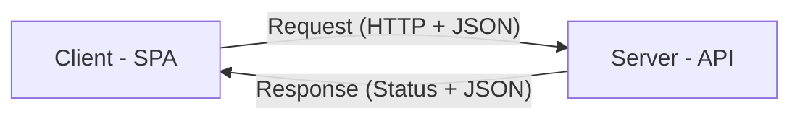

# Aula 03 - Modelagem de APIs RESTful 📡

!!! tip "Objetivo"
    **Objetivo**: Dominar os princípios do design REST, aprender a usar corretamente os métodos HTTP, interpretar códigos de status e criar contratos de API profissionais e intuitivos.

---

## 1. O que é REST? 🧊

REST (**Representational State Transfer**) não é uma linguagem nem um framework, mas um **estilo arquitetural** para sistemas distribuídos.

### Princípios Fundamentais:
1.  **Client-Server**: Separação clara entre quem pede (Frontend) e quem atende (Backend).
2.  **Stateless**: Cada requisição deve conter toda a informação necessária. O servidor não "lembra" do cliente entre chamadas.
3.  **Cacheable**: As respostas podem (e devem) ser cacheadas para melhorar a performance.
4.  **Interface Uniforme**: Uso padronizado de recursos, métodos e identificadores (URIs).

### 🏛️ Arquitetura Client-Server (Mermaid)



---

## 2. Recursos e URIs 📍

No REST, tudo é um **recurso**. Um recurso é qualquer dado que possa ser nomeado (um usuário, um produto, um pedido).

*   **Identificação**: Usamos URIs (Uniform Resource Identifiers).
*   **Boas Práticas de Nomeação**:
    *   Use **substantivos** no plural, nunca verbos.
    *   `GET /produtos` ✅ (Bom)
    *   `GET /getTodosProdutos` ❌ (Ruim)
    *   Use hierarquia: `GET /clientes/123/pedidos` (Pedidos do cliente 123).

---

## 3. Verbos (Métodos) HTTP 🛠️

Os verbos dizem ao servidor **o que fazer** com o recurso:

| Verbo | Ação | Idempotente? |
| :--- | :--- | :--- |
| **GET** | Recupera um recurso ou lista. | Sim |
| **POST** | Cria um novo recurso. | Não |
| **PUT** | Atualiza um recurso inteiro (substituição). | Sim |
| **PATCH** | Atualiza apenas parte de um recurso. | Não |
| **DELETE** | Remove um recurso. | Sim |

> **O que é Idempotência?** Significa que fazer a mesma requisição várias vezes tem o mesmo efeito que fazer uma única vez.

---

## 4. Códigos de Status (HTTP Status Codes) 🚦

A resposta do servidor deve vir com um código que indique o que aconteceu:

*   **2xx (Sucesso)**:
    *   `200 OK`: Deu tudo certo.
    *   `201 Created`: Recurso criado com sucesso (usado no POST).
    *   `204 No Content`: Sucesso, mas não há nada para retornar (usado no DELETE).
*   **4xx (Erro do Cliente)**:
    *   `400 Bad Request`: Requisição inválida (falta de dados).
    *   `401 Unauthorized`: Falta de autenticação.
    *   `403 Forbidden`: Autenticado, mas sem permissão.
    *   `404 Not Found`: Recurso não existe.
*   **5xx (Erro do Servidor)**:
    *   `500 Internal Server Error`: O servidor "quebrou".

---

## 5. O Formato JSON 🏗️

O JSON (**JavaScript Object Notation**) é o padrão de facto para troca de dados em APIs REST por ser leve e fácil de ler (por humanos e máquinas).

```json
{
  "id": 123,
  "nome": "Smartphone X",
  "preco": 1500.00,
  "disponivel": true,
  "categorias": ["Eletrônicos", "Ofertas"]
}
```

### 🖥️ Testando Verbos no Terminal

<!-- termynal -->
```termynal
# Listar produtos
$ curl -X GET http://localhost:3000/produtos

# Criar um produto
$ curl -X POST http://localhost:3000/produtos -d '{"nome": "Mouse"}'

# Deletar um produto
$ curl -X DELETE http://localhost:3000/produtos/123
```

---

## 6. Mini-Projeto: Desenhando um Contrato ✍️

Imagine que você está criando uma API para uma **Biblioteca**.

1.  Defina a URI para listar todos os livros.
2.  Defina a URI e o Verbo para cadastrar um novo livro.
3.  Qual Status Code você retornaria se alguém tentasse deletar um livro que não existe?
4.  Desenhe o JSON de um objeto "Livro" com pelo menos 5 campos.

---

## 7. Exercício de Fixação 🧠

1.  Diferencie `PUT` de `PATCH` com um exemplo prático.
2.  Por que não devemos usar verbos nas URIs (ex: `/deletarUsuario/123`)?
3.  O que significa uma API ser "Stateless"?

---

**Próxima Aula**: Vamos aprender a documentar essas APIs com [Swagger e criar Mocks](./aula-04.md)! 📝
