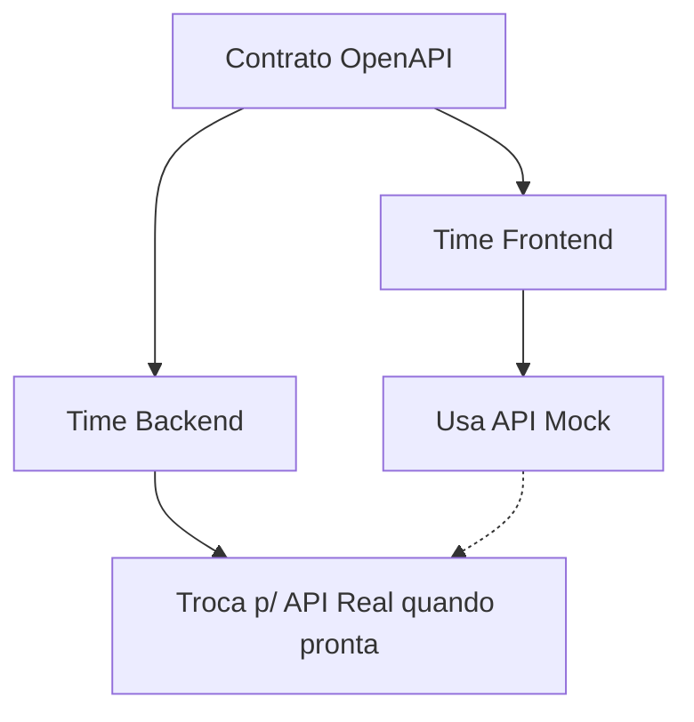

# Aula 04 - Documentação (Swagger) e Mock de APIs 📝

!!! tip "Objetivo"
    **Objetivo**: Compreender a importância da documentação para a Developer Experience (DX), aprender a usar o Swagger/OpenAPI para documentar contratos e entender como os Mocks permitem o desenvolvimento paralelo entre frontend e backend.

---

## 1. Por que documentar APIs? 🧐

Uma API sem documentação é como um labirinto no escuro. Se outros desenvolvedores (ou você mesmo no futuro) não souberem como chamar os endpoints, a API é inútil.

### Benefícios:
*   **Developer Experience (DX)**: Facilita o consumo da API por terceiros.
*   **Single Source of Truth**: O contrato documentado é a verdade absoluta do sistema.
*   **Redução de Erros**: Menos ambiguidades sobre tipos de dados e status codes.
*   **Automação**: Permite gerar clientes e testes automaticamente.

---

## 2. OpenAPI e Swagger 🛠️

O **OpenAPI** (antigamente chamado de Swagger) é o padrão mundial para descrever APIs RESTful. 

*   **Arquivo YAML/JSON**: Um arquivo que descreve rotas, parâmetros, modelos de dados e respostas.
*   **Swagger UI**: Uma ferramenta visual que transforma esse arquivo em uma página interativa onde você pode testar a API.

### 🔄 Fluxo de Desenvolvimento Paralelo (Mermaid)
Com contratos bem definidos, o time de Frontend não precisa esperar o Backend terminar.



---

```yaml
# Exemplo simplificado de OpenAPI
paths:
  /produtos:
    get:
      summary: Lista todos os produtos
      responses:
        '200':
          description: Sucesso
```

---

## 3. O Poder dos Mocks 🎭

O que fazer quando o Frontend precisa de uma API que o Backend ainda não terminou de codificar? Usamos um **Mock**.

### O que é um Mock?
É um servidor "fake" que simula o comportamento da API real. Ele recebe a requisição e retorna um dado estático pré-definido, conforme o contrato.

### 🎭 Simulando Mocks no Terminal

```termynal {markdown="1"}
# Rodando um servidor de Mock a partir de um arquivo OpenAPI
$ npx prism mock storage.yaml

# Acessando o endpoint mockado
$ curl http://localhost:4010/produtos
> [{"id": 1, "nome": "Produto Mockado"}]
```

---

## 4. Developer Experience (DX) 🚀

DX é o equivalente ao UX (User Experience), mas focado no programador. Uma API com boa DX possui:
*   Nomes intuitivos.
*   Documentação sempre atualizada.
*   Exemplos de código em várias linguagens.
*   Mensagens de erro claras (ex: `"O campo 'email' é obrigatório"` em vez de apenas `400 Bad Request`).

---

## 5. Estrutura de Documentação Profissional 📂

Uma boa documentação de endpoint deve conter:
1.  **Título e Descrição**: O que o endpoint faz?
2.  **Parâmetros**: Quais dados enviar na URL (Path) ou no Filtro (Query)?
3.  **Corpo (Body)**: Qual o esquema do JSON de entrada?
4.  **Respostas**: Quais Status Codes ele retorna e qual o JSON de saída para cada um?

---

## 6. Mini-Projeto: Criando Documentação no Swagger 🚀

Vamos criar um pequeno contrato para uma **Loja de Games**:

1.  Acesse o [Editor do Swagger](https://editor.swagger.io/).
2.  Crie um endpoint `GET /games` que retorna uma lista de objetos.
3.  Adicione um parâmetro de filtro chamado `categoria`.
4.  Crie o modelo de dados para um `Game` (id, titulo, plataforma, preco).

---

## 7. Exercício de Fixação 🧠

1.  Qual a diferença entre a Especificação OpenAPI e a Ferramenta Swagger?
2.  Como o uso de Mocks pode acelerar o cronograma de um projeto de software?
3.  Por que retornar apenas o Status Code (ex: 400) sem uma mensagem explicativa é considerado uma má prática de DX?

---

**Próxima Aula**: Fim do Módulo 1! No Módulo 2, iniciaremos a [Implementação de APIs (Controllers/Services/Rep)](./aula-05.md)! 💻