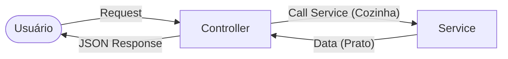

# Aula 05 - Implementação de APIs (Controllers e Rotas) ⚙️

!!! tip "Objetivo"
    **Objetivo**: Entender a camada de entrada de uma aplicação backend, aprender a mapear rotas para funções específicas e capturar parâmetros de entrada enviados pelo cliente.

---

## 1. A Camada de Controller 🎮

O **Controller** é o "maestro" de uma rota. Sua única responsabilidade é:
1.  Receber a requisição HTTP.
2.  Validar se os dados básicos estão ali.
3.  Chamar a lógica de negócio (que veremos na próxima aula).
4.  Retornar a resposta correta (Status Code + JSON).

> **Analogia**: O Controller é o garçom de um restaurante. Ele anota o pedido, leva para a cozinha e traz o prato pronto. Ele não cozinha!

### 🗺️ O Papel do Controller (Mermaid)



---

## 2. Anatomia de uma Rota 📍

Uma rota no backend é composta por:
*   **Endpoint (Path)**: O caminho (ex: `/produtos`).
*   **Verbo**: A ação (ex: `POST`).
*   **Handler**: A função que será executada quando a rota for chamada.

### Exemplo (Conceitual):
```javascript
// Quando receber um GET em /usuarios, execute a função listarUuarios
router.get('/usuarios', (req, res) => {
    const lista = [{ id: 1, nome: 'Ricardo' }];
    return res.status(200).json(lista);
});
```

---

## 3. Capturando Dados do Cliente 📥

Existem três formas principais de o cliente enviar dados:

| Tipo | Onde fica? | Exemplo | Uso Comum |
| :--- | :--- | :--- | :--- |
| **Path Params** | Na URL (como parte do caminho) | `/usuarios/123` | Identificar um recurso específico. |
| **Query Params** | Na URL (após o `?`) | `/produtos?categoria=games` | Filtros, ordenação e paginação. |
| **Request Body** | No "corpo" da mensagem | `{ "nome": "Novo Item" }` | Criação ou atualização (POST/PUT). |

---

## 4. O Objeto de Resposta (Response) 📤

Não basta retornar os dados, precisamos seguir o contrato REST.
O Controller deve garantir:
*   **Status Code Errado**: Jamais retorne `200 OK` se ocorreu um erro.
*   **Corpo Padronizado**: Envie as mensagens de erro dentro de um JSON para facilitar o trabalho do frontend.

---

## 5. Injeção de Dependência (Introdutório) 💉

Para que o Controller não tenha que "criar" outras classes, ele as recebe prontas. Isso facilita testes e troca de tecnologias.

---

## 6. Mini-Projeto: Dashboard de Usuários 👥

1.  Crie uma rota `GET /usuarios`.
2.  Crie uma rota `POST /usuarios`.
3.  Crie uma rota `DELETE /usuarios/:id`.
4.  Use o Postman para testar se os dados estão sendo recebidos e enviados corretamente.

### Testando com cURL (Terminal)

<!-- termynal -->
```termynal
$ curl -X GET http://localhost:3000/usuarios
[{"id": 1, "nome": "Ricardo"}]

$ curl -X POST http://localhost:3000/usuarios -d '{"nome": "Ana"}'
{"status": "Criado"}
```

---

## 7. Exercício de Fixação 🧠

1.  Por que o Controller não deve conter regras de negócio (ex: cálculo de desconto)?
2.  Qual a diferença prática entre usar um Query Param e um Path Param?
3.  O que acontece se um Controller tentar acessar `req.body` mas o cliente não enviou o header `Content-Type: application/json`?

---

**Próxima Aula**: Vamos tirar a lógica do Controller e levar para o lugar certo: [Services e Regras de Negócio](./aula-06.md) 🧠
