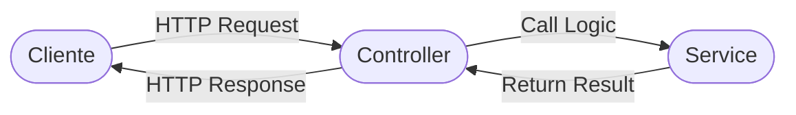

# Aula 06 - Services e Regras de Negócio 🧠

!!! tip "Objetivo"
    **Objetivo**: Entender a importância de separar a lógica de negócio da camada de transporte (HTTP), aprender a criar Services reutilizáveis e tratar erros de forma elegante.

---

## 1. Por que usar Services? 🏗️

Na aula anterior, aprendemos que o Controller é como um garçom. Ele não deve "cozinhar" (fazer cálculos ou validar regras complexas). 

Se você colocar toda a lógica no Controller:
1.  **Código Duplicado**: Se precisar da mesma lógica em outra rota, terá que copiar o código.
2.  **Difícil de Testar**: Testar lógica misturada com HTTP é muito mais complexo.
3.  **Bagunça**: O arquivo do Controller fica gigante e impossível de ler.

---

## 2. A Responsabilidade do Service ⚖️

O Service contém a **Regra de Negócio**. É aqui que o "cérebro" da aplicação reside.

**O que o Service faz:**
*   Valida se um usuário pode realizar uma ação (ex: "tem saldo suficiente?").
*   Realiza cálculos (ex: "qual o valor do desconto progressivo?").
*   Transforma dados antes de salvar (ex: "criptografar a senha").
*   Lança erros claros quando algo dá errado.

---

### Fluxo de Comunicação (Mermaid)



---

## 4. Tratamento de Erros Profissional ⚠️

Services não devem se preocupar com Status Codes (isso é coisa do Controller). O Service deve apenas avisar que algo falhou.

```javascript
// Exemplo no Service
if (usuarioExiste) {
    throw new Error("E-mail já cadastrado"); // Lança uma exceção
}
```

O Controller, então, captura esse erro e "traduz" para o HTTP:
```javascript
// No Controller
try {
    await service.cadastrar(dados);
} catch (erro) {
    return res.status(400).json({ mensagem: erro.message });
}
```

---

## 5. ViewModels e DTOs (Data Transfer Objects) 📦

Muitas vezes, não queremos devolver todos os dados do banco para o cliente (ex: não queremos devolver a senha!).
Usamos **DTOs** para filtrar o que entra e o que sai do sistema.

### 🆚 Comparação: Componentes no Frontend
Para quem já desenvolveu no Frontend, o Service no Backend é similar ao papel de um **Hook customizado** ou uma **Store de Estado**: ambos concentram a lógica de negócio e os dados, permitindo que a "View" (ou o Controller no nosso caso) foque apenas na interação/transporte.

### Migrações no Terminal (Exemplo)

```termynal {markdown="1"}
$ npx knex migrate:make criar_tabela_usuarios
Created: 20240101_criar_tabela_usuarios.js

$ npx knex migrate:latest
Batch 1 run: 1 migrations
```

---

## 5. Mini-Projeto: Refatorando para Service 🛠️

Imagine o sistema de **Transferência Bancária**.
1.  Crie a função `transferir(origem, destino, valor)` no Service.
2.  Quais validações você faria antes de confirmar a transferência? (Saldo, conta ativa, valores negativos...).
3.  Simule o lançamento de um erro caso o saldo seja insuficiente.

---

## 7. Exercício de Fixação 🧠

1.  O que acontece com a manutenção do sistema se um Service for reaproveitado por dois Controllers diferentes?
2.  Por que o Service não deve saber que o `req` e o `res` do Express existem?
3.  Qual a vantagem de "limpar" os dados (DTO) antes de enviá-los ao cliente?

---

**Próxima Aula**: Onde guardamos esses dados? [Repositories e Banco de Dados (PostgreSQL)](./aula-07.md) 🗄️
