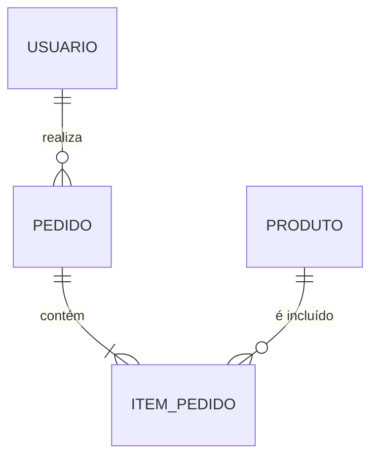

# Aula 07 - Repositories e Banco de Dados (PostgreSQL) 🗄️

!!! tip "Objetivo"
    **Objetivo**: Entender a camada de persistência, aprender os fundamentos de Bancos de Dados Relacionais (SQL) e como o padrão Repository isola o acesso aos dados da lógica de negócio.

---

## 1. Onde os dados moram? 🏠

Até agora, se reiniciarmos nosso servidor, todos os dados (usuários, produtos, etc) somem. Para que a informação sobreviva, precisamos de um **Banco de Dados**.

Neste curso, usaremos o **PostgreSQL**, um dos bancos relacionais mais robustos e utilizados no mundo backend.

---

## 2. Bancos Relacionais vs SQL 📊

Um banco relacional organiza os dados em **Tabelas** (linhas e colunas), como uma planilha de Excel gigante, mas com "superpoderes" de relacionamento.

O **SQL** (Structured Query Language) é a linguagem que usamos para falar com o banco.

### Comandos Essenciais (CRUD):
*   **CREATE**: `INSERT INTO tabela (campos) VALUES (valores);`
*   **READ**: `SELECT * FROM tabela WHERE condicao;`
*   **UPDATE**: `UPDATE tabela SET campo = valor WHERE id = 1;`
*   **DELETE**: `DELETE FROM tabela WHERE id = 1;`

---

## 3. Relacionamentos (O "Relacional") 🔗

O grande poder do SQL é ligar tabelas:
*   **1:N (Um para Muitos)**: Um *Usuário* tem muitos *Pedidos*.
*   **N:N (Muitos para Muitos)**: Um *Estudante* está em muitos *Cursos*, e um *Curso* tem muitos *Estudantes*.

### 🔗 Diagrama de Relacionamento (Mermaid)



### 📐 Performance: Teorema de CAP
Em sistemas distribuídos (como microsserviços), lidamos com o Teorema de CAP:

$$ C + A + P \implies \text{Escolha apenas dois} $$

Onde:
- **C** (Consistency): Consistência.
- **A** (Availability): Disponibilidade.
- **P** (Partition Tolerance): Tolerância a Partições.

---

## 4. O Padrão Repository 📥

Assim como o Controller não deve "cozinhar", o Service não deve saber "falar SQL". 
O Service pede os dados para o **Repository**.

**Vantagem**: Se amanhã decidirmos trocar o PostgreSQL pelo MongoDB ou por um arquivo TXT, só precisamos mudar o Repository. O Service continua igual!

```javascript
// Exemplo no Repository
async buscarPorId(id) {
    return await db.query("SELECT * FROM usuarios WHERE id = $1", [id]);
}
```

---

## 5. Migrations: O Histórico do Banco 📜

Migrations são arquivos que descrevem as mudanças no banco de dados ao longo do tempo.
*   "Criar tabela de produtos".
*   "Adicionar coluna de preço".
*   "Remover coluna de descrição".

Isso permite que toda a equipe tenha sempre a mesma estrutura de banco.

### Migrações no Terminal (Exemplo)

```termynal {markdown="1"}
$ npx knex migrate:make criar_tabela_usuarios
Created: 20240101_criar_tabela_usuarios.js

$ npx knex migrate:latest
Batch 1 run: 1 migrations
```

---

## 6. Mini-Projeto: Modelando o Banco 🏗️

Imagine um sistema de **Livraria**.
1.  Quais tabelas seriam necessárias? (Livros, Autores, Vendas).
2.  Como você ligaria um Livro ao seu Autor? (Chave Estrangeira - Foreign Key).
3  Escreva o comando SQL para buscar todos os livros que custam menos de R$ 50,00.

---

## 7. Exercício de Fixação 🧠

1.  Qual a diferença entre uma Chave Primária (Primary Key) e uma Chave Estrangeira (Foreign Key)?
2.  Por que é perigoso deixar o Service rodar comandos SQL diretamente?
3.  O que acontece se executarmos um `DELETE` sem a cláusula `WHERE`? (⚠️ Cuidado!).

---

**Próxima Aula**: Como garantir que os dados que entram no banco estão corretos? [Boas Práticas e Validação de Dados](./aula-08.md) ✅