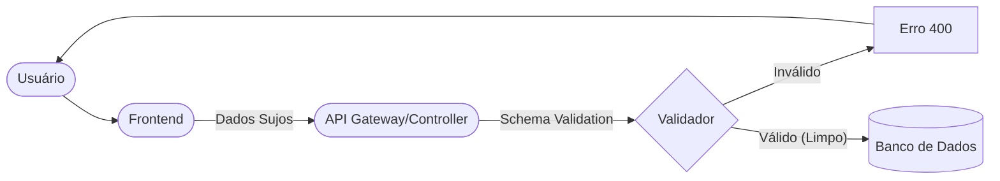

# Aula 08 - Boas Práticas e Validação de Dados ✅

!!! tip "Objetivo"
    **Objetivo**: Aprender a garantir a integridade dos dados que entram no sistema, prevenir ataques comuns e escrever um código backend limpo, sustentável e fácil de manter.

---

## 1. Por que validar? 🛡️

O lema de todo desenvolvedor backend deve ser: **"Nunca confie nos dados vindos do cliente"**. O frontend pode ter falhas ou alguém pode tentar burlar a interface e enviar dados maliciosos diretamente para a API.

Validar evita:
*   **Dados Inconsistentes**: Um produto sem preço ou um usuário sem e-mail.
*   **Crashes**: O servidor tentando processar algo que não existe.
*   **Vulnerabilidades**: Como nomes gigantes que quebram o layout ou scripts maliciosos.

---

## 2. Validação vs Sanitização 🧼

*   **Validação**: Checar se o dado está correto (ex: "Isso é um e-mail válido?", "A idade é maior que 18?").
*   **Sanitização**: Limpar o dado (ex: remover espaços em branco extras, remover tags HTML de um comentário).

---

## 3. Esquemas de Validação (Zod/Joi) 📐

Em vez de encher o Controller de `if (campo == null)`, usamos bibliotecas de **Schema Validation**. Definimos um "contrato" e a biblioteca checa tudo para nós.

```javascript
// Exemplo de esquema (Conceitual)
const usuarioSchema = {
    nome: string().min(3),
    email: string().email(),
    idade: number().min(18)
};
```

---

## 4. Tratamento Global de Erros 🚨

Não devemos colocar `try/catch` em todas as funções. O ideal é ter um **Middleware de Erro** que captura qualquer falha inesperada e envia uma resposta padrão para o cliente.

### Benefícios:
*   O código fica limpo.
*   As mensagens de erro para o cliente são amigáveis.
*   Você pode logar o erro real no servidor para o time analisar sem expor detalhes sensíveis (como queries SQL) ao usuário final.

---

## 5. Clean Code: O Backend Elegante ✨

*   **Nomes Descritivos**: `buscarUsuarioPorId` é melhor que `getUs`.
*   **Funções Pequenas**: Se uma função faz 10 coisas, ela deve ser dividida.
*   **Princípio DRY**: *Don't Repeat Yourself* (Não se repita). Se você usa o mesmo código em dois lugares, ele deve virar uma função ou utilitário.

### 🧩 Arquitetura de Validação (Mermaid)
Um bom fluxo de dados garante que apenas informações limpas cheguem ao core da sua aplicação.



---

## 6. Mini-Projeto: O Validador de Produtos 🛒

Crie o esquema de validação para o cadastro de um **Produto de E-commerce**.
*   `nome`: Obrigatório, mínimo 5 caracteres.
*   `preco`: Obrigatório, deve ser maior que zero.
*   `estoque`: Inteiro, não pode ser negativo.
*   `categoria`: Deve ser uma das opções: 'Eletrônicos', 'Roupas' ou 'Alimentos'.

---

## 7. Exercício de Fixação 🧠

1.  Qual a diferença entre uma falha de validação (erro 400) e um erro inesperado no servidor (erro 500)?
2.  Por que sanitizar o texto de um comentário de usuário antes de salvá-lo no banco?
3.  O que acontece se uma API retornar detalhes técnicos do banco de dados (Stack Trace) em uma mensagem de erro para o cliente? (Dica: pense em segurança).

---

**Próxima Aula**: Entrando no Módulo 3! [Segurança e Autenticação com JWT](./aula-09.md) 🔐
