# Aula 09 - Segurança e Autenticação com JWT 🔐

!!! tip "Objetivo"
    **Objetivo**: Entender os conceitos de Autenticação e Autorização, aprender como funciona o padrão JWT (JSON Web Token) e como implementar um login seguro e sem estado (stateless).

---

## 1. Autenticação vs Autorização 🚦

Embora pareçam iguais, são processos diferentes:
*   **Autenticação**: "Quem é você?" (Validar e-mail e senha).
*   **Autorização**: "O que você pode fazer?" (Checar se você tem permissão de Admin, por exemplo).

---

## 2. O Problema das Sessões (Stateful) 🍪

Antigamente, o servidor guardava uma "sessão" na memória para cada usuário logado.
*   **Problema**: Se você tivesse 1 milhão de usuários, a memória do servidor estourava.
*   **Problema 2**: Se você tivesse dois servidores, o segundo não conheceria a sessão guardada no primeiro.

---

## 3. A Solução: JWT (Stateless) 🎫

O **JWT (JSON Web Token)** é como um "crachá digital". O servidor não guarda nada na memória. Ele entrega o crachá assinado para o usuário, e o usuário deve apresentar esse crachá em todas as próximas requisições.

### Estrutura do JWT:
O token é composto por 3 partes separadas por pontos (`.`):
1.  **Header**: Tipo do token e algoritmo de criptografia.
2.  **Payload**: Os dados do usuário (ex: id, nome, permissões). **Atenção**: Não guarde senhas aqui, pois o payload é apenas codificado, não encriptado!
3.  **Signature**: A "assinatura digital" que garante que o token não foi alterado.

---

## 4. O Fluxo do Login 🌊

1.  **Cliente** envia e-mail e senha.
2.  **Servidor** valida os dados no banco.
3.  **Servidor** gera um JWT usando uma "Chave Secreta" e envia para o cliente.
4.  **Cliente** armazena o token (geralmente no `localStorage`).
5.  **Cliente** envia o token no header `Authorization` em todas as rotas protegidas.

### Fluxo de Login JWT (Mermaid)

```mermaid
sequenceDiagram
    participant C as Cliente/App
    participant S as Servidor/API
    participant DB as Banco de Dados
    
    C->>S: POST /login (email, senha)
    S->>DB: Buscar usuário
    DB-->>S: Usuário encontrado
    S->>S: Assinar JWT (Secret)
    S-->>C: Retorna Token (Crachá)
    C->>S: GET /perfil (Header: Authorization: Bearer JWT)
    S->>S: Validar Assinatura
    S-->>C: Dados do Perfil
```



---

## 5. Implementando no Backend ⚡

Usamos bibliotecas como `jsonwebtoken` para assinar e validar os tokens.

```javascript
// Gerando o token
const token = jwt.sign({ id: user.id }, 'CHAVE_SUPER_SECRETA', { expiresIn: '1d' });
```

### 🆚 Comparação: Keychain / EncryptedSharedPreferences (Mobile)
No Mobile, o JWT deve ser guardado com segurança máxima.
*   **Web**: Usamos `Cookies` (HttpOnly) ou `localStorage` (com cautela).
Nunca guarde o JWT em texto simples no dispositivo!

### Verificando Token no Terminal

```termynal {markdown="1"}
$ export TOKEN="seu_jwt_aqui"
$ curl -H "Authorization: Bearer $TOKEN" http://localhost:3000/perfil
{"nome": "Ricardo", "role": "admin"}
```

---

## 6. Mini-Projeto: Gerador de Tokens 🛠️

1.  Crie uma função `login(email, senha)`.
2.  Se o e-mail for "admin@teste.com" e a senha "123456", gere um JWT com o payload `{ role: 'admin' }`.
3.  Defina que esse token deve expirar em apenas 1 hora (`1h`).

---

## 7. Exercício de Fixação 🧠

1.  Por que o JWT é chamado de "Stateless" (Sem estado)?
2.  O que acontece se uma pessoa mal-intencionada mudar o `role` de 'user' para 'admin' dentro do Payload do JWT? Por que a assinatura (Signature) impede isso?
3.  Qual o perigo de usar uma "Chave Secreta" muito Curta ou óbvia (ex: "123")?

---

**Próxima Aula**: Como proteger rotas específicas? [Controle de Acesso (RBAC) e Permissões](./aula-10.md) 🛡️
