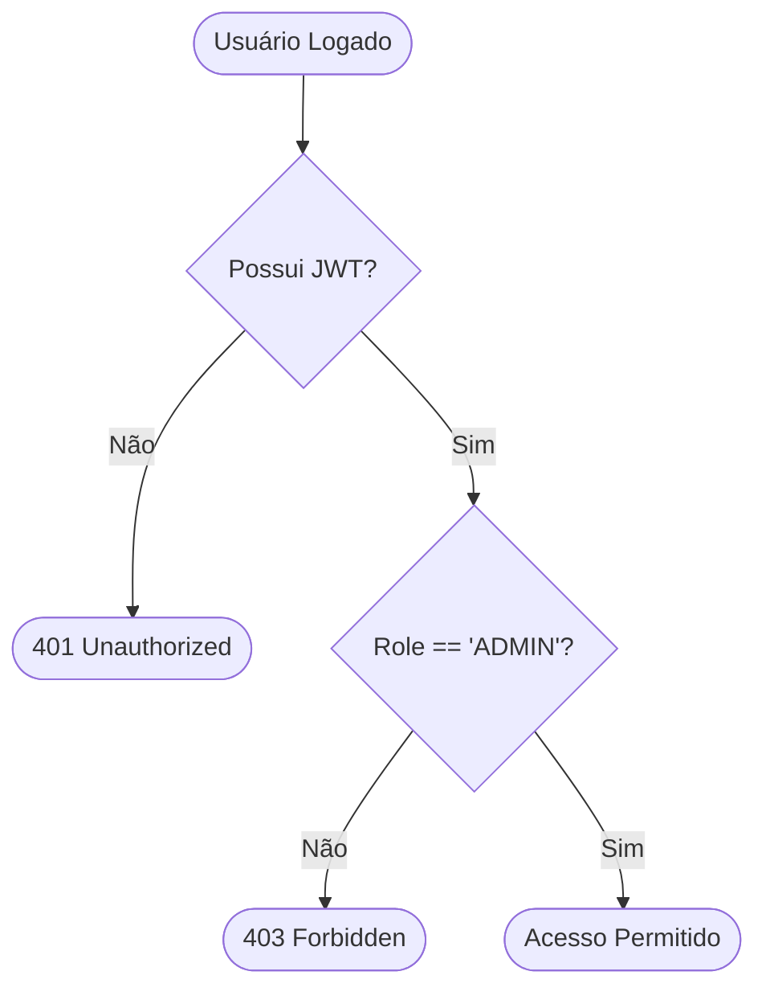

# Aula 10 - Controle de Acesso (RBAC) e Permissões 🛡️

!!! tip "Objetivo"
    **Objetivo**: Aprender a restringir o acesso a partes específicas da aplicação baseando-se no nível do usuário (Roles), utilizando o padrão RBAC (Role-Based Access Control) e Middlewares de autorização.

---

## 1. O que é RBAC? 👑

O **RBAC (Role-Based Access Control)** é um sistema onde você não dá permissão para um *usuário* específico, mas sim para um *perfil* (Role).
*   **ADMIN**: Pode criar, editar e deletar tudo.
*   **EDITOR**: Pode criar e editar, mas não deletar.
*   **CLIENTE**: Pode apenas visualizar o que é dele.

---

## 2. Middlewares de Autorização 🚧

Na aula passada, vimos a autenticação (login). Agora, precisamos de uma "cancela" que checa se o usuário logado tem o perfil certo para entrar em uma rota.

**Como funciona:**
1.  O usuário envia o JWT.
2.  O **Middleware de Autenticação** valida o token e extrai o `id` e o `role`.
3.  O **Middleware de Autorização** checa: "Esse `role` está na lista de perfis permitidos?".

---

## 3. Implementando a Trava de Acesso 🔒

Criamos funções que geram middlewares dinamicamente.

```javascript
// Exemplo conceitual
function autorizar(perfilNecessario) {
    return (req, res, next) => {
        if (req.usuario.role !== perfilNecessario) {
            return res.status(403).json({ mensagem: "Acesso Negado: Você não é um " + perfilNecessario });
        }
        next(); // Tudo certo, pode passar!
    };
}
```

---

## 4. Diferença entre 401 e 403 ❌

Estes dois códigos de erro são fundamentais no mundo da segurança:
*   **401 Unauthorized**: "Não sei quem você é" (Token inválido, expirado ou ausente).
*   **403 Forbidden**: "Eu sei quem você é, mas você não tem permissão para entrar aqui" (Ex: Cliente tentando entrar em rota de Admin).

---

## 5. Hierarquia de Permissões 🏛️

Em sistemas complexos, um Admin geralmente tem todas as permissões dos perfis abaixo dele.
*   Se uma rota permite `EDITOR`, o `ADMIN` também deve conseguir entrar automaticamente.

### Fluxo RBAC (Mermaid)



---

## 5. Testando Permissões no Terminal 💻

Simulando o acesso de um usuário comum tentando entrar em uma área de Admin.

```termynal {markdown="1"}
# Usuário tenta acessar rota de Admin
$ curl -H "Authorization: Bearer TOKEN_USUARIO" http://localhost:3000/admin/delete-all
# Resposta do servidor (Middleware barrou)
> 403 Forbidden: Acesso Negado
```

---

## 6. Mini-Projeto: O Gerente de Notificações 📢

Imagine um app escolar.
1.  Crie uma rota `/avisos/enviar`.
2.  Apenas usuários com o role `PROFESSOR` ou `DIRETOR` podem acessar essa rota.
3.  Implemente o middleware que barra usuários do tipo `ALUNO`.

---

## 7. Exercício de Fixação 🧠

1.  Por que é melhor usar Roles (Perfis) em vez de dar permissões específicas para cada ID de usuário?
2.  Em qual parte do token JWT costumamos guardar o `role` do usuário?
3.  Uma rota protegida deve primeiro passar pelo middleware de Autenticação ou pelo de Autorização? Por quê?

---

**Próxima Aula**: Como manter o usuário logado com segurança? [Refresh Token e Segurança Avançada](./aula-11.md) 🧵
