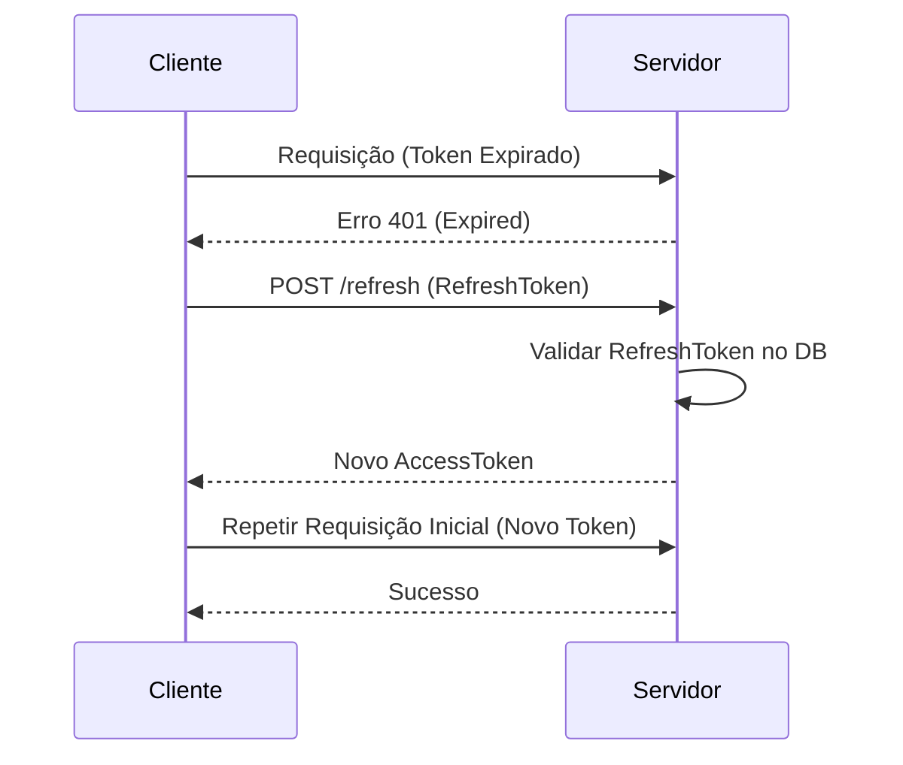

# Aula 11 - Refresh Token e Segurança Avançada 🏗️

!!! tip "Objetivo"
    **Objetivo**: Aprender a lidar com a expiração de tokens usando o padrão Refresh Token, configurar políticas de acesso com CORS e fortalecer o servidor contra ataques comuns usando Headers de Segurança (Helmet).

---

## 1. O Problema do Token Expirado ⏰

Tokens JWT devem ter vida curta (ex: 15 minutos).
*   **Se for eterno**: Se alguém roubar o celular, terá acesso para sempre.
*   **Se for curto**: O usuário terá que fazer login a cada 15 minutos (péssima experiência!).

### A Solução: Refresh Token 🔁
Quando o usuário faz login, ele recebe dois tokens:
1.  **Access Token**: Curto (15 min). Usado em cada requisição.
2.  **Refresh Token**: Longo (7 dias). Guardado no Banco de Dados. Ele serve apenas para pedir um novo Access Token quando o antigo expirar.

### Flow de Refresh (Mermaid)



---

## 2. CORS: Quem pode me chamar? 🌍

O **CORS (Cross-Origin Resource Sharing)** é uma trava que o navegador usa.
*   Se o seu site está em `meusite.com` e tenta chamar sua API em `api.com`, o navegador bloqueia por segurança, a menos que o servidor da API diga explicitamente: "Eu aceito chamadas de `meusite.com`".

**No Backend (Express):**
```javascript
app.use(cors({
  origin: 'https://meusite.com'
}));
```

---

## 3. Helmet: Blindando os Headers 🪖

O **Helmet** é uma biblioteca que configura automaticamente vários cabeçalhos HTTP de segurança para esconder informações do seu servidor (ex: esconder que você usa Express) e prevenir ataques de injeção de scripts (XSS).

```javascript
const helmet = require('helmet');
app.use(helmet());
```

---

## 4. Proteção contra Brute Force 🔨

Se um hacker tentar 1 milhão de senhas por segundo, ele vai acabar entrando.
*   **Rate Limit**: Limitamos que o mesmo IP só pode tentar o login 5 vezes a cada minuto.
*   Se passar disso, o IP é bloqueado temporariamente.

### Testando Segurança (Terminal)

```termynal {markdown="1"}
$ curl -I http://localhost:3000
HTTP/1.1 200 OK
X-Content-Type-Options: nosniff
X-Frame-Options: SAMEORIGIN
Strict-Transport-Security: max-age=15552000; includeSubDomains
```

---

## 5. XSS e SQL Injection (Revisão) ⚔️

*   **XSS**: Injeção de scripts maliciosos no HTML. Previna limpando (sanitizando) o que o usuário digita.
*   **SQL Injection**: Vimos na Aula 08. Use sempre Query Parameters ou ORMs.

---

## 6. Mini-Projeto: O Flow do Refresh 🔄

1.  Crie uma rota `/refresh`.
2.  Essa rota deve receber um `refreshToken`.
3.  Valide o token no banco de dados.
4.  Se for válido, gere um NOVO `accessToken` e devolva para o usuário.

---

## 7. Exercício de Fixação 🧠

1.  Por que guardamos o Refresh Token no Banco de Dados, mas o Access Token não (Stateless)?
2.  O que acontece se você configurar o CORS com `origin: '*'`? Por que isso é perigoso em produção?
3.  Qual a vantagem de usar o Helmet em um servidor em vez de configurar cada Header manualmente?

---

**Próxima Aula**: Fim do Módulo de Segurança! Vamos entrar no mundo das Aplicações Web Modernas? [Introdução a SPAs e Frontend Moderno](./aula-12.md) 🎨