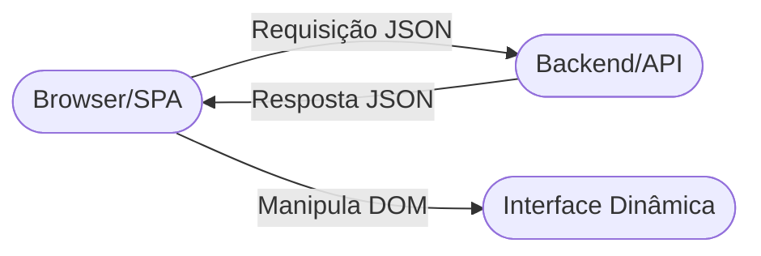

# Aula 12 - Introdução ao Frontend Moderno (React) ⚛️

!!! tip "Objetivo"
    **Objetivo**: Entender o que são Single Page Applications (SPAs), conhecer o ecossistema do React e aprender a arquitetura baseada em componentes.

---

## 1. O que é uma SPA? 📄

Antigamente, cada clique em um site fazia a página "piscar" e recarregar tudo do zero (HTML, CSS, JS). Nas **Single Page Applications (SPAs)**:
*   A página carrega apenas uma vez.
*   Quando você clica em algo, apenas o conteúdo necessário é trocado (via Javascript).
*   É muito mais rápido e parece um aplicativo de celular.

### Arquitetura SPA (Mermaid)



---

## 2. Por que React? 🚀

O **React** (criado pelo Facebook) é a biblioteca mais usada no mundo para criar interfaces modernas.
*   **Componentização**: Você cria pequenos pedaços (botões, menus, cards) e os junta como peças de LEGO.
*   **Virtual DOM**: O React é inteligente e só atualiza na tela o que realmente mudou, tornando tudo muito performático.

---

## 3. Vite: A Ferramenta de Próxima Geração ⚡

Para criar um projeto React, usamos o **Vite**. Ele é extremamente rápido para o desenvolvedor (o código carrega instantaneamente enquanto você edita).

### Criando Projeto (Terminal)

<!-- termynal -->
```termynal
$ npm create vite@latest meu-app -- --template react
$ cd meu-app
$ npm install
$ npm run dev
```

---

## 4. O Coração do React: Componentes 🧩

Um componente é apenas uma função Javascript que retorna algo parecido com HTML (chamado de **JSX**).

```jsx
function Saudacao() {
  return (
    <div className="card">
      <h1>Olá, Mundo!</h1>
      <p>Este é meu primeiro componente React.</p>
    </div>
  );
}
```

### Regras do JSX:
1.  Você deve retornar apenas **um** elemento pai (ou usar um Fragment `&lt;&gt;&lt;/&gt;`).
2.  Use `className` em vez de `class` (porque `class` é uma palavra reservada no Javascript).

---

## 5. Props: Passando Dados 🎁

Assim como passamos argumentos para funções, passamos **Props** para componentes.

```jsx
function Usuario(props) {
  return <h2>Bem-vindo, {props.nome}!</h2>;
}

// Usando o componente:
`&lt;Usuario nome="Ricardo" /&gt;`
```

---

## 6. Mini-Projeto: Dashboard de Vendas 📊

1.  Crie um componente `CardResumo` que recebe `titulo` e `valor`.
2.  Crie um componente `ListaVendas` que exibe 3 vendas falsas.
3.  Monte uma página simples juntando esses componentes.

---

## 7. Exercício de Fixação 🧠

1.  Qual a principal diferença entre um site tradicional (Multi Page) e uma SPA?
2.  Por que o uso de componentes facilita a manutenção de projetos grandes?
3.  O que é o JSX e por que ele não é exatamente HTML puro?

---

**Próxima Aula**: Como o React guarda informações? [Hooks: useState e useEffect](./aula-13.md) 🎣
