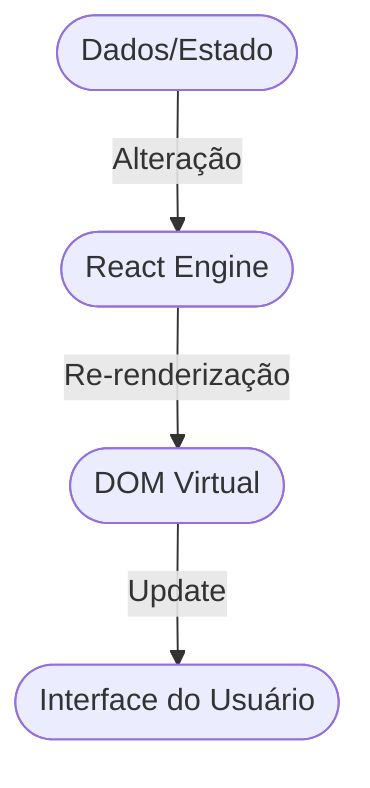

# Aula 13 - Estado e Reatividade (Hooks) 🎣

!!! tip "Objetivo"
    **Objetivo**: Aprender a tornar seus componentes vivos e interativos usando o hook `useState`, entendendo como o React reage a mudanças de dados.

### Fluxo de Reatividade (Mermaid)



---

## 1. O que é o "Estado" (State)? 🧠

Imagine um botão de curtir. O número de curtidas muda. No React, variáveis comuns NÃO fazem a tela atualizar. Para isso, usamos o **Estado**.
*   **Variável Comum**: Se o valor muda, a tela continua igual.
*   **Estado (State)**: Se o valor muda, o React redesenha (re-renderiza) o componente na tela.

---

## 2. O Hook `useState` 🎣

O `useState` é uma função especial que nos dá duas coisas: o valor atual e uma função para mudar esse valor.

```jsx
import { useState } from 'react';

function Contador() {
  // valor: o número atual | setValor: a função para mudar
  const [valor, setValor] = useState(0);

  return (
    <div>
      <p>Você clicou {valor} vezes</p>
      <button onClick={() => setValor(valor + 1)}>
        Aumentar
      </button>
    </div>
  );
}
```

---

## 3. Lidando com Eventos ⚡

No React, os eventos são muito parecidos com o HTML, mas usamos **CamelCase**:
*   `onclick` ➔ `onClick`
*   `onchange` ➔ `onChange`
*   `onsubmit` ➔ `onSubmit`

---

## 4. Inputs Controlados ⌨️

Para pegar o que o usuário digita, conectamos o valor do input ao nosso estado.

```jsx
function Formulario() {
  const [nome, setNome] = useState("");

  return (
    <div>
      <input 
        type="text" 
        value={nome} 
        onChange={(e) => setNome(e.target.value)} 
        placeholder="Digite seu nome"
      />
      <p>Olá, {nome}!</p>
    </div>
  );
}
```

---

## 5. A Regra de Ouro: Nunca mude o estado diretamente ❌

Você **nunca** deve fazer isto: `valor = valor + 1;`.
Você deve sempre usar a função disparadora: `setValor(valor + 1);`.
Isso avisa ao React: "Ei, os dados mudaram! Desenha a tela de novo!".

---

## 6. Mini-Projeto: Lista de Compras Simples 🛒

1.  Crie um input e um botão "Adicionar".
2.  Use um estado para guardar a lista (um Array).
3.  Ao clicar, adicione o texto do input no array usando `setLista([...lista, novoItem])`.
4.  Exiba a lista usando `.map()`.

---

## 7. Exercício de Fixação 🧠

1.  O que acontece com a interface se você alterar uma variável comum `let contador = 0` dentro de um componente?
2.  Para que serve o segundo item retornado pelo `useState` (a função `set...`)?
3.  Como limpamos um campo de input após o usuário clicar em um botão de enviar?

### 💻 Ambiente de Desenvolvimento (Terminal)

```termynal {markdown="1"}
$ npm run dev
VITE v5.0.0  ready in 150ms

  ➜  Local:   http://localhost:5173/
  ➜  Network: use --host to expose
```

---

**Próxima Aula**: Ciclo de Vida e APIs! [Hook: useEffect](./aula-14.md) 🕒