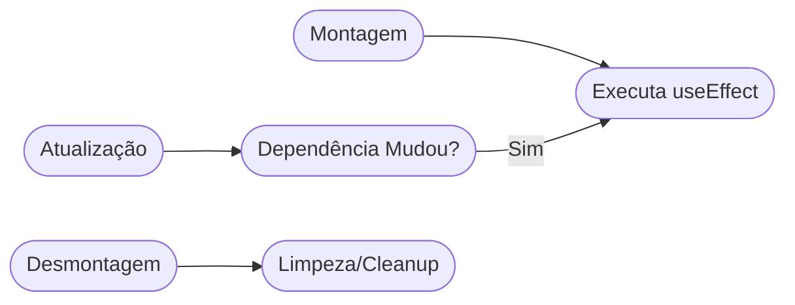

# Aula 14 - Efeitos e Chamadas de API (useEffect) 🌐

!!! tip "Objetivo"
    **Objetivo**: Entender o ciclo de vida de um componente React e aprender a buscar dados de APIs reais usando o hook `useEffect`.

### Ciclo de Vida (Mermaid)



---

## 1. O que são "Efeitos Colaterais"? 🧪

Em um componente, a tarefa principal é desenhar a tela. Qualquer coisa que aconteça "por fora" disso é um efeito colateral:
*   Buscar dados em uma API. <!-- .element: class="fragment" -->
*   Mudar o título da aba do navegador. <!-- .element: class="fragment" -->
*   Configurar um cronômetro (timer). <!-- .element: class="fragment" -->

---

## 2. O Hook `useEffect` 🕒

O `useEffect` permite que você execute código em momentos específicos:
1.  Quando o componente aparece na tela (Montagem).
2.  Quando algum dado específico muda.
3.  Sempre que o componente atualiza.

```jsx
import { useEffect, useState } from 'react';

function Exemplo() {
  useEffect(() => {
    console.log("O componente apareceu na tela!");
  }, []); // [] = Array de dependências vazio significa "executa só uma vez"
}
```

---

## 3. O Array de Dependências 🗃️

É o segundo argumento do `useEffect`. Ele diz ao React quando rodar o efeito de novo:
*   `[]`: Roda apenas na montagem.
*   `[contador]`: Roda na montagem e toda vez que `contador` mudar.
*   **Sem array**: Roda em toda e qualquer atualização (Cuidado! Pode causar loops infinitos).

---

## 4. Buscando Dados de uma API (Fetch) 📨

Vamos usar a API do GitHub como exemplo:

```jsx
function PerfilGithub() {
  const [usuario, setUsuario] = useState(null);

  useEffect(() => {
    fetch("https://api.github.com/users/ricardotecpro")
      .then(response => response.json())
      .then(data => setUsuario(data));
  }, []);

  if (!usuario) return <p>Carregando...</p>;

  return (
    <div>
      <h1>{usuario.name}</h1>
      
    </div>
  );
}
```

### Consumindo API (Terminal)

```termynal {markdown="1"}
$ curl https://api.github.com/users/ricardotecpro
{
  "login": "ricardotecpro",
  "name": "Ricardo Tec Pro",
  "bio": "Desenvolvedor Full Stack"
}
```

---

## 5. Boas Práticas: Loading e Error 🛡️

Sempre que fizermos uma chamada de rede, devemos tratar três estados:
1.  **Loading**: "Aguarde, estamos buscando...".
2.  **Success**: Exibir os dados.
3.  **Error**: "Ops, algo deu errado!".

---

## 6. Mini-Projeto: Dashboard de Clima ☁️

1.  Crie um estado para a cidade e outro para os dados do clima.
2.  Use o `useEffect` para buscar os dados de uma API de clima sempre que a cidade mudar.
3.  Exiba a temperatura e a condição atual.

---

## 7. Exercício de Fixação 🧠

1.  O que acontece se esquecermos de passar o array de dependências `[]` em um `useEffect` que faz um `fetch` e atualiza o estado?
2.  Como fazemos para que um efeito seja executado apenas quando uma variável `ID` mudar?
3.  Para que serve o comando `response.json()` após uma chamada de `fetch`?

---

**Próxima Aula**: Navegação entre telas! [React Router](./aula-15.md) 🚦
