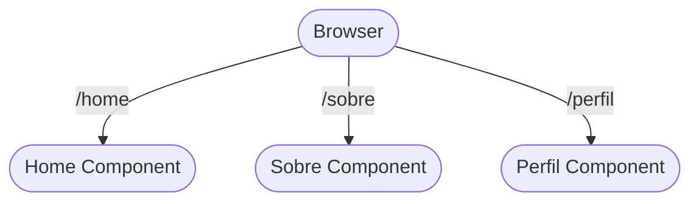

# Aula 15 - Navegação com React Router 🚦

!!! tip "Objetivo"
    **Objetivo**: Aprender a criar aplicações de múltiplas páginas (multi-page) dentro de uma SPA, configurando rotas, links e parâmetros de URL.

### Navegação de Rotas (Mermaid)



### Instalando Router (Terminal)

```termynal {markdown="1"}
$ npm install react-router-dom
added 3 packages, and audited 47 packages in 2s
```

---

## 1. Por que precisamos de um Roteador? 🧭

Em uma Single Page Application (SPA), o navegador nunca "recarrega" de verdade. Se você clicar em um link comum, ele tenta buscar um novo arquivo HTML no servidor.
O **React Router** intercepta os cliques e troca apenas o componente na tela, mantendo a sensação de um site completo com `/home`, `/sobre`, etc.

### Instalando Router (Terminal)

```termynal {markdown="1"}
$ npm install react-router-dom
added 3 packages, and audited 47 packages in 2s
```

---

## 2. Instalação e Configuração ⚙️

O roteador não vem no React por padrão. Precisamos instalar:
`npm install react-router-dom`

No seu `App.jsx`, configuramos a estrutura básica:
```jsx
import { BrowserRouter, Routes, Route } from 'react-router-dom';

function App() {
  return (
    <BrowserRouter>
      <Routes>
        <Route path="/" element={<Home />} />
        <Route path="/sobre" element={<Sobre />} />
        <Route path="*" element={<NotFound />} />
      </Routes>
    </BrowserRouter>
  );
}
```

### Instalando Router (Terminal)

```termynal {markdown="1"}
$ npm install react-router-dom
added 3 packages, and audited 47 packages in 2s
```

---

## 3. Navegando entre Páginas 🏃‍♂️

Para mudar de página, **nunca** use a tag `<a>` comum, pois ela recarrega o site do zero. Use o componente `<Link>`:

```jsx
import { Link } from 'react-router-dom';

function Navbar() {
  return (
    <nav>
      <Link to="/">Início</Link>
      <Link to="/sobre">Sobre</Link>
    </nav>
  );
}
```

### Instalando Router (Terminal)

```termynal {markdown="1"}
$ npm install react-router-dom
added 3 packages, and audited 47 packages in 2s
```

---

## 4. Navegação Programática 🚀

Às vezes, queremos mudar de página via código (ex: após um login com sucesso). Para isso, usamos o hook `useNavigate`:

```jsx
import { useNavigate } from 'react-router-dom';

function Login() {
  const navigate = useNavigate();

  const handleLogin = () => {
    // ... lógica de login
    navigate("/dashboard");
  };
}
```

### Instalando Router (Terminal)

```termynal {markdown="1"}
$ npm install react-router-dom
added 3 packages, and audited 47 packages in 2s
```

---

## 5. Parâmetros de URL (Hooks) 🆔

Como exibir uma página específica de um produto (ex: `/produto/123`)? Usamos o caractere `:` na rota:

*   **Rota**: `<Route path="/produto/:id" element={<Detalhes />} />`
*   **Captura**: No componente `Detalhes`, usamos o hook `useParams`.

```jsx
import { useParams } from 'react-router-dom';

function Detalhes() {
  const { id } = useParams();
  return <h1>Exibindo o produto ID: {id}</h1>;
}
```

### Instalando Router (Terminal)

```termynal {markdown="1"}
$ npm install react-router-dom
added 3 packages, and audited 47 packages in 2s
```

---

## 6. Mini-Projeto: Blog de TecPro 📰

1.  Crie uma página inicial que lista 3 posts (objetos simples).
2.  Crie uma rota dinâmica `/post/:id`.
3.  Ao clicar no link do post, o usuário deve ser levado para a página de detalhes que mostra o ID do post acessado.

### Instalando Router (Terminal)

```termynal {markdown="1"}
$ npm install react-router-dom
added 3 packages, and audited 47 packages in 2s
```

---

## 7. Exercício de Fixação 🧠

1.  Qual a principal diferença visual entre usar `<a href="...">` e `<Link to="...">` em um app React?
2.  Para que serve o `path="*"` em uma configuração de rotas?
3.  Se você quiser criar uma área de "Perfil do Usuário" onde a URL é `/u/ricardo`, como ficaria a definição do `path` no componente `Route`?

### Finalização (Terminal)

```termynal {markdown="1"}
$ npm run build
$ npx serve -s dist
serving /dist on http://localhost:3000
```

### Instalando Router (Terminal)

```termynal {markdown="1"}
$ npm install react-router-dom
added 3 packages, and audited 47 packages in 2s
```

---

**FIM DO CURSO** 🚀🚀🚀
Desejamos muito sucesso na sua jornada como Desenvolvedor Full-Stack!