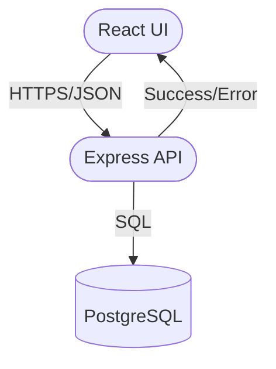

# Aula 16 - Projeto Final e Conclusão 🏆

!!! tip "Objetivo"
    **Objetivo**: Aplicar TODO o conhecimento adquirido (Node.js, Express, JWT, RBAC, React, Hooks e Router) para criar uma aplicação Full-Stack completa e funcional.

### Integração Full-Stack (Mermaid)



---

## 1. O Desafio Final: "TecPro Connect" 🔗

Você deve criar uma plataforma web completa que conecte seu Frontend ao seu Backend. Escolha UM dos temas abaixo ou crie o seu:

1.  **Gerenciador de Tarefas Cloud**: Sistema de login, cadastro de tarefas com categorias, salvamento no banco de dados e filtros de status.
2.  **Mini E-commerce**: Listagem de produtos vindo da API, página de detalhes, "carrinho" (estado global) e simulação de checkout.
3.  **Rede Social de Bolso**: Postagem de mensagens (tweets), perfil de usuário dinâmico e curtidas (likes) em tempo real.
4.  **Sistema de Chamados (Helpdesk)**: Usuário abre o ticket (Frontend) e o Admin visualiza e altera o status (Backend com permissões RBAC).

---

## 2. Requisitos Obrigatórios (Checkout) 📋

O projeto integrado deve conter obrigatoriamente:
- [ ] **Backend em Node.js**: Pelo menos 3 rotas protegidas por JWT.
- [ ] **Frontend em React**: Interface moderna, responsiva e baseada em componentes.
- [ ] **Integração (Fetch)**: O site deve buscar dados reais da sua API local ou hospedada.
- [ ] **Navegação**: Uso de `React Router` para pelo menos 3 páginas (Login, Home, Perfil).
- [ ] **Estado**: Uso de `useState` e `useEffect` para gerenciar os dados.

---

## 3. Dicas para um Portfólio Arrasador ✨

Para que seu projeto chame a atenção de empresas:
1.  **README.md Profissional**: Explique o problema que você resolveu, como rodar o projeto (frontend e backend) e liste as tecnologias (ex: Vite, Express, Helmet).
2.  **Tratamento de Erros**: Se o servidor cair, o frontend deve avisar o usuário amigavelmente.
3.  **Aesthetics**: Capriche no CSS! Use cores harmônicas e uma tipografia limpa.
4.  **Segurança**: Não esqueça de configurar o CORS no backend para aceitar os pedidos do seu frontend.

---

## 4. Onde continuar estudando? 📚

A jornada de um desenvolvedor Full-Stack está apenas começando. O que aprender agora?
1.  **TypeScript**: O "superpoder" do Javascript para evitar erros de tipos.
2.  **Bancos de Dados SQL**: Postgres ou MySQL para aplicações ainda mais robustas.
3.  **Next.js**: O framework React que domina o mercado atual (com SSR e rotas nativas).
4.  **Docker**: Para empacotar sua aplicação e rodar em qualquer lugar.

---

## 5. Mensagem Final 🌟

Parabéns! Você saiu do básico de requisições HTTP e hoje é capaz de construir uma ponte sólida entre o usuário e os dados. Você domina a arte de criar APIs seguras e interfaces vivas.

> "A tecnologia é apenas uma ferramenta. Em termos de conseguir que as pessoas trabalhem juntas e as motivem, o desenvolvedor é o artista."

### Finalização (Terminal)

```termynal {markdown="1"}
$ npm run build
$ npx serve -s dist
serving /dist on http://localhost:3000
```

---

**FIM DO CURSO** 🚀🚀🚀
Desejamos muito sucesso na sua jornada como Desenvolvedor Full-Stack!
