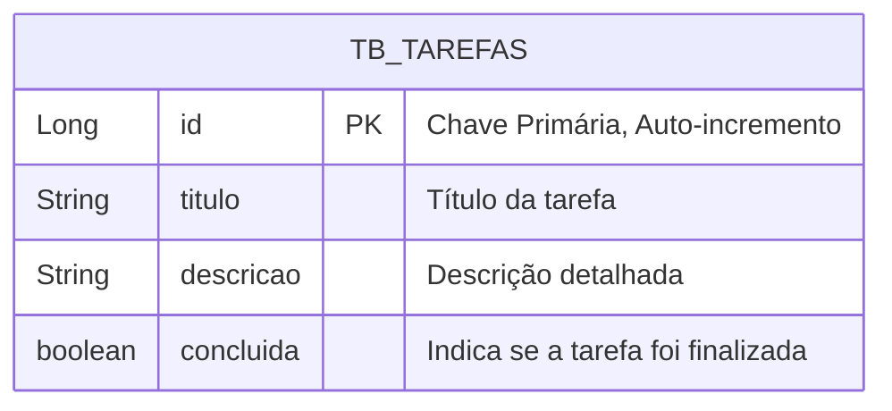

# 🚀 Projeto Lista de Tarefas" (To-Do List)
 v1.0

Este guia é uma sequência didática projetada para ensinar, passo a passo, como construir uma API RESTful robusta e moderna utilizando Spring Boot. Vamos abordar desde a configuração inicial até práticas avançadas de engenharia de software.

## 🎯 Objetivo

Ao final deste tutorial, você terá construído uma API completa para um sistema de "Lista de Tarefas" (To-Do List), capaz de realizar as operações de **Criar, Ler, Atualizar e Deletar** (CRUD).

## 🛠️ Módulo 1: Preparando o Terreno

### 1.1 - Configurando o Projeto

Vamos começar criando nosso projeto com o **Spring Initializr**, a ferramenta oficial para iniciar projetos Spring.

1.  Acesse [start.spring.io](https://start.spring.io).
2.  Preencha os metadados do projeto:
    *   **Project**: `Maven`
    *   **Language**: `Java`
    *   **Spring Boot**: Use a versão estável mais recente (ex: 3.x.x).
    *   **Group**: `br.com.curso`
    *   **Artifact**: `todolist-api`
    *   **Packaging**: `Jar`
    *   **Java**: `21` (ou a versão que você tiver instalada)
3.  Adicione as seguintes dependências (`Dependencies`):
    *   `Spring Web`: Para criar APIs REST.
    *   `Spring Data JPA`: Para facilitar o acesso a dados.
    *   `H2 Database`: Um banco de dados em memória, ótimo para desenvolvimento.
    *   `Lombok`: Para reduzir código repetitivo (getters, setters, etc.).
    *   `Spring Boot DevTools`: Para reinicializações automáticas durante o desenvolvimento.
4.  Clique em **GENERATE** e extraia o arquivo `.zip` em seu computador.

### 1.2 - Estrutura Inicial do Projeto

Após abrir o projeto em sua IDE (IntelliJ, VS Code, Eclipse), a estrutura de pastas será a seguinte:

```
todolist-api/
├── pom.xml                # Arquivo de configuração do Maven com nossas dependências
└── src/
    ├── main/
    │   ├── java/
    │   │   └── br/com/curso/todolist/api/
    │   │       └── TodolistApiApplication.java  # Ponto de entrada da aplicação
    │   └── resources/
    │       └── application.properties         # Configurações da aplicação
    └── test/
        └── ...
```

### 1.3 - Configurando o Banco de Dados

Abra o arquivo `src/main/resources/application.properties` e adicione as seguintes linhas para configurar nosso banco de dados H2 em memória:

```properties
# Nome da aplicação
spring.application.name=todolist-api

# Habilita o console web do H2 para visualizarmos o banco
spring.h2.console.enabled=true
spring.h2.console.path=/h2-console

# Configurações de conexão com o banco
spring.datasource.url=jdbc:h2:mem:testdb
spring.datasource.driverClassName=org.h2.Driver
spring.datasource.username=sa
spring.datasource.password=

# Informa ao Hibernate qual "dialeto" SQL usar
spring.jpa.database-platform=org.hibernate.dialect.H2Dialect

# Garante que as tabelas sejam criadas antes de tentar inserir dados
spring.jpa.defer-datasource-initialization=true
```

## 📦 Módulo 2: A Camada de Dados

Nesta etapa, vamos modelar como os dados de uma "Tarefa" serão armazenados.

### 2.1 - Criando a Entidade `Tarefa`

Uma **Entidade** é uma classe Java que representa uma tabela no banco de dados.

1.  Crie um novo pacote chamado `tarefa` dentro de `br.com.curso.todolist.api`.
2.  Dentro deste pacote, crie a classe `Tarefa.java`.

```java
package br.com.curso.todolist.api.tarefa;

import jakarta.persistence.*;
import lombok.Data;

@Data // Lombok: gera getters, setters, etc.
@Entity // JPA: Marca como uma entidade
@Table(name = "tb_tarefas") // JPA: Define o nome da tabela
public class Tarefa {

    @Id // JPA: Marca como chave primária
    @GeneratedValue(strategy = GenerationType.IDENTITY) // JPA: Define a geração automática do ID
    private Long id;

    private String titulo;
    private String descricao;
    private boolean concluida;
}
```

### 2.2 - Diagrama Entidade-Relacionamento (ER)

A classe acima será mapeada para a seguinte estrutura no banco de dados:


```mermaid
erDiagram
    TB_TAREFAS {
        Long id PK "Chave Primária, Auto-incremento"
        String titulo "Título da tarefa"
        String descricao "Descrição detalhada"
        boolean concluida "Indica se a tarefa foi finalizada"
    }
```

### 2.3 - Criando o Repositório `TarefaRepository`

Um **Repositório** é uma interface que abstrai o acesso aos dados. O Spring Data JPA implementará os métodos para nós!

1.  No mesmo pacote `tarefa`, crie a interface `TarefaRepository.java`.

```java
package br.com.curso.todolist.api.tarefa;

import org.springframework.data.jpa.repository.JpaRepository;

public interface TarefaRepository extends JpaRepository<Tarefa, Long> {
}
```

E é só isso! Agora já temos métodos como `save()`, `findById()`, `findAll()` e `deleteById()` prontos para usar.

## 🧠 Módulo 3: A Camada de Lógica de Negócios

A camada de **Serviço** orquestra as operações e contém as regras de negócio da nossa aplicação.

1.  No pacote `tarefa`, crie a classe `TarefaService.java`.

```java
package br.com.curso.todolist.api.tarefa;

import org.springframework.stereotype.Service;
import java.util.List;

@Service // Spring: Marca como um componente de serviço
public class TarefaService {

    private final TarefaRepository tarefaRepository;

    // Injeção de dependência via construtor (prática recomendada)
    public TarefaService(TarefaRepository tarefaRepository) {
        this.tarefaRepository = tarefaRepository;
    }

    public List<Tarefa> listarTodas() {
        return tarefaRepository.findAll();
    }

    // Outros métodos (criar, atualizar, etc.) virão aqui...
}
```

## 🔌 Módulo 4: Expondo a API com o Controller

O **Controller** é a porta de entrada da nossa API. Ele recebe as requisições HTTP e as direciona para a camada de serviço.

1.  No pacote `tarefa`, crie a classe `TarefaController.java`.

```java
package br.com.curso.todolist.api.tarefa;

import org.springframework.web.bind.annotation.GetMapping;
import org.springframework.web.bind.annotation.RequestMapping;
import org.springframework.web.bind.annotation.RestController;
import java.util.List;

@RestController // Spring: Define que esta classe é um controller REST
@RequestMapping("/tarefas") // Define a URL base para todos os métodos: http://localhost:8080/tarefas
public class TarefaController {

    private final TarefaService tarefaService;

    public TarefaController(TarefaService tarefaService) {
        this.tarefaService = tarefaService;
    }

    @GetMapping // Mapeia requisições HTTP GET para este método
    public List<Tarefa> listarTarefas() {
        return tarefaService.listarTodas();
    }
}
```

### 4.1 - Testando o Primeiro Endpoint

1.  **Execute a aplicação**: Rode a classe `TodolistApiApplication.java`.
2.  **Acesse no navegador**: Abra a URL `http://localhost:8080/tarefas`.

Você deverá ver uma lista vazia `[]`, pois ainda não temos dados. Vamos adicionar alguns dados de exemplo! Crie o arquivo `src/main/resources/data.sql`:

```sql
INSERT INTO TB_TAREFAS (TITULO, DESCRICAO, CONCLUIDA) VALUES ('Configurar o Backend', 'Criar a entidade e o repositório da Tarefa.', true);
INSERT INTO TB_TAREFAS (TITULO, DESCRICAO, CONCLUIDA) VALUES ('Criar a API REST', 'Desenvolver o endpoint para listar as tarefas.', false);
```

Reinicie a aplicação e acesse a URL novamente. Agora você verá os dados em formato JSON!


-----

### 🚀 [ricardotecpro.github.io](https://ricardotecpro.github.io/)

