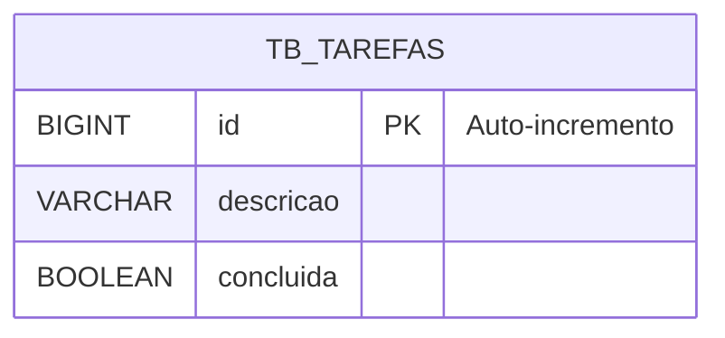
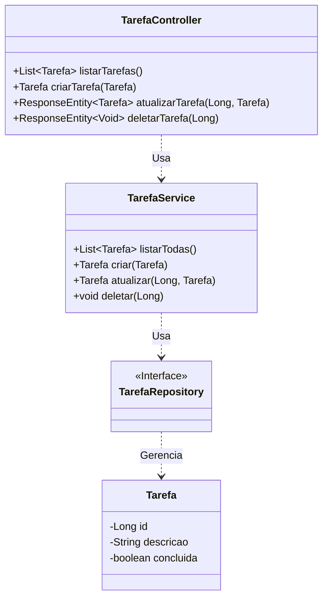

# 🚀 Projeto Lista de Tarefas" (To-Do List)
v2.0

## 🗺️ Visão Geral da Arquitetura

Neste projeto, construiremos um sistema completo de "Lista de Tarefas" (To-Do List), demonstrando como diferentes aplicações cliente podem consumir uma única fonte de dados central (API). A arquitetura final será:

  * **Um Backend (API REST):** O cérebro do sistema, desenvolvido em Java com Spring Boot.
  * **Um Cliente:**
    1.  Uma aplicação **Web** com Angular.

### Diagrama da Arquitetura

```mermaid
graph TD
    subgraph "🎛️ Gerenciamento e Automação"
        Script["🛠️ Painel de Controle (listadetarefas-painel.ps1)"]
    end

    subgraph "📱 Clientes (Frontends)"
        Web["💻 Frontend Web (Angular)"]
        Desktop["🖥️ Frontend Desktop (JavaFX)"]
        Mobile["📱 Frontend Mobile (Android)"]
    end

    subgraph "⚙️ Serviços (Backend)"
        API["🔌 Backend API (Spring Boot)"]
        DB[("🗄️ Banco de Dados Em Memória H2")]
    end

    %% Conexões de Dados
    Web -->|Requisições HTTP/JSON| API
    Desktop -->|Requisições HTTP/JSON| API
    Mobile -->|Requisições HTTP/JSON| API
    API --- DB

    %% Conexões de Gerenciamento
    Script -- Gerencia --> API
    Script -- Gerencia --> Web
    Script -- Gerencia --> Desktop
    Script -- Gerencia --> Mobile

```



-----

## ⚙️ Módulo 1: A Fundação – Backend com Spring Boot (`listadetarefas-api`)

**Objetivo:** Criar o serviço central que irá gerenciar os dados das tarefas, servindo como a única fonte de verdade para todos os clientes.

### 🛠️ Ferramentas Necessárias

  * **Java Development Kit (JDK):** Versão 17 ou superior.
  * **Apache Maven:** Ferramenta de automação de build.
  * **IDE (Ambiente de Desenvolvimento):** IntelliJ IDEA ou Eclipse.
  * **Cliente REST:** Postman ou Insomnia (para testes).

### \#\#\# 📂 Passo 1: Criação do Projeto

1.  Acesse o **Spring Initializr** ([https://start.spring.io](https://start.spring.io)).
2.  Preencha os metadados do projeto:
      * **Project:** `Maven`
      * **Language:** `Java`
      * **Spring Boot:** Versão estável mais recente (ex: 3.x.x)
      * **Group:** `br.com.curso`
      * **Artifact:** `listadetarefas-api`
      * **Package name:** `br.com.curso.listadetarefas.api`
3.  Adicione as seguintes dependências (`Dependencies`):
      * `Spring Web`, `Spring Data JPA`, `H2 Database`, `Lombok`.
4.  Clique em **GENERATE**, baixe o projeto, descompacte-o e abra na sua IDE.

#### Estrutura Inicial de Pastas

Após criar o projeto, sua estrutura de pastas principal será:

```
listadetarefas-api/
├── src/
│   └── main/
│       ├── java/
│       │   └── br/com/curso/listadetarefas/api/
│       │       └── ListadetarefasApiApplication.java
│       └── resources/
│           └── application.properties
└── pom.xml
```

### \#\#\# ⚙️ Passo 2: Configuração do Projeto

Abra o arquivo `src/main/resources/application.properties` e substitua seu conteúdo por este:

```properties
# Permite que o servidor aceite conexões de qualquer endereço de rede da máquina.
server.address=0.0.0.0

# Habilita o console web do H2
spring.h2.console.enabled=true
# Define o caminho para acessar o console
spring.h2.console.path=/h2-console

# Configurações do Datasource para H2
spring.datasource.url=jdbc:h2:mem:testdb
spring.datasource.driverClassName=org.h2.Driver
spring.datasource.username=sa
spring.datasource.password=
spring.jpa.database-platform=org.hibernate.dialect.H2Dialect
```

### \#\#\# 📝 Passo 3: Modelagem dos Dados

Vamos definir a estrutura da nossa tabela de tarefas.

#### Diagrama Entidade-Relacionamento (ER)



1.  Dentro de `src/main/java/br/com/curso/listadetarefas/api`, crie um novo pacote chamado `tarefa`.
2.  Dentro do pacote `tarefa`, crie a classe `Tarefa.java`.

<!-- end list -->

```java
// src/main/java/br/com/curso/listadetarefas/api/tarefa/Tarefa.java
package br.com.curso.listadetarefas.api.tarefa;

import jakarta.persistence.*;
import lombok.Data;

@Data
@Entity
@Table(name = "tb_tarefas")
public class Tarefa {
    @Id
    @GeneratedValue(strategy = GenerationType.IDENTITY)
    private Long id;
    private String descricao;
    private boolean concluida;
}
```

#### Estrutura de Pastas Após a Criação do Modelo

```
api/
└── src/main/java/br/com/curso/listadetarefas/api/
    ├── tarefa/
    │   └── Tarefa.java  # <- Arquivo criado
    └── ListadetarefasApiApplication.java
```

### \#\#\# 🏗️ Passo 4: Construção das Camadas de Serviço

Agora, criaremos as classes que formam a arquitetura da nossa API: `Repository` (acesso a dados), `Service` (regras de negócio) e `Controller` (endpoints HTTP).

#### Diagrama de Classes



1.  Dentro do pacote `tarefa`, crie as seguintes classes e interfaces:

**`TarefaRepository.java`**

```java
package br.com.curso.listadetarefas.api.tarefa;
import org.springframework.data.jpa.repository.JpaRepository;
public interface TarefaRepository extends JpaRepository<Tarefa, Long> {
}
```

**`TarefaService.java`**

```java
package br.com.curso.listadetarefas.api.tarefa;
import org.springframework.beans.factory.annotation.Autowired;
import org.springframework.stereotype.Service;
import java.util.List;

@Service
public class TarefaService {
    @Autowired
    private TarefaRepository tarefaRepository;

    public List<Tarefa> listarTodas() { return tarefaRepository.findAll(); }
    public Tarefa criar(Tarefa tarefa) { return tarefaRepository.save(tarefa); }
    public Tarefa atualizar(Long id, Tarefa tarefaAtualizada) {
        return tarefaRepository.findById(id)
            .map(tarefaExistente -> {
                tarefaExistente.setDescricao(tarefaAtualizada.getDescricao());
                tarefaExistente.setConcluida(tarefaAtualizada.isConcluida());
                return tarefaRepository.save(tarefaExistente);
            }).orElseThrow(() -> new RuntimeException("Tarefa não encontrada com o id: " + id));
    }
    public void deletar(Long id) {
        if (!tarefaRepository.existsById(id)) {
            throw new RuntimeException("Tarefa não encontrada com o id: " + id);
        }
        tarefaRepository.deleteById(id);
    }
}
```

**`TarefaController.java`**

```java
package br.com.curso.listadetarefas.api.tarefa;
import org.springframework.beans.factory.annotation.Autowired;
import org.springframework.http.ResponseEntity;
import org.springframework.web.bind.annotation.*;
import java.util.List;

@RestController
@RequestMapping("/api/tarefas")
@CrossOrigin(origins = "*")
public class TarefaController {
    @Autowired
    private TarefaService tarefaService;

    @GetMapping
    public List<Tarefa> listarTarefas() { return tarefaService.listarTodas(); }
    @PostMapping
    public Tarefa criarTarefa(@RequestBody Tarefa tarefa) { return tarefaService.criar(tarefa); }
    @PutMapping("/{id}")
    public ResponseEntity<Tarefa> atualizarTarefa(@PathVariable Long id, @RequestBody Tarefa tarefa) {
        try {
            Tarefa atualizada = tarefaService.atualizar(id, tarefa);
            return ResponseEntity.ok(atualizada);
        } catch (RuntimeException e) {
            return ResponseEntity.notFound().build();
        }
    }
    @DeleteMapping("/{id}")
    public ResponseEntity<Void> deletarTarefa(@PathVariable Long id) {
        try {
            tarefaService.deletar(id);
            return ResponseEntity.noContent().build();
        } catch (RuntimeException e) {
            return ResponseEntity.notFound().build();
        }
    }
}
```

#### Estrutura de Pastas Final do Backend

```
api/
└── src/main/java/br/com/curso/listadetarefas/api/
    ├── tarefa/
    │   ├── Tarefa.java
    │   ├── TarefaController.java
    │   ├── TarefaRepository.java
    │   └── TarefaService.java
    └── ListadetarefasApiApplication.java
```

### \#\#\# ✅ Passo 5: Execução e Teste da API

#### Diagrama de Casos de Uso da API

```mermaid
usecaseDiagram
    Usuário as "Usuário (via Cliente)"
    package "Sistema de Tarefas" {
        usecase "Listar todas as tarefas" as UC1
        usecase "Adicionar nova tarefa" as UC2
        usecase "Atualizar uma tarefa" as UC3
        usecase "Deletar uma tarefa" as UC4
    }
    Usuário --> UC1
    Usuário --> UC2
    Usuário --> UC3
    Usuário --> UC4
```

1.  **Execute a Aplicação:**

      * Na sua IDE, execute a classe `ListadetarefasApiApplication.java`.
      * Ou, via terminal na raiz do projeto: `./mvnw spring-boot:run`

2.  **Teste com Cliente REST (ex: Postman):**

      * Use um cliente REST para fazer requisições para `http://localhost:8080/api/tarefas` e verifique todas as operações de CRUD (GET, POST, PUT, DELETE) como detalhado no guia anterior.

3.  **Teste com o Console H2:**

      * Com a API rodando, acesse `http://localhost:8080/h2-console` no navegador.
      * Use as seguintes credenciais para logar:
          * **JDBC URL:** `jdbc:h2:mem:testdb`
          * **User Name:** `sa`
          * **Password:** (em branco)
      * Após criar tarefas via API, execute o comando SQL `SELECT * FROM TB_TAREFAS;` para ver os dados diretamente no banco.

-----

### 🚀 [ricardotecpro.github.io](https://ricardotecpro.github.io/)

