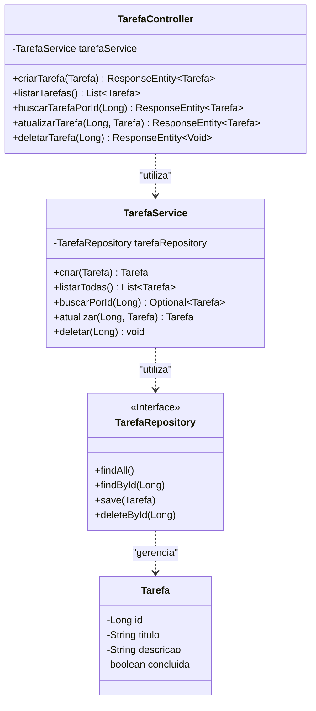
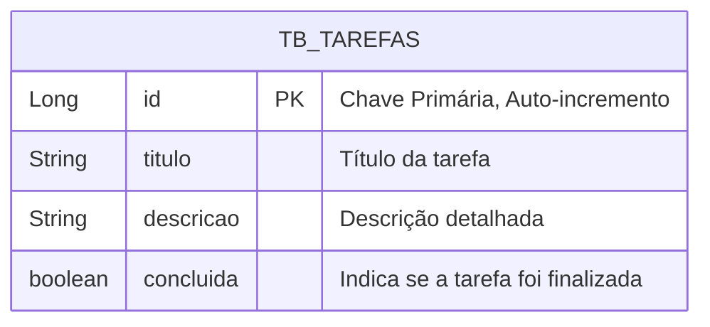

# 📝 Guia de Arquitetura e Desenvolvimento: Aplicação de Lista de Tarefas

Este documento detalha a arquitetura, a estrutura do projeto e as decisões de design para a aplicação de Lista de Tarefas. O objetivo é servir como uma fonte central de conhecimento para a equipe de desenvolvimento.

## 🗂️ Estrutura do Projeto

A aplicação segue uma arquitetura de monorepo, separando claramente as responsabilidades do backend e do frontend. Essa abordagem facilita o desenvolvimento, o deploy e a manutenção de cada parte de forma independente.

```
listadetarefas_v0/
├── backend/              # Contém toda a API Spring Boot (o projeto atual)
│   ├── pom.xml
│   └── src/
│       ├── main/
│       │   ├── java/
│       │   │   └── br/com/curso/todolist/api/
│       │   │       ├── TodolistApiApplication.java
│       │   │       └── tarefa/
│       │   │           ├── Tarefa.java
│       │   │           ├── TarefaController.java
│       │   │           ├── TarefaRepository.java
│       │   │           └── TarefaService.java
│       │   └── resources/
│       │       ├── application.properties
│       │       └── data.sql
│       └── test/
│           └── java/
│               └── br/com/curso/todolist/api/tarefa/
│                   └── TarefaControllerTest.java
│
├── frontend/             # (Exemplo) Projeto Angular, React, Vue, etc.
│   ├── package.json
│   └── src/
│
└── GUIA_DE_ARQUITETURA.md  # Este arquivo
```

### 🏛️ Arquitetura do Backend (Spring Boot)

O backend adota uma arquitetura em camadas clássica, que promove a separação de responsabilidades (Separation of Concerns) e facilita os testes e a manutenção.

1.  **Camada de Apresentação (Controller):**
    -   **Pacote:** `...api.tarefa`
    -   **Responsabilidade:** Expor os endpoints da API REST. Lida com requisições HTTP (JSON), validação de entrada e delega a lógica de negócio para a camada de Serviço.
    -   **Arquivo Principal:** `TarefaController.java`

2.  **Camada de Lógica de Negócio (Service):**
    -   **Pacote:** `...api.tarefa`
    -   **Responsabilidade:** Orquestrar as regras de negócio da aplicação. Ela atua como uma intermediária entre o Controller e o Repository.
    -   **Arquivo Principal:** `TarefaService.java`

3.  **Camada de Acesso a Dados (Repository):**
    -   **Pacote:** `...api.tarefa`
    -   **Responsabilidade:** Abstrair a comunicação com o banco de dados. Utiliza o Spring Data JPA para simplificar as operações CRUD (Create, Read, Update, Delete).
    -   **Arquivo Principal:** `TarefaRepository.java`

4.  **Camada de Domínio (Entity/Model):**
    -   **Pacote:** `...api.tarefa`
    -   **Responsabilidade:** Mapear as tabelas do banco de dados para objetos Java.
    -   **Arquivo Principal:** `Tarefa.java`

## 📊 Diagramas de Arquitetura

### Casos de Uso da API

Este diagrama ilustra as principais interações que um cliente (como o frontend) pode ter com o sistema de tarefas.

```mermaid
usecaseDiagram
    actor "Cliente da API (Frontend)" as client
    rectangle "Sistema de Tarefas" {
        usecase "Criar Tarefa" as UC1
        usecase "Listar Todas as Tarefas" as UC2
        usecase "Buscar Tarefa por ID" as UC3
        usecase "Atualizar Tarefa" as UC4
        usecase "Excluir Tarefa" as UC5
    }
    client --> UC1
    client --> UC2
    client --> UC3
    client --> UC4
    client --> UC5
```

### Diagrama de Classes do Backend

Este diagrama mostra a relação entre as principais classes do backend e suas responsabilidades.



### Diagrama Entidade-Relacionamento (ER)

Representação da tabela de tarefas no banco de dados.



## ✍️ Guia de Implementação Passo a Passo (Backend)

Esta seção descreve o fluxo de criação dos componentes do backend.

### 1. Configuração do Projeto (`pom.xml` e `application.properties`)
- **`pom.xml`**: Define as dependências essenciais: `spring-boot-starter-web` para a API, `spring-boot-starter-data-jpa` para o acesso a dados, `h2` para o banco em memória e `lombok` para reduzir código boilerplate.
- **`application.properties`**: Configura a conexão com o banco de dados H2 e habilita o `defer-datasource-initialization` para garantir que as tabelas sejam criadas pelo Hibernate antes da execução do `data.sql`.

### 2. Criação da Entidade (`Tarefa.java`)
- A classe é anotada com `@Entity` para ser reconhecida pelo JPA.
- `@Table(name = "tb_tarefas")` define o nome da tabela.
- `@Id` e `@GeneratedValue(strategy = GenerationType.IDENTITY)` configuram a chave primária com auto-incremento gerenciado pelo banco.

### 3. Criação do Repositório (`TarefaRepository.java`)
- É uma interface que estende `JpaRepository<Tarefa, Long>`.
- O Spring Data JPA implementa automaticamente os métodos CRUD básicos em tempo de execução, sem a necessidade de código SQL manual.

### 4. Implementação do Serviço (`TarefaService.java`)
- Anotado com `@Service` para ser gerenciado pelo Spring.
- Recebe uma injeção de `TarefaRepository` via `@Autowired`.
- Contém a lógica de negócio, como a verificação da existência de uma tarefa antes de atualizá-la ou deletá-la.

### 5. Exposição da API (`TarefaController.java`)
- Anotado com `@RestController` para indicar que os retornos dos métodos serão serializados para JSON.
- `@RequestMapping("/tarefas")` define a URL base para todos os endpoints.
- Utiliza anotações como `@GetMapping`, `@PostMapping`, `@PutMapping` e `@DeleteMapping` para mapear os métodos HTTP para as ações CRUD, seguindo as melhores práticas REST.