# 🚀 Sistema Full Stack Completo v3.8

**Objetivo do Projeto:** Construir um ecossistema de software completo para uma Lista de Tarefas. Este guia é a versão definitiva do projeto, contendo a arquitetura, estrutura de pastas, descrição de arquivos e o código completo para o backend, frontend web e frontend desktop, com foco em uma experiência de usuário consistente e com a sincronização de estado corrigida entre as plataformas.

#### **Arquitetura da Aplicação**

O sistema é composto por um Backend (API) que centraliza os dados e a lógica, e dois Frontends (Web e Desktop) que consomem esses dados para apresentar a interface ao usuário.

```mermaid
graph TD
    subgraph "Clientes"
        A["🌐 Frontend Web<br>(Angular)"]
        B["💻 Frontend Desktop<br>(JavaFX)"]
    end

    subgraph "Servidor"
        C["🚀 Backend API<br>(Spring Boot)"]
    end

    subgraph "Persistência"
        D[(🗄️ Banco de Dados H2)]
    end

    A -- HTTP Requests (JSON) --> C
    B -- HTTP Requests (JSON) --> C
    C -- JPA/Hibernate --> D
```



-----

### Passo 0: Configuração Inicial do Projeto

Nesta primeira etapa, vamos criar a estrutura base do **backend** utilizando o **Spring Initializr**.  
Esse gerador oficial do Spring Boot nos ajuda a configurar dependências essenciais de forma rápida e segura.

---

#### Passo 1: Acessar o Spring Initializr

Acesse o site: 👉 [https://start.spring.io](https://start.spring.io)

---

#### Passo 2: Preencher os campos

- **Project**: Maven  
- **Language**: Java  
- **Spring Boot**: Versão estável mais recente (exemplo: `3.x.x`)  

##### Project Metadata
- **Group**: `br.com.curso`  
- **Artifact**: `lista-tarefas-api`  
- **Name**: `lista-tarefas-api`  
- **Description**: `API para gerenciamento de tarefas`  
- **Package name**: `br.com.curso.lista-tarefas.api`  
- **Packaging**: Jar  
- **Java**: `21` (ou a versão que você instalou)  

---

#### Passo 3: Adicionar dependências

Clique em **“ADD DEPENDENCIES”** e adicione as seguintes:

- **Spring Web** → Essencial para criar aplicações web e APIs REST.  
- **Spring Data JPA** → Facilita a comunicação com o banco de dados.  
- **H2 Database** → Banco de dados em memória, ideal para desenvolvimento e testes.  
- **Lombok** → Reduz código repetitivo (getters, setters, construtores, etc).  

---

#### Passo 4: Gerar o projeto

- Clique em **GENERATE**.  
- Um arquivo `.zip` será baixado no seu computador.  

---

#### Passo 5: Abrir o projeto na IDE

1. **Descompacte** o arquivo `.zip`.  
2. Abra a pasta gerada na sua IDE favorita:  
   - **IntelliJ IDEA** (recomendado)  
   - ou **VS Code** (com extensões de Java instaladas).  

---

### **Parte 1: O Backend - A API com Spring Boot**

O cérebro da nossa aplicação, responsável por gerenciar e fornecer os dados das tarefas.

#### **Estrutura de Pastas (Backend)**

```
listadetarefas-api/
├── pom.xml
└── src/
    └── main/
        ├── java/
        │   └── br/com/curso/listadetarefas/api/
        │       ├── ListadetarefasApiApplication.java
        │       └── tarefa/
        │           ├── Tarefa.java
        │           ├── TarefaRepository.java
        │           ├── TarefaService.java
        │           └── TarefaController.java
        └── resources/
            └── application.properties
```

#### **Descrição dos Arquivos (Backend)**

  * `pom.xml`: Arquivo de configuração do Maven. Define as dependências e como o projeto deve ser construído.
  * `application.properties`: Arquivo de configuração do Spring Boot, usado para habilitar o console web do banco de dados H2.
  * `ListadetarefasApiApplication.java`: Ponto de entrada da aplicação Spring Boot.
  * `Tarefa.java`: Entidade JPA que modela uma tarefa.
  * `TarefaRepository.java`: Interface do Spring Data JPA que fornece métodos CRUD.
  * `TarefaService.java`: Camada de serviço que contém a lógica de negócio.
  * `TarefaController.java`: Camada de API que expõe os endpoints REST.

#### **Código Completo (Backend)**

**1. `pom.xml`**

```xml
<?xml version="1.0" encoding="UTF-8"?>
<project xmlns="http://maven.apache.org/POM/4.0.0" xmlns:xsi="http://www.w3.org/2001/XMLSchema-instance"
         xsi:schemaLocation="http://maven.apache.org/POM/4.0.0 https://maven.apache.org/xsd/maven-4.0.0.xsd">
    <modelVersion>4.0.0</modelVersion>
    <parent>
        <groupId>org.springframework.boot</groupId>
        <artifactId>spring-boot-starter-parent</artifactId>
        <version>3.3.3</version>
        <relativePath/>
    </parent>
    <groupId>br.com.curso</groupId>
    <artifactId>listadetarefas-api</artifactId>
    <version>0.0.1-SNAPSHOT</version>
    <name>listadetarefas-api</name>
    <description>API para gerenciamento de tarefas</description>
    <properties>
        <java.version>17</java.version>
    </properties>
    <dependencies>
        <dependency>
            <groupId>org.springframework.boot</groupId>
            <artifactId>spring-boot-starter-data-jpa</artifactId>
        </dependency>
        <dependency>
            <groupId>org.springframework.boot</groupId>
            <artifactId>spring-boot-starter-web</artifactId>
        </dependency>
        <dependency>
            <groupId>com.h2database</groupId>
            <artifactId>h2</artifactId>
            <scope>runtime</scope>
        </dependency>
        <dependency>
            <groupId>org.projectlombok</groupId>
            <artifactId>lombok</artifactId>
            <optional>true</optional>
        </dependency>
        <dependency>
            <groupId>org.springframework.boot</groupId>
            <artifactId>spring-boot-starter-test</artifactId>
            <scope>test</scope>
        </dependency>
    </dependencies>
    <build>
        <plugins>
            <plugin>
                <groupId>org.springframework.boot</groupId>
                <artifactId>spring-boot-maven-plugin</artifactId>
                <configuration>
                    <excludes>
                        <exclude>
                            <groupId>org.projectlombok</groupId>
                            <artifactId>lombok</artifactId>
                        </exclude>
                    </excludes>
                </configuration>
            </plugin>
        </plugins>
    </build>
</project>
```

**2. `src/main/resources/application.properties`**

```properties
# Habilita o console web do banco de dados H2
spring.h2.console.enabled=true

# Define o caminho para acessar o console (ex: http://localhost:8080/h2-console)
spring.h2.console.path=/h2-console

# Configurações da fonte de dados (DataSource)
spring.datasource.url=jdbc:h2:mem:testdb
spring.datasource.driverClassName=org.h2.Driver
spring.datasource.username=sa
spring.datasource.password=

# Configurações do JPA/Hibernate
spring.jpa.database-platform=org.hibernate.dialect.H2Dialect
spring.jpa.defer-datasource-initialization=true
```

**3. `ListadetarefasApiApplication.java`**

```java
package br.com.curso.listadetarefas.api;

import org.springframework.boot.SpringApplication;
import org.springframework.boot.autoconfigure.SpringBootApplication;

@SpringBootApplication
public class ListadetarefasApiApplication {
    public static void main(String[] args) {
        SpringApplication.run(ListadetarefasApiApplication.class, args);
    }
}
```

**4. `tarefa/Tarefa.java`**

```java
package br.com.curso.listadetarefas.api.tarefa;

import jakarta.persistence.*;
import lombok.Data;

@Data
@Entity
@Table(name = "tb_tarefas")
public class Tarefa {
    @Id
    @GeneratedValue(strategy = GenerationType.IDENTITY)
    private Long id;
    private String descricao;
    private boolean concluida;
}
```

**5. `tarefa/TarefaRepository.java`**

```java
package br.com.curso.listadetarefas.api.tarefa;

import org.springframework.data.jpa.repository.JpaRepository;

public interface TarefaRepository extends JpaRepository<Tarefa, Long> {
}
```

**6. `tarefa/TarefaService.java`**

```java
package br.com.curso.listadetarefas.api.tarefa;

import org.springframework.beans.factory.annotation.Autowired;
import org.springframework.stereotype.Service;
import java.util.List;

@Service
public class TarefaService {
    @Autowired
    private TarefaRepository tarefaRepository;

    public List<Tarefa> listarTodas() { return tarefaRepository.findAll(); }
    public Tarefa criar(Tarefa tarefa) { return tarefaRepository.save(tarefa); }
    public Tarefa atualizar(Long id, Tarefa tarefaAtualizada) {
        return tarefaRepository.findById(id)
                .map(tarefaExistente -> {
                    tarefaExistente.setDescricao(tarefaAtualizada.getDescricao());
                    tarefaExistente.setConcluida(tarefaAtualizada.isConcluida());
                    return tarefaRepository.save(tarefaExistente);
                }).orElseThrow(() -> new RuntimeException("Tarefa não encontrada: " + id));
    }
    public void deletar(Long id) {
        if (!tarefaRepository.existsById(id)) {
            throw new RuntimeException("Tarefa não encontrada: " + id);
        }
        tarefaRepository.deleteById(id);
    }
}
```

**7. `tarefa/TarefaController.java`**

```java
package br.com.curso.listadetarefas.api.tarefa;

import org.springframework.beans.factory.annotation.Autowired;
import org.springframework.http.ResponseEntity;
import org.springframework.web.bind.annotation.*;
import java.util.List;

@RestController
@RequestMapping("/api/tarefas")
@CrossOrigin(origins = "*")
public class TarefaController {
    @Autowired
    private TarefaService tarefaService;

    @GetMapping
    public List<Tarefa> listarTarefas() { return tarefaService.listarTodas(); }

    @PostMapping
    public Tarefa criarTarefa(@RequestBody Tarefa tarefa) { return tarefaService.criar(tarefa); }

    @PutMapping("/{id}")
    public ResponseEntity<Tarefa> atualizarTarefa(@PathVariable Long id, @RequestBody Tarefa tarefa) {
        try {
            return ResponseEntity.ok(tarefaService.atualizar(id, tarefa));
        } catch (RuntimeException e) {
            return ResponseEntity.notFound().build();
        }
    }

    @DeleteMapping("/{id}")
    public ResponseEntity<Void> deletarTarefa(@PathVariable Long id) {
        try {
            tarefaService.deletar(id);
            return ResponseEntity.noContent().build();
        } catch (RuntimeException e) {
            return ResponseEntity.notFound().build();
        }
    }
}
```

-----

### **Parte 2: O Frontend Web com Angular**

A interface web, com layout de tabela e funcionalidades consistentes.

#### **Estrutura de Pastas (Web)**

```
listadetarefas-web/
└── src/
    └── app/
        ├── components/
        │   └── task-list/
        │       ├── task-list.component.css
        │       ├── task-list.component.html
        │       └── task-list.component.ts
        ├── models/
        │   └── tarefa.ts
        ├── services/
        │   └── tarefa.service.ts
        ├── app.component.ts
        └── app.config.ts
```

#### **Descrição dos Arquivos (Web)**

  * `app.config.ts`: Arquivo de configuração principal da aplicação `standalone`.
  * `app.component.ts`: Componente raiz da aplicação.
  * `tarefa.service.ts`: Serviço responsável pela comunicação com a API.
  * `tarefa.ts`: Interface TypeScript que define a estrutura de dados de uma tarefa.
  * `task-list.component.html`: Template HTML com estrutura de tabela para exibir a lista.
  * `task-list.component.css`: Folha de estilos para o layout de tabela.
  * `task-list.component.ts`: Lógica do componente, com todas as funcionalidades.

#### **Código Completo (Web)**

**1. `app.config.ts`**

```typescript
import { ApplicationConfig } from '@angular/core';
import { provideRouter } from '@angular/router';
import { routes } from './app.routes';
import { provideHttpClient } from '@angular/common/http';

export const appConfig: ApplicationConfig = {
  providers: [
    provideRouter(routes),
    provideHttpClient()
  ]
};
```

**2. `app.component.ts`**

```typescript
import { Component } from '@angular/core';
import { TaskListComponent } from './components/task-list/task-list.component';

@Component({
  selector: 'app-root',
  standalone: true,
  imports: [TaskListComponent],
  template: `<app-task-list></app-task-list>`,
  styleUrl: './app.component.css'
})
export class AppComponent {}
```

**3. `services/tarefa.service.ts`**

```typescript
import { Injectable } from '@angular/core';
import { HttpClient } from '@angular/common/http';
import { Observable } from 'rxjs';
import { Tarefa } from '../models/tarefa';

@Injectable({ providedIn: 'root' })
export class TarefaService {
  private apiUrl = 'http://localhost:8080/api/tarefas';

  constructor(private http: HttpClient) { }

  getTarefas(): Observable<Tarefa[]> { return this.http.get<Tarefa[]>(this.apiUrl); }
  addTarefa(tarefa: Tarefa): Observable<Tarefa> { return this.http.post<Tarefa>(this.apiUrl, tarefa); }
  updateTarefa(tarefa: Tarefa): Observable<Tarefa> { return this.http.put<Tarefa>(`${this.apiUrl}/${tarefa.id}`, tarefa); }
  deleteTarefa(id: number): Observable<void> { return this.http.delete<void>(`${this.apiUrl}/${id}`); }
}
```

**4. `models/tarefa.ts`**

```typescript
export interface Tarefa {
  id?: number;
  descricao: string;
  concluida: boolean;
  selecionada?: boolean;
}
```

**5. `components/task-list/task-list.component.html`**

```html
<div class="container">
  <div class="header">
    <h1>Minha Lista de Tarefas</h1>
    <div class="header-actions">
      <button class="btn-refresh" (click)="carregarTarefas()">🔄 Atualizar</button>
      <button *ngIf="existemTarefasSelecionadas()" class="btn-delete" (click)="deletarTarefasSelecionadas()">
        ❌ Excluir Selecionadas
      </button>
    </div>
  </div>

  <form class="form-add" (ngSubmit)="adicionarTarefa()">
    <input type="text" placeholder="O que precisa ser feito?" [(ngModel)]="novaTarefa.descricao" name="descricao" required>
    <button type="submit" class="btn-create">Adicionar</button>
  </form>

  <div class="task-list-container">
    <div class="task-list-header">
      <div class="col-select">Sel.</div>
      <div class="col-status">Status</div>
      <div class="col-desc">Descrição</div>
      <div class="col-actions">Ações</div>
    </div>
    <div class="task-list-body">
      <div *ngFor="let tarefa of tarefas" class="task-row">
        <div class="col-select">
          <input class="selection-checkbox" type="checkbox" [(ngModel)]="tarefa.selecionada">
        </div>
        <div class="col-status">
          <input class="status-checkbox" type="checkbox" [(ngModel)]="tarefa.concluida" (ngModelChange)="atualizarStatus(tarefa)">
        </div>
        <div class="col-desc">
           <span *ngIf="!tarefaEmEdicao || tarefaEmEdicao.id !== tarefa.id" [ngClass]="{'completed': tarefa.concluida}">{{ tarefa.descricao }}</span>
           <input *ngIf="tarefaEmEdicao && tarefaEmEdicao.id === tarefa.id" type="text" [(ngModel)]="tarefaEmEdicao.descricao" (keyup.enter)="salvarEdicao()" (keyup.escape)="cancelarEdicao()">
        </div>
        <div class="col-actions">
          <div class="actions" *ngIf="!tarefaEmEdicao || tarefaEmEdicao.id !== tarefa.id">
            <button class="btn-update" (click)="iniciarEdicao(tarefa)">✏️</button>
            <button class="btn-delete" (click)="deletarTarefa(tarefa.id)">❌</button>
          </div>
           <div class="actions" *ngIf="tarefaEmEdicao && tarefaEmEdicao.id === tarefa.id">
            <button class="btn-create" (click)="salvarEdicao()">✔️</button>
            <button class="btn-cancel" (click)="cancelarEdicao()">✖️</button>
          </div>
        </div>
      </div>
    </div>
  </div>
</div>
```

**6. `components/task-list/task-list.component.css`**

```css
.container { max-width: 800px; margin: 2rem auto; font-family: sans-serif; }
.header { display: flex; justify-content: space-between; align-items: center; margin-bottom: 1rem; }
.header-actions { display: flex; gap: 10px; }
.form-add { display: flex; gap: 10px; margin-bottom: 1rem; }
.form-add input { flex-grow: 1; padding: 10px; border: 1px solid #ccc; border-radius: 4px; }
button { padding: 8px 12px; border: none; border-radius: 4px; color: white; cursor: pointer; font-size: 1rem; }
.btn-create { background-color: #4CAF50; }
.btn-update { background-color: #FFC107; }
.btn-delete { background-color: #F44336; }
.btn-cancel { background-color: #9E9E9E; }
.btn-refresh { background-color: #2196F3; }

.task-list-container { border: 1px solid #eee; border-radius: 4px; overflow: hidden; }
.task-list-header, .task-row { display: flex; align-items: center; padding: 10px; gap: 15px; }
.task-list-header { font-weight: bold; background-color: #f8f9fa; border-bottom: 2px solid #dee2e6; color: #333; }
.task-row { border-bottom: 1px solid #eee; }
.task-row:last-child { border-bottom: none; }
.col-select { flex: 0 0 40px; text-align: center; }
.col-status { flex: 0 0 60px; text-align: center; }
.col-desc { flex-grow: 1; }
.col-desc input { width: 100%; padding: 5px; }
.col-actions { flex: 0 0 100px; }
.actions { display: flex; justify-content: flex-end; gap: 5px; }
.completed { text-decoration: line-through; color: #888; }
```

**7. `components/task-list/task-list.component.ts`**

```typescript
import { Component, OnInit } from '@angular/core';
import { TarefaService } from '../../services/tarefa.service';
import { Tarefa } from '../../models/tarefa';
import { CommonModule } from '@angular/common';
import { FormsModule } from '@angular/forms';
import { forkJoin } from 'rxjs';

@Component({
  selector: 'app-task-list',
  standalone: true,
  imports: [CommonModule, FormsModule],
  templateUrl: './task-list.component.html',
  styleUrl: './task-list.component.css'
})
export class TaskListComponent implements OnInit {
  tarefas: Tarefa[] = [];
  novaTarefa: Tarefa = { descricao: '', concluida: false };
  tarefaEmEdicao: Tarefa | null = null;

  constructor(private tarefaService: TarefaService) { }

  ngOnInit(): void { this.carregarTarefas(); }

  carregarTarefas(): void {
    this.tarefaService.getTarefas().subscribe(data => {
      this.tarefas = data.map(t => ({ ...t, selecionada: false }));
    });
  }

  adicionarTarefa(): void {
    if (this.novaTarefa.descricao.trim() === '') return;
    this.tarefaService.addTarefa(this.novaTarefa).subscribe(() => {
        this.novaTarefa = { descricao: '', concluida: false };
        this.carregarTarefas();
    });
  }

  iniciarEdicao(tarefa: Tarefa): void {
    this.tarefaEmEdicao = { ...tarefa };
  }

  salvarEdicao(): void {
    if (!this.tarefaEmEdicao) return;
    this.tarefaService.updateTarefa(this.tarefaEmEdicao).subscribe(() => {
      this.tarefaEmEdicao = null;
      this.carregarTarefas();
    });
  }

  cancelarEdicao(): void {
    this.tarefaEmEdicao = null;
  }

  atualizarStatus(tarefa: Tarefa): void {
    this.tarefaService.updateTarefa(tarefa).subscribe();
  }

  deletarTarefa(id: number | undefined): void {
    if (id === undefined) return;
    this.tarefaService.deleteTarefa(id).subscribe(() => this.carregarTarefas());
  }

  existemTarefasSelecionadas(): boolean {
    return this.tarefas.some(t => t.selecionada);
  }

  deletarTarefasSelecionadas(): void {
    const tarefasParaExcluir = this.tarefas.filter(t => t.selecionada && t.id);
    if (tarefasParaExcluir.length === 0) return;

    const chamadasDeExclusao = tarefasParaExcluir.map(tarefa =>
      this.tarefaService.deleteTarefa(tarefa.id!)
    );

    forkJoin(chamadasDeExclusao).subscribe(() => this.carregarTarefas());
  }
}
```

-----

### **Parte 3: O Frontend Desktop com JavaFX**

A aplicação nativa, com layout e funcionalidades consistentes com a versão web.

#### **Estrutura de Pastas (Desktop)**

```
listadetarefas-desktop/
├── pom.xml
└── src/
    └── main/
        ├── java/
        │   ├── br/com/curso/listadetarefas/desktop/
        │   │   ├── Launcher.java
        │   │   ├── MainApp.java
        │   │   ├── MainViewController.java
        │   │   ├── Tarefa.java
        │   │   └── TarefaApiService.java
        │   └── module-info.java
        └── resources/
            └── br/com/curso/listadetarefas/desktop/
                └── MainView.fxml
```

#### **Descrição dos Arquivos (Desktop)**

  * `pom.xml`: Arquivo de configuração do Maven.
  * `module-info.java`: Arquivo do Sistema de Módulos do Java.
  * `MainView.fxml`: Arquivo XML que define a estrutura visual da aplicação.
  * `Launcher.java`: Ponto de entrada para o JAR executável.
  * `MainApp.java`: Classe principal que inicia a aplicação JavaFX.
  * `Tarefa.java`: Modelo de dados (POJO) para uma tarefa.
  * `TarefaApiService.java`: Serviço que realiza a comunicação com a API.
  * `MainViewController.java`: Controlador da interface, com todas as funcionalidades e correções.

#### **Código Completo (Desktop)**

**1. `pom.xml`**

```xml
<?xml version="1.0" encoding="UTF-8"?>
<project xmlns="http://maven.apache.org/POM/4.0.0"
         xmlns:xsi="http://www.w3.org/2001/XMLSchema-instance"
         xsi:schemaLocation="http://maven.apache.org/POM/4.0.0 http://maven.apache.org/xsd/maven-4.0.0.xsd">
    <modelVersion>4.0.0</modelVersion>
    <groupId>br.com.curso</groupId>
    <artifactId>listadetarefas-desktop</artifactId>
    <version>1.0-SNAPSHOT</version>
    <properties>
        <project.build.sourceEncoding>UTF-8</project.build.sourceEncoding>
        <maven.compiler.source>17</maven.compiler.source>
        <maven.compiler.target>17</maven.compiler.target>
        <javafx.version>17.0.6</javafx.version>
    </properties>
    <dependencies>
        <dependency>
            <groupId>org.openjfx</groupId>
            <artifactId>javafx-controls</artifactId>
            <version>${javafx.version}</version>
        </dependency>
        <dependency>
            <groupId>org.openjfx</groupId>
            <artifactId>javafx-fxml</artifactId>
            <version>${javafx.version}</version>
        </dependency>
        <dependency>
            <groupId>com.fasterxml.jackson.core</groupId>
            <artifactId>jackson-databind</artifactId>
            <version>2.17.0</version>
        </dependency>
    </dependencies>
    <build>
        <plugins>
            <plugin>
                <groupId>org.apache.maven.plugins</groupId>
                <artifactId>maven-compiler-plugin</artifactId>
                <version>3.11.0</version>
            </plugin>
            <plugin>
                <groupId>org.apache.maven.plugins</groupId>
                <artifactId>maven-shade-plugin</artifactId>
                <version>3.5.1</version>
                <executions>
                    <execution>
                        <phase>package</phase>
                        <goals>
                            <goal>shade</goal>
                        </goals>
                        <configuration>
                            <transformers>
                                <transformer implementation="org.apache.maven.plugins.shade.resource.ManifestResourceTransformer">
                                    <mainClass>br.com.curso.listadetarefas.desktop.Launcher</mainClass>
                                </transformer>
                            </transformers>
                        </configuration>
                    </execution>
                </executions>
            </plugin>
        </plugins>
    </build>
</project>
```

**2. `module-info.java`**

```java
module br.com.curso.listadetarefas.desktop {
    requires javafx.controls;
    requires javafx.fxml;
    requires com.fasterxml.jackson.databind;
    requires java.net.http;

    opens br.com.curso.listadetarefas.desktop to javafx.fxml, com.fasterxml.jackson.databind;
    exports br.com.curso.listadetarefas.desktop;
}
```

**3. `resources/br/com/curso/listadetarefas/desktop/MainView.fxml`**

```xml
<?xml version="1.0" encoding="UTF-8"?>

<?import javafx.geometry.Insets?>
<?import javafx.scene.control.Button?>
<?import javafx.scene.control.Label?>
<?import javafx.scene.control.TableColumn?>
<?import javafx.scene.control.TableView?>
<?import javafx.scene.control.TextField?>
<?import javafx.scene.layout.BorderPane?>
<?import javafx.scene.layout.HBox?>
<?import javafx.scene.text.Font?>

<BorderPane maxHeight="-Infinity" maxWidth="-Infinity" minHeight="-Infinity" minWidth="-Infinity" prefHeight="600.0" prefWidth="800.0" xmlns="http://javafx.com/javafx/17" xmlns:fx="http://javafx.com/fxml/1" fx:controller="br.com.curso.listadetarefas.desktop.MainViewController">
   <top>
      <HBox alignment="CENTER_LEFT" prefHeight="70.0" spacing="10.0" BorderPane.alignment="CENTER">
         <padding>
            <Insets bottom="10.0" left="10.0" right="10.0" top="10.0" />
         </padding>
         <children>
            <Label text="Nova Tarefa:">
               <font>
                  <Font name="System Bold" size="14.0" />
               </font>
            </Label>
            <TextField fx:id="novaTarefaTextField" HBox.hgrow="ALWAYS" onAction="#adicionarTarefa" promptText="O que precisa ser feito?" />
            <Button onAction="#adicionarTarefa" style="-fx-base: #4CAF50;" text="Adicionar" textFill="WHITE">
               <font>
                  <Font name="System Bold" size="12.0" />
               </font>
            </Button>
            <Button fx:id="atualizarButton" onAction="#carregarTarefas" style="-fx-base: #2196F3;" text="🔄" textFill="WHITE" />
            <Button fx:id="excluirSelecionadosButton" onAction="#deletarTarefasSelecionadas" style="-fx-base: #F44336;" text="Excluir Selecionadas" textFill="WHITE" />
         </children>
      </HBox>
   </top>
   <center>
      <TableView fx:id="tabelaTarefas" editable="true" prefHeight="200.0" prefWidth="200.0" BorderPane.alignment="CENTER">
         <columns>
            <TableColumn fx:id="colunaSelecao" prefWidth="50.0" text="Sel." />
            <TableColumn fx:id="colunaConcluida" prefWidth="75.0" text="Status" />
            <TableColumn fx:id="colunaDescricao" prefWidth="450.0" text="Descrição" />
            <TableColumn fx:id="colunaAcoes" prefWidth="150.0" text="Ações" />
         </columns>
         <columnResizePolicy>
            <TableView fx:constant="CONSTRAINED_RESIZE_POLICY" />
         </columnResizePolicy>
      </TableView>
   </center>
</BorderPane>
```

**4. `Launcher.java`**

```java
package br.com.curso.listadetarefas.desktop;

public class Launcher {
    public static void main(String[] args) {
        MainApp.main(args);
    }
}
```

**5. `MainApp.java`**

```java
package br.com.curso.listadetarefas.desktop;

import javafx.application.Application;
import javafx.fxml.FXMLLoader;
import javafx.scene.Scene;
import javafx.stage.Stage;

public class MainApp extends Application {
    @Override
    public void start(Stage stage) throws Exception {
        FXMLLoader fxmlLoader = new FXMLLoader(MainApp.class.getResource("MainView.fxml"));
        Scene scene = new Scene(fxmlLoader.load(), 800, 600);
        stage.setTitle("Minha Lista de Tarefas (Desktop)");
        stage.setScene(scene);
        stage.show();
    }
    public static void main(String[] args) {
        launch(args);
    }
}
```

**6. `Tarefa.java`**

```java
package br.com.curso.listadetarefas.desktop;

import com.fasterxml.jackson.annotation.JsonIgnore;
import com.fasterxml.jackson.annotation.JsonIgnoreProperties;
import javafx.beans.property.BooleanProperty;
import javafx.beans.property.SimpleBooleanProperty;

@JsonIgnoreProperties(ignoreUnknown = true)
public class Tarefa {
    private Long id;
    private String descricao;
    private boolean concluida;

    @JsonIgnore
    private final BooleanProperty selecionada = new SimpleBooleanProperty(false);

    public Long getId() { return id; }
    public void setId(Long id) { this.id = id; }
    public String getDescricao() { return descricao; }
    public void setDescricao(String descricao) { this.descricao = descricao; }
    public boolean isConcluida() { return concluida; }
    public void setConcluida(boolean concluida) { this.concluida = concluida; }

    public boolean isSelecionada() { return selecionada.get(); }
    public BooleanProperty selecionadaProperty() { return selecionada; }
    public void setSelecionada(boolean selecionada) { this.selecionada.set(selecionada); }
}
```

**7. `TarefaApiService.java`**

```java
package br.com.curso.listadetarefas.desktop;

import com.fasterxml.jackson.core.type.TypeReference;
import com.fasterxml.jackson.databind.ObjectMapper;
import java.io.IOException;
import java.net.URI;
import java.net.http.HttpClient;
import java.net.http.HttpRequest;
import java.net.http.HttpResponse;
import java.util.Collections;
import java.util.List;

public class TarefaApiService {
    private final HttpClient client = HttpClient.newHttpClient();
    private final ObjectMapper objectMapper = new ObjectMapper();
    private final String API_URL = "http://localhost:8080/api/tarefas";

    public List<Tarefa> listarTarefas() {
        HttpRequest request = HttpRequest.newBuilder().uri(URI.create(API_URL)).GET().build();
        try {
            HttpResponse<String> response = client.send(request, HttpResponse.BodyHandlers.ofString());
            if (response.statusCode() == 200) {
                return objectMapper.readValue(response.body(), new TypeReference<>() {});
            }
        } catch (IOException | InterruptedException e) {
            e.printStackTrace();
        }
        return Collections.emptyList();
    }

    public void adicionarTarefa(Tarefa novaTarefa) {
        try {
            String jsonBody = objectMapper.writeValueAsString(novaTarefa);
            HttpRequest request = HttpRequest.newBuilder()
                    .uri(URI.create(API_URL))
                    .header("Content-Type", "application/json")
                    .POST(HttpRequest.BodyPublishers.ofString(jsonBody))
                    .build();
            client.send(request, HttpResponse.BodyHandlers.ofString());
        } catch (IOException | InterruptedException e) {
            e.printStackTrace();
        }
    }

    public void atualizarTarefa(Tarefa tarefa) {
        try {
            String jsonBody = objectMapper.writeValueAsString(tarefa);
            HttpRequest request = HttpRequest.newBuilder()
                    .uri(URI.create(API_URL + "/" + tarefa.getId()))
                    .header("Content-Type", "application/json")
                    .PUT(HttpRequest.BodyPublishers.ofString(jsonBody))
                    .build();
            client.send(request, HttpResponse.BodyHandlers.ofString());
        } catch (IOException | InterruptedException e) {
            e.printStackTrace();
        }
    }

    public void deletarTarefa(Long id) {
        try {
            HttpRequest request = HttpRequest.newBuilder()
                    .uri(URI.create(API_URL + "/" + id))
                    .DELETE()
                    .build();
            client.send(request, HttpResponse.BodyHandlers.ofString());
        } catch (IOException | InterruptedException e) {
            e.printStackTrace();
        }
    }
}
```

**8. `MainViewController.java`**

```java
package br.com.curso.listadetarefas.desktop;

import javafx.application.Platform;
import javafx.collections.FXCollections;
import javafx.concurrent.Task;
import javafx.fxml.FXML;
import javafx.fxml.Initializable;
import javafx.geometry.Pos;
import javafx.scene.control.*;
import javafx.scene.control.cell.CheckBoxTableCell;
import javafx.scene.control.cell.PropertyValueFactory;
import javafx.scene.layout.HBox;
import java.net.URL;
import java.util.List;
import java.util.Optional;
import java.util.ResourceBundle;
import java.util.stream.Collectors;

public class MainViewController implements Initializable {

    @FXML private TableView<Tarefa> tabelaTarefas;
    @FXML private TableColumn<Tarefa, Boolean> colunaSelecao;
    @FXML private TableColumn<Tarefa, Boolean> colunaConcluida;
    @FXML private TableColumn<Tarefa, String> colunaDescricao;
    @FXML private TableColumn<Tarefa, Void> colunaAcoes;
    @FXML private TextField novaTarefaTextField;

    private final TarefaApiService tarefaService = new TarefaApiService();

    @Override
    public void initialize(URL url, ResourceBundle resourceBundle) {
        configurarTabela();
        carregarTarefas();
    }

    private void configurarTabela() {
        // Coluna de Seleção
        colunaSelecao.setCellValueFactory(cellData -> cellData.getValue().selecionadaProperty());
        colunaSelecao.setCellFactory(CheckBoxTableCell.forTableColumn(colunaSelecao));
        colunaSelecao.setEditable(true);

        // Coluna de Status (com correção de sincronização)
        colunaConcluida.setCellValueFactory(new PropertyValueFactory<>("concluida"));
        colunaConcluida.setCellFactory(CheckBoxTableCell.forTableColumn(colunaConcluida));
        colunaConcluida.setOnEditCommit(event -> {
            Tarefa tarefa = event.getRowValue();
            tarefa.setConcluida(event.getNewValue());
            atualizarTarefa(tarefa);
        });
        
        // Coluna de Descrição
        colunaDescricao.setCellValueFactory(new PropertyValueFactory<>("descricao"));

        // Coluna de Ações
        colunaAcoes.setCellFactory(param -> new TableCell<>() {
            private final Button btnEditar = new Button("Editar");
            private final Button btnExcluir = new Button("Excluir");
            private final HBox pane = new HBox(5, btnEditar, btnExcluir);
            {
                pane.setAlignment(Pos.CENTER);
                btnEditar.setStyle("-fx-base: #FFC107;");
                btnExcluir.setStyle("-fx-base: #F44336; -fx-text-fill: white;");
                btnEditar.setOnAction(event -> abrirDialogoEdicao(getTableView().getItems().get(getIndex())));
                btnExcluir.setOnAction(event -> confirmarExclusao(getTableView().getItems().get(getIndex())));
            }
            @Override
            protected void updateItem(Void item, boolean empty) {
                super.updateItem(item, empty);
                setGraphic(empty ? null : pane);
            }
        });

        tabelaTarefas.setEditable(true);
    }

    @FXML
    private void carregarTarefas() {
        Task<List<Tarefa>> task = new Task<>() {
            @Override
            protected List<Tarefa> call() {
                return tarefaService.listarTarefas();
            }
        };
        task.setOnSucceeded(e -> tabelaTarefas.setItems(FXCollections.observableArrayList(task.getValue())));
        task.setOnFailed(e -> exibirAlerta("Erro", "Não foi possível carregar as tarefas."));
        new Thread(task).start();
    }

    @FXML
    private void adicionarTarefa() {
        String descricao = novaTarefaTextField.getText().trim();
        if (descricao.isEmpty()) {
            exibirAlerta("Campo Vazio", "A descrição não pode ser vazia.");
            return;
        }
        Tarefa novaTarefa = new Tarefa();
        novaTarefa.setDescricao(descricao);
        novaTarefa.setConcluida(false);

        Task<Void> task = new Task<>() {
            @Override
            protected Void call() {
                tarefaService.adicionarTarefa(novaTarefa);
                return null;
            }
        };
        task.setOnSucceeded(e -> {
            novaTarefaTextField.clear();
            carregarTarefas();
        });
        task.setOnFailed(e -> exibirAlerta("Erro", "Não foi possível criar a tarefa."));
        new Thread(task).start();
    }

    private void atualizarTarefa(Tarefa tarefa) {
        Task<Void> task = new Task<>() {
            @Override
            protected Void call() {
                tarefaService.atualizarTarefa(tarefa);
                return null;
            }
        };
        task.setOnFailed(e -> {
            exibirAlerta("Erro", "Não foi possível sincronizar a tarefa. Recarregando...");
            carregarTarefas();
        });
        new Thread(task).start();
    }

    private void abrirDialogoEdicao(Tarefa tarefa) {
        TextInputDialog dialog = new TextInputDialog(tarefa.getDescricao());
        dialog.setTitle("Editar Tarefa");
        dialog.setHeaderText("Editando a tarefa: " + tarefa.getDescricao());
        dialog.setContentText("Nova descrição:");

        dialog.showAndWait().ifPresent(novaDescricao -> {
            if (!novaDescricao.trim().isEmpty()) {
                tarefa.setDescricao(novaDescricao.trim());
                atualizarTarefa(tarefa);
                tabelaTarefas.refresh();
            }
        });
    }

    private void confirmarExclusao(Tarefa tarefa) {
        Alert alert = new Alert(Alert.AlertType.CONFIRMATION);
        alert.setTitle("Confirmar Exclusão");
        alert.setHeaderText("Excluir tarefa: " + tarefa.getDescricao());
        alert.setContentText("Você tem certeza?");
        alert.showAndWait().filter(r -> r == ButtonType.OK).ifPresent(r -> deletarTarefa(tarefa));
    }

    private void deletarTarefa(Tarefa tarefa) {
        Task<Void> task = new Task<>() {
            @Override
            protected Void call() {
                tarefaService.deletarTarefa(tarefa.getId());
                return null;
            }
        };
        task.setOnSucceeded(e -> carregarTarefas());
        task.setOnFailed(e -> exibirAlerta("Erro", "Não foi possível excluir a tarefa."));
        new Thread(task).start();
    }

    @FXML
    private void deletarTarefasSelecionadas() {
        List<Tarefa> tarefasParaExcluir = tabelaTarefas.getItems().stream()
                .filter(Tarefa::isSelecionada)
                .collect(Collectors.toList());

        if (tarefasParaExcluir.isEmpty()) {
            exibirAlerta("Nenhuma Seleção", "Nenhuma tarefa foi selecionada.");
            return;
        }

        Alert alert = new Alert(Alert.AlertType.CONFIRMATION);
        alert.setTitle("Confirmar Exclusão em Massa");
        alert.setHeaderText("Excluir " + tarefasParaExcluir.size() + " tarefa(s)");
        alert.setContentText("Você tem certeza?");

        alert.showAndWait().filter(r -> r == ButtonType.OK).ifPresent(r -> {
            Task<Void> task = new Task<>() {
                @Override
                protected Void call() {
                    for (Tarefa tarefa : tarefasParaExcluir) {
                        tarefaService.deletarTarefa(tarefa.getId());
                    }
                    return null;
                }
            };
            task.setOnSucceeded(e -> carregarTarefas());
            task.setOnFailed(e -> exibirAlerta("Erro", "Ocorreu um erro ao excluir as tarefas."));
            new Thread(task).start();
        });
    }

    private void exibirAlerta(String titulo, String mensagem) {
        Platform.runLater(() -> {
            Alert alert = new Alert(Alert.AlertType.WARNING);
            alert.setTitle(titulo);
            alert.setHeaderText(null);
            alert.setContentText(mensagem);
            alert.showAndWait();
        });
    }
}
```