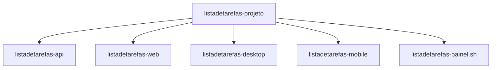

### **Parte 6: Automação com Bash para Linux (v4.3)**

Para oferecer uma experiência de desenvolvimento consistente em diferentes sistemas operacionais, esta seção fornece a versão para Linux (Ubuntu) do painel de controle, utilizando um script Bash (`.sh`). O script replica todas as funcionalidades da versão PowerShell, permitindo um gerenciamento completo do ambiente de desenvolvimento no terminal Linux.

#### **Pré-requisitos de Ferramentas**

Antes de executar o script, você pode precisar instalar algumas ferramentas de linha de comando que ele utiliza para gerenciar janelas e processos. Abra seu terminal e execute:

```bash
sudo apt-get update && sudo apt-get install -y wmctrl lsof gnome-terminal
```

  * **`wmctrl`**: Usado para interagir com janelas do sistema (necessário para detectar a aplicação Desktop).
  * **`lsof`**: Ferramenta para listar arquivos abertos, usada aqui para encontrar processos que estão usando portas de rede específicas.
  * **`gnome-terminal`**: O terminal padrão do Ubuntu, usado para abrir os servidores em novas janelas.

#### **Estrutura de Pastas do Ambiente**

O script `listadetarefas-painel.sh` deve estar localizado na pasta raiz do projeto, ao lado das outras pastas.



#### **Descrição do Arquivo `listadetarefas-painel.sh`**

Este arquivo é a contraparte Bash do script PowerShell, servindo como o orquestrador do ambiente de desenvolvimento em Linux.

  * **Função:** Automatizar o ciclo de vida do desenvolvimento: iniciar e parar servidores, construir os projetos, limpar caches e gerenciar o emulador Android.
  * **Componentes Principais:**
      * **Configurações Globais:** Define os caminhos para os projetos e ferramentas do SDK do Android, assumindo uma instalação padrão no diretório `$HOME`.
      * **Detecção de Emuladores:** Ao iniciar, o script automaticamente lista os emuladores disponíveis e permite que o usuário selecione qual usar.
      * **Funções de Status:** Utiliza comandos nativos do Linux (`lsof`, `wmctrl`, `adb`) para verificar o status de cada componente em tempo real.
      * **Gerenciamento de Serviços:** Usa o `gnome-terminal` para iniciar cada serviço em sua própria janela de terminal, facilitando a visualização de logs.
      * **Interface de Usuário:** Apresenta um menu de texto interativo, colorido para fácil leitura, diretamente no seu terminal.

-----

### **Código Completo do Painel (Bash para Linux v4.3)**

1.  Crie um novo arquivo na raiz do seu projeto chamado `listadetarefas-painel.sh`.
2.  Copie e cole o código abaixo no arquivo.
3.  **Importante:** Torne o script executável. Abra um terminal na raiz do projeto e execute o comando:
    ```bash
    chmod +x listadetarefas-painel.sh
    ```
4.  Execute o painel com:
    ```bash
    ./listadetarefas-painel.sh
    ```

**Arquivo: `listadetarefas-painel.sh`**

```bash
#!/bin/bash
#
# SYNOPSIS
#   Painel de controle para gerenciar o projeto To-Do List (API, Web, Desktop, Mobile).
#
# DESCRIPTION
#   Este script Bash fornece um menu interativo para iniciar, parar, construir e depurar
#   os diferentes componentes do projeto no ambiente Linux (Ubuntu).
#
# VERSION
#   4.3 - Versão Bash com detecção e seleção dinâmica de emuladores Android.
#

#==============================================================================
# --- CONFIGURAÇÕES E CORES ---
#==============================================================================

# Cores ANSI para a interface
GREEN='\033[0;32m'
RED='\033[0;31m'
YELLOW='\033[1;33m'
CYAN='\033[0;36m'
WHITE='\033[1;37m'
NC='\033[0m' # No Color

# Caminho base do script
SCRIPT_DIR=$(cd -- "$(dirname -- "${BASH_SOURCE[0]}")" &>/dev/null && pwd)
API_PATH="$SCRIPT_DIR/listadetarefas-api"
WEB_PATH="$SCRIPT_DIR/listadetarefas-web"
DESKTOP_PATH="$SCRIPT_DIR/listadetarefas-desktop"
MOBILE_PATH="$SCRIPT_DIR/listadetarefas-mobile"

# Configurações Android (caminho padrão no Linux)
SDK_PATH="$HOME/Android/Sdk"
EMULATOR_PATH="$SDK_PATH/emulator"
PLATFORM_TOOLS_PATH="$SDK_PATH/platform-tools"
EMULATOR_NAME="" # Definido dinamicamente
AVAILABLE_EMULATORS=() # Array de emuladores

# Configurações dos artefatos e URLs
API_JAR="$API_PATH/target/listadetarefas-api-0.0.1-SNAPSHOT.jar"
DESKTOP_JAR="$DESKTOP_PATH/target/listadetarefas-desktop-1.0-SNAPSHOT.jar"
ANDROID_PACKAGE="br.com.curso.listadetarefas.android"
WEB_URL="http://localhost:4200"
DESKTOP_WINDOW_TITLE="Minha Lista de Tarefas (Desktop)"

#==============================================================================
# --- VERIFICAÇÃO DE PRÉ-REQUISITOS ---
#==============================================================================

function check_dependencies() {
    local missing_deps=()
    command -v wmctrl >/dev/null 2>&1 || missing_deps+=("wmctrl")
    command -v lsof >/dev/null 2>&1 || missing_deps+=("lsof")
    command -v gnome-terminal >/dev/null 2>&1 || missing_deps+=("gnome-terminal")
    
    if [ ${#missing_deps[@]} -ne 0 ]; then
        echo -e "${RED}ERRO: Ferramentas necessárias não encontradas: ${missing_deps[*]}.${NC}"
        echo -e "${YELLOW}Por favor, instale-as com o comando:${NC}"
        echo -e "sudo apt-get update && sudo apt-get install -y ${missing_deps[*]}"
        exit 1
    fi
}

#==============================================================================
# --- FUNÇÕES DE SELEÇÃO DE EMULADOR ---
#==============================================================================

function initialize_emulator_selection() {
    echo -e "${CYAN}Detectando emuladores instalados...${NC}"
    if [ ! -f "$EMULATOR_PATH/emulator" ]; then
        echo -e "${YELLOW}AVISO: Executável do emulador não encontrado em '$EMULATOR_PATH'.${NC}"
        echo -e "${YELLOW}Verifique o caminho do SDK do Android no script.${NC}"
        sleep 2
        return
    fi

    # shellcheck disable=SC2207
    AVAILABLE_EMULATORS=($("$EMULATOR_PATH/emulator" -list-avds | sed '/^\s*$/d'))
    
    if [ ${#AVAILABLE_EMULATORS[@]} -eq 0 ]; then
        echo -e "${YELLOW}AVISO: Nenhum emulador (AVD) foi encontrado.${NC}"
        EMULATOR_NAME=""
    elif [ ${#AVAILABLE_EMULATORS[@]} -eq 1 ]; then
        EMULATOR_NAME="${AVAILABLE_EMULATORS[0]}"
        echo -e "${GREEN}Emulador '$EMULATOR_NAME' selecionado automaticamente.${NC}"
    else
        EMULATOR_NAME="${AVAILABLE_EMULATORS[0]}"
        echo -e "${GREEN}Múltiplos emuladores encontrados. '$EMULATOR_NAME' foi selecionado como padrão.${NC}"
        echo -e "Use a opção 'S' no menu para selecionar outro."
    fi
    sleep 2
}

function select_emulator() {
    clear
    echo -e "${YELLOW}--- SELECIONAR EMULADOR ANDROID ---${NC}"
    if [ ${#AVAILABLE_EMULATORS[@]} -eq 0 ]; then
        read -rp "Nenhum emulador foi detectado. Pressione Enter..."
        return
    fi

    echo -e "\nEmuladores disponíveis:"
    for i in "${!AVAILABLE_EMULATORS[@]}"; do
        indicator=""
        if [[ "${AVAILABLE_EMULATORS[$i]}" == "$EMULATOR_NAME" ]]; then
            indicator=" ${GREEN}[SELECIONADO]${NC}"
        fi
        echo "  $(($i + 1)). ${AVAILABLE_EMULATORS[$i]}$indicator"
    done
    
    read -rp $'\nDigite o número do emulador que deseja usar e pressione Enter (ou Enter para cancelar): ' choice
    if [[ -z "$choice" ]]; then return; fi

    if [[ "$choice" =~ ^[0-9]+$ ]] && [ "$choice" -ge 1 ] && [ "$choice" -le ${#AVAILABLE_EMULATORS[@]} ]; then
        EMULATOR_NAME="${AVAILABLE_EMULATORS[$(($choice - 1))]}"
        echo -e "${GREEN}Emulador '$EMULATOR_NAME' selecionado.${NC}"
    else
        echo -e "${RED}Seleção inválida. Nenhuma alteração foi feita.${NC}"
    fi
    sleep 2
}

#==============================================================================
# --- FUNÇÕES AUXILIARES ---
#==============================================================================

function get_service_status() {
    case "$1" in
        'api') lsof -i :8080 -sTCP:LISTEN -t >/dev/null && echo "RUNNING" || echo "STOPPED" ;;
        'web') lsof -i :4200 -sTCP:LISTEN -t >/dev/null && echo "RUNNING" || echo "STOPPED" ;;
        'desktop') wmctrl -l | grep -q "$DESKTOP_WINDOW_TITLE" && echo "RUNNING" || echo "STOPPED" ;;
        'android') [[ -n $("$PLATFORM_TOOLS_PATH/adb" shell ps | grep "$ANDROID_PACKAGE") ]] && echo "RUNNING" || echo "STOPPED" ;;
        'emulator') [[ -n $("$PLATFORM_TOOLS_PATH/adb" devices | grep "device$") ]] && echo "RUNNING" || echo "STOPPED" ;;
    esac
}

function wait_for_adb_device() {
    local timeout=90
    if [[ $(get_service_status 'emulator') == "RUNNING" ]]; then return 0; fi
    echo -ne "${CYAN}Aguardando o emulador/dispositivo ficar online...${NC}"
    SECONDS=0
    while (( SECONDS < timeout )); do
        if [[ $(get_service_status 'emulator') == "RUNNING" ]]; then
            echo -e "\n${GREEN}Dispositivo detectado.${NC}"; sleep 1; return 0
        fi
        echo -n "."
        sleep 2
    done
    echo -e "\n${RED}Tempo esgotado!${NC}"; return 1
}

function ensure_build_artifact() {
    local artifact_path=$1
    local project_path=$2
    if [ ! -f "$artifact_path" ]; then
        read -rp "Artefato de build não encontrado em '$artifact_path'. Deseja construir agora? (s/n) " choice
        if [[ "$choice" == "s" ]]; then
            (cd "$project_path" && ./mvnw clean package)
            if [ $? -ne 0 ]; then
                echo -e "${RED}ERRO DE BUILD.${NC}"; sleep 2; return 1
            fi
        else
            echo -e "${RED}Início cancelado.${NC}"; sleep 2; return 1
        fi
    fi
    return 0
}

#==============================================================================
# --- FUNÇÕES DE GERENCIAMENTO ---
#==============================================================================

function start_service() {
    local service_name=$1
    local cold_boot=$2

    if [[ "$service_name" =~ ^(web|desktop|android)$ ]] && [[ $(get_service_status 'api') == "STOPPED" ]]; then
        read -rp "AVISO: A API está parada. Deseja iniciá-la primeiro? (s/n) " confirm
        if [[ "$confirm" == "s" ]]; then
            start_service 'api' || { echo -e "${RED}Falha ao iniciar API.${NC}"; sleep 2; return 1; }
        fi
    fi

    echo -e "\n${YELLOW}Tentando iniciar serviço: $service_name...${NC}"
    case "$service_name" in
        'api')
            ensure_build_artifact "$API_JAR" "$API_PATH" || return 1
            gnome-terminal --title="API-Backend" --working-directory="$API_PATH" -- bash -c "java -jar '$API_JAR'; exec bash"
            ;;
        'web')
            gnome-terminal --title="Frontend-Web" --working-directory="$WEB_PATH" -- bash -c "ng serve --open; exec bash"
            ;;
        'desktop')
            ensure_build_artifact "$DESKTOP_JAR" "$DESKTOP_PATH" || return 1
            gnome-terminal --title="App-Desktop" --working-directory="$DESKTOP_PATH" -- bash -c "java -jar '$DESKTOP_JAR'; exec bash"
            ;;
        'android')
            wait_for_adb_device || { echo -e "${RED}Nenhum emulador/dispositivo detectado.${NC}"; sleep 2; return 1; }
            echo -e "${CYAN}Criando túnel de rede (adb reverse)...${NC}"
            "$PLATFORM_TOOLS_PATH/adb" reverse tcp:8080 tcp:8080
            echo "Iniciando App Mobile..."
            "$PLATFORM_TOOLS_PATH/adb" shell am start -n "$ANDROID_PACKAGE/$ANDROID_PACKAGE.MainActivity"
            ;;
        'emulator')
            if [[ -z "$EMULATOR_NAME" ]]; then
                echo -e "${YELLOW}Nenhum emulador está selecionado.${NC}"; select_emulator
                [[ -z "$EMULATOR_NAME" ]] && { read -rp "Operação cancelada. Pressione Enter..."; return 1; }
            fi
            if [[ $(get_service_status 'emulator') == "RUNNING" ]]; then
                echo -e "${GREEN}Emulador já parece estar rodando.${NC}"; return 0
            fi
            local args=("-avd" "$EMULATOR_NAME")
            if [[ "$cold_boot" == "-ColdBoot" ]]; then
                args+=("-no-snapshot-load")
                echo -e "${YELLOW}Iniciando emulador em modo Cold Boot...${NC}"
            fi
            (cd "$EMULATOR_PATH" && ./emulator "${args[@]}" > /dev/null 2>&1 &)
            wait_for_adb_device || return 1
            ;;
    esac
}

function stop_service() {
    echo -e "\n${YELLOW}Parando serviço: $1...${NC}"
    case "$1" in
        'api') lsof -t -i:8080 | xargs -r kill -9 ;;
        'web') lsof -t -i:4200 | xargs -r kill -9 ;;
        'desktop')
            local pid
            pid=$(wmctrl -lp | grep "$DESKTOP_WINDOW_TITLE" | awk '{print $3}')
            [[ -n "$pid" ]] && kill -9 "$pid"
            ;;
        'android') "$PLATFORM_TOOLS_PATH/adb" shell am force-stop "$ANDROID_PACKAGE" ;;
        'emulator') "$PLATFORM_TOOLS_PATH/adb" emu kill ;;
    esac
    echo -e "${GREEN}Comando de parada enviado.${NC}"; sleep 1
}

function clean_project() {
    clear
    echo -e "${YELLOW}--- LIMPANDO CACHES E BUILDS ---${NC}"
    echo -e "\n${CYAN}Limpando API...${NC}"; (cd "$API_PATH" && ./mvnw clean)
    echo -e "\n${CYAN}Limpando Desktop...${NC}"; (cd "$DESKTOP_PATH" && ./mvnw clean)
    echo -e "\n${CYAN}Limpando Web...${NC}"
    rm -rf "$WEB_PATH/.angular" "$WEB_PATH/dist"
    echo -e "\n${GREEN}--- LIMPEZA CONCLUÍDA ---${NC}"
    read -rp "Pressione Enter..."
}

function invoke_adb_tool() {
    wait_for_adb_device || { read -rp "Operação ADB cancelada. Pressione Enter..."; return; }
    clear
    echo -e "${YELLOW}--- Ferramenta Mobile (ADB): $1 ---${NC}"
    case "$1" in
        'reset') "$PLATFORM_TOOLS_PATH/adb" kill-server && "$PLATFORM_TOOLS_PATH/adb" start-server ;;
        'devices') "$PLATFORM_TOOLS_PATH/adb" devices ;;
        'logcat') 
            gnome-terminal --title="Logcat" -- bash -c "\"$PLATFORM_TOOLS_PATH/adb\" logcat '*:S' '$ANDROID_PACKAGE:V'; exec bash"
            return
            ;;
        'reverse') 
            "$PLATFORM_TOOLS_PATH/adb" reverse tcp:8080 tcp:8080
            echo "Verificando túneis:"; "$PLATFORM_TOOLS_PATH/adb" reverse --list
            ;;
    esac
    read -rp $'\nPressione Enter para voltar ao menu'
}

#==============================================================================
# --- INTERFACE DO USUÁRIO (MENU) ---
#==============================================================================

function show_menu() {
    clear
    echo -e "${CYAN}=================================================${NC}"
    echo -e "${WHITE}      PAINEL DE CONTROLE - PROJETO TO-DO LIST      ${NC}"
    echo -e "${CYAN}=================================================${NC}"

    local emulator_display_name="${EMULATOR_NAME:-Nenhum Selecionado}"
    local statuses=(
        "Emulador ($emulator_display_name)" "$(get_service_status 'emulator')"
        "API Backend" "$(get_service_status 'api')"
        "Frontend Web" "$(get_service_status 'web')"
        "App Desktop" "$(get_service_status 'desktop')"
        "App Mobile" "$( [[ $(get_service_status 'emulator') == "RUNNING" ]] && get_service_status 'android' || echo "OFFLINE" )"
    )

    echo -e "\n${WHITE}STATUS ATUAL:${NC}"
    for ((i=0; i<${#statuses[@]}; i+=2)); do
        local color="$RED"
        [[ "${statuses[i+1]}" == "RUNNING" ]] && color="$GREEN"
        printf "  %-30s %b%s%b\n" "${statuses[i]}" "$color" "${statuses[i+1]}" "$NC"
    done
    
    echo -e "\n${YELLOW}--- OPÇÕES ---${NC}"
    echo " ${WHITE}GERAL                     SERVIÇOS INDIVIDUAIS${NC}"
    echo "  ${YELLOW}9)${NC} Iniciar TUDO          ${YELLOW}1)${NC} Iniciar API          ${YELLOW}5)${NC} Iniciar Desktop"
    echo "  ${YELLOW}10)${NC} Parar TUDO             ${YELLOW}2)${NC} Parar API            ${YELLOW}6)${NC} Parar Desktop"
    echo "  ${YELLOW}L)${NC} Limpar Caches         ${YELLOW}3)${NC} Iniciar Web          ${YELLOW}7)${NC} Iniciar App Mobile"
    echo "                           ${YELLOW}4)${NC} Parar Web            ${YELLOW}8)${NC} Parar App Mobile"
    echo "-----------------------------------------------------------------"
    echo " ${WHITE}FERRAMENTAS MOBILE (ANDROID)                      NAVEGAÇÃO${NC}"
    echo "  ${YELLOW}A)${NC} Iniciar Emulador      ${YELLOW}D)${NC} Resetar Servidor ADB ${YELLOW}R)${NC} Atualizar Status"
    echo "  ${YELLOW}B)${NC} Parar Emulador        ${YELLOW}E)${NC} Listar Dispositivos  ${YELLOW}Q)${NC} Sair"
    echo "  ${YELLOW}H)${NC} Ligar (Cold Boot)     ${YELLOW}F)${NC} Ver Logs (logcat)"
    echo "  ${YELLOW}S)${NC} Selecionar Emulador   ${YELLOW}G)${NC} Criar Túnel de Rede"
    echo ""
}

#==============================================================================
# --- LÓGICA PRINCIPAL (LOOP DO MENU) ---
#==============================================================================

check_dependencies
initialize_emulator_selection

while true; do
    show_menu
    read -rp "Digite sua opção e pressione Enter: " choice
    
    case "${choice,,}" in
        '1') start_service 'api' ;;
        '2') stop_service 'api' ;;
        '3') start_service 'web' ;;
        '4') stop_service 'web' ;;
        '5') start_service 'desktop' ;;
        '6') stop_service 'desktop' ;;
        '7') start_service 'android' ;;
        '8') stop_service 'android' ;;
        '9')
            start_service 'emulator' || { read -rp "Falha ao iniciar Emulador."; continue; }
            start_service 'api' || { read -rp "Falha ao iniciar API."; continue; }
            start_service 'web'; start_service 'desktop'; start_service 'android'
            read -rp $'\n--- SEQUÊNCIA CONCLUÍDA ---\nPressione Enter...'
            ;;
        '10')
            stop_service 'android'; stop_service 'desktop'; stop_service 'web'; stop_service 'api'
            if [[ $(get_service_status 'emulator') == "RUNNING" ]]; then
                read -rp "Deseja parar o Emulador também? (s/n) " confirm
                [[ "$confirm" == "s" ]] && stop_service 'emulator'
            fi
            ;;
        'a') start_service 'emulator' ;;
        'b') stop_service 'emulator' ;;
        'h') start_service 'emulator' '-ColdBoot' ;;
        's') select_emulator ;;
        'c') xdg-open "$WEB_URL" 2>/dev/null || echo -e "${RED}Não foi possível abrir o navegador.${NC}" ;;
        'd') invoke_adb_tool 'reset' ;;
        'e') invoke_adb_tool 'devices' ;;
        'f') invoke_adb_tool 'logcat' ;;
        'g') invoke_adb_tool 'reverse' ;;
        'l') clean_project ;;
        'r') ;;
        'q') break ;;
        *) echo -e "${RED}Opção inválida!${NC}"; sleep 2 ;;
    esac
done
```

---

### 🚀 [ricardotecpro.github.io](https://ricardotecpro.github.io/)
